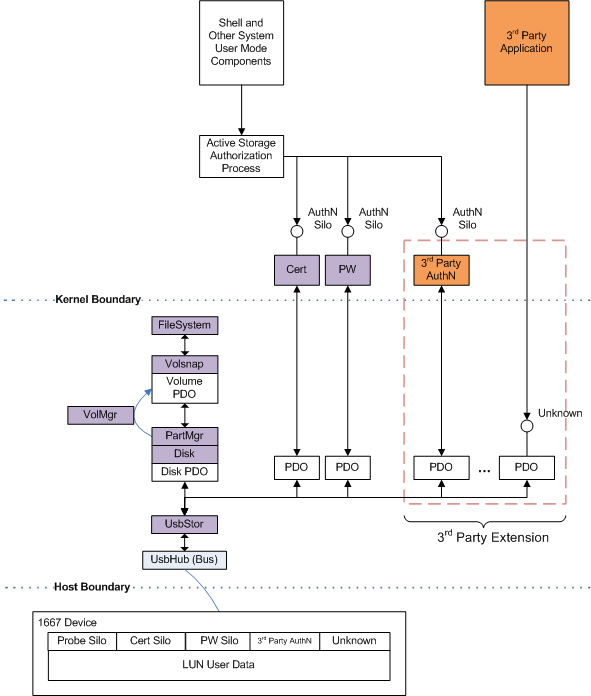

# Architecture

Before discussing the enumeration and discovery process for 1667-compatible mass storage devices, it is helpful to understand the process as it existed previously for legacy USB Mass Storage devices.

When a USB mass storage device is connected to a Windows XP or Vista host system, the kernel-mode driver USBStor is installed and loaded. This driver creates a number of disk Physical Device Objects (PDOs) equal to the number of logical units (LUNs) present on the device. Figure 1 illustrates the driver stack for a single LUN USB flash device (UFD).

When the device is connected to the system, data storage media available at LUN 0 is made accessible through the disk device represented by the disk PDO. PartMgr recognizes the partition information stored on the media, and VolMgr uses this information to create one or more Volume PDOs that represent logical partitions on the media. Each volume is inspected to identify the file system type, and then the appropriate file system is mounted for that volume. Applications then address this mounted volume through the system API, using the familiar file-path nomenclature that incorporates a DOS drive letter (for example, *E:\\myfile*).

One major difference between a legacy and 1667 mass storage device is that prior to authorization, the user data portion of the 1667 ACT is completely inaccessible. Contrast this with the behavior of legacy mass storage bearing nonremovable media. For a connected device with nonremovable media, the storage data must be accessible. Any behavior to the contrary is assumed to be due to device error by the Windows OS platform and its attendant application ecosystem. Connected implies accessible, so adding a connected yet inaccessible device exposes this underlying assumption and breaks the user experience in the following ways:

-   Attempting to access the drive from a Command Prompt window results in a dialog reporting "0xC0000013", no media in the device.

-   Despite the drive being inaccessible, a volume appears for it (not really backed by a mounted file system, just created for the purpose of offering a target for initialization, partitioning, and formatting). Clicking the icon for this volume in either shell or an Open/Save Common Dialogs results in the following insert-disk dialog. This is not a user-actionable instruction for a connected UFD.

-   All **Open** and **Save As** dialog boxes resulting from an application calling by the GetOpenFileName and GetSaveFileName routines result in the same dialog being presented.

-   Any application that uses the Win32 File System APIs may encounter unexpected behavior due to connected but inaccessible storage.

-   Boot error log entries appear because of access problems occurring for an unauthenticated device that reports RMB=0.

-   Shell autoplay assumes drives are immediately accessible when connected. Autoplay is not designed to accommodate scenarios where a drive is only accessible after the process of successful authentication. Such behavior is a departure from the usual shell mass storage device experience.

Therefore, in order to avoid confusing error dialogs and cryptic application errors, presentation of the volume to the system is completely suspended until authorized access to the corresponding ACT has been granted via 1667 authentication.

In Figure 1, USBStor creates a new PDO for each type of silo present on a given ACT. In the figure, both password and a certificate authentication silos appear. Each silo receives a unique PDO upon which the corresponding silo driver is loaded. The user mode authorization process creates a handle to the silo PDO to communicate with the device for the purpose of authentication. At this point the device does not yet enumerate a volume to the system; therefore, there is no confusion regarding an inaccessible storage target. Only the 1667 silos are accessible, and these function to bring the device into a state in which the underlying user data for the ACT user may be accessed. For simplicity and clarity, a device with a single ACT is shown, but the same principle applies when there are multiple ACTs on a device.

Figures 2 and 3 show the two steps that occur from the time that a 1667 UFD is first connected to the point where the ACT is authenticated and a corresponding volume is presented to the system.

The creation of the disk PDO has been delayed until the ACT has entered the access authorized state. After authentication completes successfully and access has been granted, a follow-up IOCTL to USBStor signals this authorization state change. USBStor, in turn, creates the disk PDO, and on top of this disk PDO, the volume and file system driver stack is instantiated. It is through this volume that the ACT data is made accessible to the system.

The device is the ultimate authority for granting access to itself. Therefore, if the authorization state is somehow misjudged, the worst-case end result is that USBStor mistakenly creates a disk PDO for an inaccessible ACT. However, that data remains secure according to access enforcement provided by the device. The delayed disk PDO mechanism is only intended to enable a user experience closer to that provided for legacy mass storage devices. It is not intended as an access control mechanism. A 1667 device is responsible for governing secure access to ACTs.

While Figure 3 refers to the in-box password and cert silo drivers, the extensible nature of the design also allows third-party vendors to participate in the authentication and ACT authorization workflow by writing their own driver. In addition, generic silos whose functions are unrelated to the authentication process may also be discovered and accessed.

The IEEE 1667 specification allows for up to 255 independent silos per ACT present on the device. Each silo is identified not only ordinally, but by a unique silo type ID corresponding to a particular function implementation on the device that corresponds to that silo. For the device shown in Figure 3, a single ACT exposes both certificate and password authentication silos. The first silo is a password silo, as denoted by the Password silo type identifier. The second silo is recognized as the Certificate silo by a different silo type identifier. All silo type identifiers are unique for a given silo function and are issued by the IEEE 1667 governing body.

Figure 4 shows a device with multiple silo types, each addressed by independent drivers.

For devices with a third-party authentication to fully participate in the host authentication process, the vendor must create an authentication silo driver and an authentication client. The ActiveStorage API then facilitates the process of authorizing access to the device via the third-party-provided authentication client process that communicates with the third-party silo through their driver. The interface between the ActiveStorage API and the third-party authentication client is covered in the ActiveStorage API design document.

In addition to third-party authentication silos, a 1667 device may also expose other silos. A third-party driver may be deployed to provide access to a given silo, but such a driver is not absolutely necessary. The vendor may also choose to communicate with the silo without a silo driver; thus avoiding the need to deploy a driver altogether. The third-party application may send raw silo commands directly to the device.

The advantages and disadvantages of using a silo driver versus leaving the silo in raw mode are as follows:

<table>
<colgroup>
<col width="50%" />
<col width="50%" />
</colgroup>
<thead>
<tr class="header">
<th align="left">Silo driver</th>
<th align="left">Raw silo</th>
</tr>
</thead>
<tbody>
<tr class="odd">
<td align="left">
<strong>-</strong> Driver deployment required.
</td>
<td align="left">
+ Driver not required.
</td>
</tr>
<tr class="even">
<td align="left">
<strong>+</strong> Access and transaction control enforced by the silo driver.
</td>
<td align="left">
- Only rudimentary access and transaction control as provided by raw I/O via USBStor.
</td>
</tr>
<tr class="odd">
<td align="left">
<strong>+</strong> Can participate in authorization workflow and UI.
</td>
<td align="left">
- No participation in authorization workflow and UI.
</td>
</tr>
<tr class="even">
<td align="left">
<strong>+</strong> Context menu action verbs.
</td>
<td align="left">
- No context menu action verbs.
</td>
</tr>
<tr class="odd">
<td align="left">
<strong>+</strong> Translation/validation layer contained in the silo driver.
</td>
<td align="left">
- Raw commands sent directly to the device.
</td>
</tr>
<tr class="even">
<td align="left">
<strong>+</strong> Silo driver provides transactional integrity for multicommand operations.
</td>
<td align="left">
- Basic transactional integrity at the SPO and SPI level.
</td>
</tr>
</tbody>
</table>

 

These considerations may inform the vendor's decision about whether to deploy a silo driver for their particular silo. In some cases, remaining with driverless, raw silo access is sufficient for a single client application that has detailed knowledge of the operation of that silo. To make this approach suitable, vendors must also ensure that simultaneous access from multiple applications does not pose a problem for their devices.

In other cases, vendors may want to provide more restricted access to the silo. If so, a more extensive translation and verification layer is required. Another vendor requirement is to provide custom actions on the context menu for the shell drive folder icon corresponding to the drive volume. For these reasons, vendors may choose to deploy a silo driver to provide access to the proprietary silo on their device.
