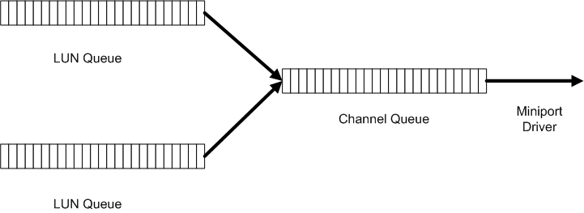

# ATA Port Driver's Queue Management

## 

**NOTE** The ATA port driver and ATA miniport driver models may be altered or unavailable in the future. Instead, we recommend using the [Storport driver](https://msdn.microsoft.com/windows/hardware/drivers/storage/storport-driver) and [Storport miniport](https://msdn.microsoft.com/windows/hardware/drivers/storage/storport-miniport-drivers) driver models.

The ATA port driver maintains a device queue for each logical unit number (LUN) that is exposed by the miniport driver and a separate queue for each channel that is enabled on the IDE controller. These queues work together to control the flow of requests to the miniport driver.

The following figure shows how requests flow from the port driver's LUN queues into the channel queues.

Because the ATA port driver uses a push model of I/O, the ATA port driver does not wait for the miniport driver to request input before it forwards the next packet to the miniport driver. For information about the I/O model that the ATA port driver uses, see [ATA Port I/O Model](ata-port-i-o-model.md).

Nevertheless, the ATA port driver *does* limit the number of requests that it pushes down to the miniport driver. The number of requests is the value that the miniport driver assigns to the **NumberOfOverlappedRequests** member of the [**IDE\_CHANNEL\_CONFIGURATION**](https://msdn.microsoft.com/library/windows/hardware/ff559029) structure. The ATA port driver maintains a count of the number of uncompleted "overlapped" requests that it has forwarded to its miniport driver for a given channel. If this number exceeds the value in **NumberOfOverlappedRequests**, the ATA port driver stops passing new requests to the miniport driver. The ATA port driver keeps all new requests in its queues and waits for the miniport driver to complete some requests. After the number of outstanding requests falls below the value in **NumberOfOverlappedRequests**, the port driver resumes sending requests to the miniport driver.

The ATA miniport driver can also control the flow of requests that it receives from the port driver by calling the [**AtaPortDeviceBusy**](https://msdn.microsoft.com/library/windows/hardware/ff550155) and [**AtaPortDeviceReady**](https://msdn.microsoft.com/library/windows/hardware/ff550157) routines.

 

 

