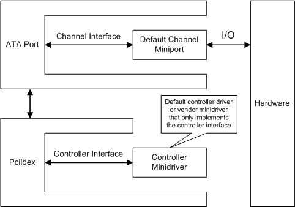
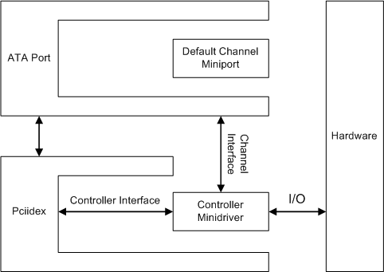

# ATA Port's Interface with ATA Miniport Drivers

## 

**NOTE** The ATA port driver and ATA miniport driver models may be altered or unavailable in the future. Instead, we recommend using the [Storport driver](https://msdn.microsoft.com/windows/hardware/drivers/storage/storport-driver) and [Storport miniport](https://msdn.microsoft.com/windows/hardware/drivers/storage/storport-miniport-drivers) driver models.

In the IDE architecture for Windows Vista and later versions of Windows, there are four system-supplied IDE drivers:

-   The ATA port driver (*Ataport.sys*) that manages the controller channel

-   The default ATA miniport driver (*Atapi.sys*)

-   The controller driver (*Pciidex.sys*)

-   The default controller minidriver (*Pciide.sys*)

The ATA port driver and default miniport driver are new for Windows Vista. The controller driver and default controller driver are not new for Windows Vista.

In versions of the Microsoft Windows operating system earlier than Windows Vista, vendors could replace the default controller minidriver (*Pciide.sys*) with a different minidriver that is customized to a particular controller. For more information about the structure of the IDE stack in Windows operating systems earlier than Windows Vista, see [IDE Port Driver](ide-port-driver.md).

In Windows Vista and later versions of Windows that incorporate ATA port drivers into the IDE architecture, vendors can replace *Pciide.sys* with a vendor-supplied ATA miniport driver. This driver can contain more features than a controller minidriver.

An ATA miniport driver can potentially perform two functions: it can serve as both a controller minidriver and a channel miniport driver by supporting two interfaces:

-   Controller interface

    This interface is required. ATA miniport drivers that implement this interface perform the function of a controller minidriver. This interface enables the ATA miniport driver to control the enumeration of the controller's channels and to configure certain characteristics of the IDE controller, such as timing modes.

-   Channel interface

    This interface is optional. ATA miniport drivers that implement this interface perform both the function of a controller minidriver and the function of a channel miniport driver. Such drivers provide the ATA port driver with hooks into minidriver routines that manage channel I/O. If an ATA miniport driver does not implement this interface, the system uses a default channel miniport driver to handle channel operations (*Atapi.sys*).

Separating these two interfaces complies with the underlying hardware configuration, improves performance when the channels are operated in parallel, and makes the miniport driver code easier to develop and maintain. Moreover, by separating the interfaces, each channel can have its own instance of the channel miniport driver that enables the port driver to do operations such as bus resets on a per channel basis.

The following diagram shows an ATA miniport driver that only implements the controller interface.

After the ATA miniport driver initializes the controller interface, the port driver calls miniport driver routines to configure certain characteristics of the controller, but the ATA miniport driver does not handle device or controller I/O. All I/O requests are handled by the ATA port driver and the default channel miniport driver.

In most cases, you do not have to implement this kind of vendor minidriver. The default controller minidriver (*Pciide.sys*) is sufficient to manage most controller hardware.

The following diagram shows a configuration in which the vendor-supplied miniport driver functions both as the channel driver and the controller driver.

An ATA miniport driver that implements the channel interface exposes controller and channel management routines to the controller driver (*Pciidex.sys*). For performance reasons, *Pciidex.sys* passes the channel management entry points to the ATA port driver, and the ATA port driver calls the ATA miniport driver's channel management routines directly without the mediation of *Pciidex.sys*. The *Pciidex.sys* driver calls the ATA miniport driver's controller routines.

 

 

