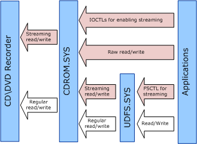

# CD-ROM Real-Time Streaming

Streaming (or real-time streaming) is a feature provided by optical drives to allow faster read and write requests. Starting in Windows 7, support for streaming of DVD-Video has been implemented in all layers of the storage stack, from Cdrom.sys to Windows Media Player, including the UDF file system driver, Udfs.sys, and the video playback sub-system.

## About real-time streaming

In general, read and write access to optical media is characterized by two properties: reliability and sustained performance. These properties are interdependent and cannot be maximized at the same time (higher reliability is achieved at the expense of lower performance).

The majority of applications for optical media are focused on reliability (that is, data integrity). However, certain applications, such as DVD recorders and digital video camcorders, are focused on sustained performance and require a certain level of guaranteed data throughput for proper operation. By design, these applications are resilient to reasonable data loss (for example, video codecs assume that some frames can be lost). For these applications, reliability is not the highest priority. Optical drives address this need by providing a special (so-called Real-Time Streaming) mode of operation. To increase the performance in this mode, read or write errors are ignored and the drive does not perform retries or error correction or prevention.

## Developer support for real-time streaming in Windows

Starting in Windows 7, the CD-ROM class driver, Cdrom.sys, supports low-level streaming read and write requests (the READ12/WRITE12 commands of the MMC specification). User-mode applications can use the [**IOCTL\_CDROM\_ENABLE\_STREAMING**](/windows-hardware/drivers/ddi/ntddcdrm/ni-ntddcdrm-ioctl_cdrom_enable_streaming) I/O control code (IOCTL) to enable or disable streaming for raw read and write requests. These read and write requests are performed using the handles opened for the raw CD/DVD-ROM device.

In addition, for kernel-mode components, there are changes in the way Cdrom.sys handles [**IRP\_MJ\_READ**](../kernel/irp-mj-read.md) and [**IRP\_MJ\_WRITE**](../kernel/irp-mj-write.md) requests. The class driver validates that the real-time streaming requests meet the capabilities of the device. To implement this feature, Windows 7 introduced a streaming flag, **SL\_REALTIME\_STREAM**, in the driver's [**IO\_STACK\_LOCATION**](/windows-hardware/drivers/ddi/wdm/ns-wdm-_io_stack_location). This flag is asserted for all streaming read or write requests and cleared for all non-streaming requests.

These changes in the storage driver stack allow higher layers (in particular, file system drivers and applications) to perform read/write operations at a guaranteed speed for files containing real-time data. Starting in Windows 7, you can mark a file for real-time streaming by using the [**FSCTL\_MARK\_HANDLE**](/windows/win32/api/winioctl/ni-winioctl-fsctl_mark_handle) Control Code and specifying the streaming mode by setting **MARK\_HANDLE\_REALTIME** flag in the [**MARK\_HANDLE\_INFO**](/windows/win32/api/winioctl/ns-winioctl-mark_handle_info) structure.

Figure 1 illustrates the relationship between regular and streaming read and write requests and the UDF file system and CDROM class drivers.

DVD playback applications and file system drivers have a choice of using IOCTLs to access the raw streaming support in Cdrom.sys (lowest level), or using the file system support for streaming mode introduced in Udfs.sys. Applications can also include the Windows video playback sub-system as a whole. In addition to playback, the Cdrom.sys and file system layers also support streaming recording.

## Verifying device support for real-time streaming using IOCTLs

-   Use [**IOCTL\_CDROM\_GET\_CONFIGURATION**](/windows-hardware/drivers/ddi/ntddcdrm/ni-ntddcdrm-ioctl_cdrom_get_configuration) to determine if the streaming feature is present and current.

## Enabling or disabling real-time streaming using IOCTLs

-   Use the [**IOCTL\_CDROM\_ENABLE\_STREAMING**](/windows-hardware/drivers/ddi/ntddcdrm/ni-ntddcdrm-ioctl_cdrom_enable_streaming) I/O control code to enable or disable streaming mode for raw read and write requests. This IOCTL does not have output parameter and supports the [**CDROM\_STREAMING\_CONTROL**](/windows-hardware/drivers/ddi/ntddcdrm/ns-ntddcdrm-_cdrom_streaming_control) structure as the input parameter.

    This IOCTL enables or disables streaming mode on a per-handle basis. By default, streaming is disabled for all newly opened raw CDROM handles. A playback application that does not want to use file system and prefers to work with raw data should open two file handles for the same device: a regular one for file system metadata and a streaming one for real-time files.

## Specifying real-time streaming for IRP\_MJ\_READ and IRP\_MJ\_WRITE requests

-   The SL\_REALTIME\_STREAM flag in the [**IoGetCurrentIrpStackLocation**](/windows-hardware/drivers/ddi/wdm/nf-wdm-iogetcurrentirpstacklocation)(Irp)-&gt;Flags field controls read and write streaming requests ([**IRP\_MJ\_READ**](../ifs/irp-mj-read.md) and [**IRP\_MJ\_WRITE**](../ifs/irp-mj-write.md)). The flag is set for all streaming read and write requests and cleared for all non-streaming requests. If the SL\_REALTIME\_STREAM flag is set, Cdrom.sys performs streaming requests by using READ12 and WRITE12 SCSI commands instead of READ10 or WRITE10 SCSI commands. If the SL\_REALTIME\_STREAM flag is set in an IRP, but the device does not support streaming for the currently inserted media, the IRP will be rejected with the status code STATUS\_INVALID\_DEVICE\_REQUEST.

## Specifying real-time streaming for a file using FSCTLs

-   You can mark any file for real-time read behavior, regardless of the file type. To do this, set the **MARK\_HANDLE\_REALTIME** flag in the [**MARK\_HANDLE\_INFO**](/windows/win32/api/winioctl/ns-winioctl-mark_handle_info) structure, and then send the [**FSCTL\_MARK\_HANDLE**](/windows/win32/api/winioctl/ni-winioctl-fsctl_mark_handle) control code. Files marked with this flag must be opened for unbuffered I/O.
-   An application can unmark a file that was previously flagged for real-time behavior, by setting the **MARK\_HANDLE\_NOT\_REALTIME** flag in the MARK\_HANDLE\_INFO structure.
-   If FSCTL\_MARK\_HANDLE control code is sent with MARK\_HANDLE\_REALTIME and either the CD-ROM/DVD drive or media indicate that the real time streaming feature is not supported, IOCTL returns STATUS\_INVALID\_DEVICE\_REQUEST. If the handle is opened without buffering, the STATUS\_INVALID\_DEVICE\_REQUEST is also returned.

## Performing Optimum Power Calibration (OPC) before writing

Some applications might want to perform the OPC procedure in advance, so that the first streaming write does not have to wait for the OPC to finish. To do this, Cdrom.sys provides an IOCTL called [**IOCTL\_CDROM\_SEND\_OPC\_INFORMATION**](/windows-hardware/drivers/ddi/ntddcdrm/ni-ntddcdrm-ioctl_cdrom_send_opc_information).

## Determining the read/write speed for the drive

The MMC specification recommends that applications indicate the desirable read and write speed before using streaming I/O, so that the drive can find a better balance between read and write quality and throughput. Applications can use the [**IOCTL\_CDROM\_SET\_SPEED**](/windows-hardware/drivers/ddi/ntddcdrm/ni-ntddcdrm-ioctl_cdrom_set_speed) to indicate the preferred speed. To determine the supported capabilities of the drive, Windows 7 introduced the [**IOCTL\_CDROM\_GET\_PERFORMANCE**](/windows-hardware/drivers/ddi/ntddcdrm/ni-ntddcdrm-ioctl_cdrom_get_performance) control code, which takes as an input a [**CDROM\_PERFORMANCE\_REQUEST**](/windows-hardware/drivers/ddi/ntddcdrm/ns-ntddcdrm-_cdrom_performance_request) structure.

## Related topics
[**IOCTL\_CDROM\_ENABLE\_STREAMING**](/windows-hardware/drivers/ddi/ntddcdrm/ni-ntddcdrm-ioctl_cdrom_enable_streaming)  
[**IOCTL\_CDROM\_GET\_PERFORMANCE**](/windows-hardware/drivers/ddi/ntddcdrm/ni-ntddcdrm-ioctl_cdrom_get_performance)  
[**IOCTL\_CDROM\_SEND\_OPC\_INFORMATION**](/windows-hardware/drivers/ddi/ntddcdrm/ni-ntddcdrm-ioctl_cdrom_send_opc_information)  
[**IOCTL\_CDROM\_SET\_SPEED**](/windows-hardware/drivers/ddi/ntddcdrm/ni-ntddcdrm-ioctl_cdrom_set_speed)  
[**FSCTL\_MARK\_HANDLE**](/windows/win32/api/winioctl/ni-winioctl-fsctl_mark_handle)  
[**MARK\_HANDLE\_INFO**](/windows/win32/api/winioctl/ns-winioctl-mark_handle_info)  
[**CDROM\_PERFORMANCE\_REQUEST**](/windows-hardware/drivers/ddi/ntddcdrm/ns-ntddcdrm-_cdrom_performance_request)
