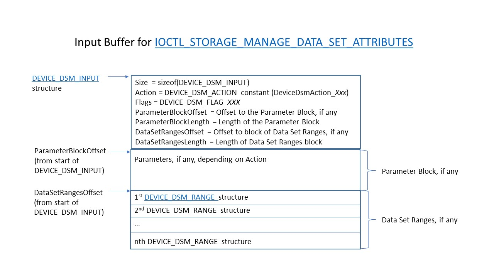
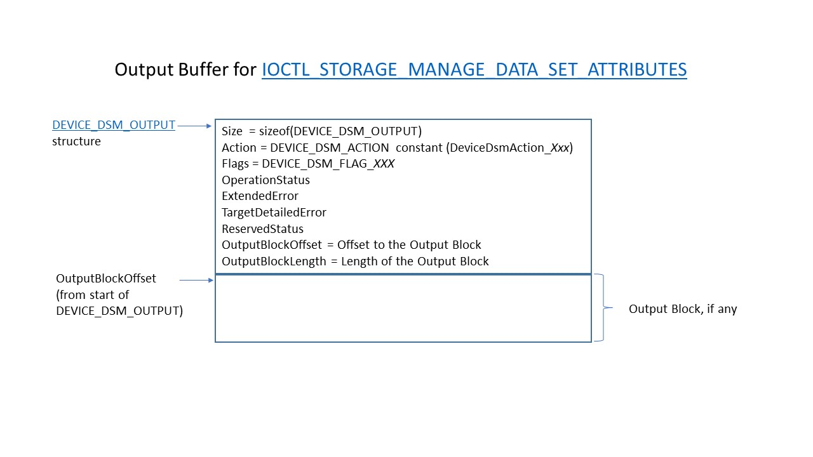
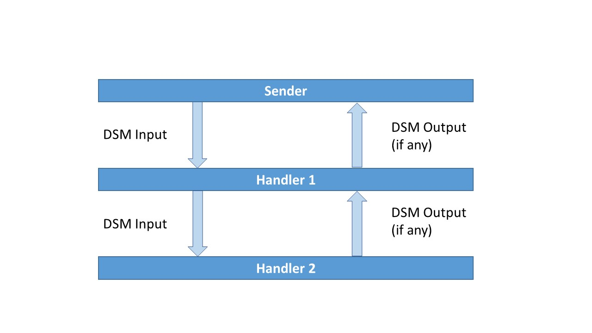

# Data Set Management (DSM) Overview

Starting with Windows 7, drivers can perform management actions on a device's data set. DSM actions are defined by Microsoft.

A [DEVICE_DSM_ACTION](device-dsm-action-descriptions.md) constant specifies the action. This constant is passed in the **Action** member of the [DEVICE_DSM_INPUT](/windows-hardware/drivers/ddi/ntddstor/ns-ntddstor-_device_manage_data_set_attributes) structure contained in the system buffer of an [IOCTL_STORAGE_MANAGE_DATA_SET_ATTRIBUTES](/windows-hardware/drivers/ddi/ntddstor/ni-ntddstor-ioctl_storage_manage_data_set_attributes) request. If the action requires additional parameters, a parameter block will immediately follow the DEVICE_DSM_INPUT structure, and **ParameterBlockOffset** will specify the offset from the start of the DEVICE_DSM_INPUT structure at which the parameter block starts. Data set ranges, if any, will immediately follow the parameter block, and **DataSetRangesOffset** will specify the offset from the start of the DEVICE_DSM_INPUT structure at which the range(s) starts. The system buffer structure is shown in the following diagram.

If the management action will return output, a pointer to a [DEVICE_DSM_OUTPUT](/windows-hardware/drivers/ddi/ntddstor/ns-ntddstor-_device_manage_data_set_attributes_output) structure is passed in the IOCTL's *OutputBuffer*. If the action will return additional action-specific output, an output block will immediately follow the DEVICE_DSM_OUTPUT structure, and **OutputBlockOffset** will specify the offset from the start of the DEVICE_DSM_OUTPUT structure at which the parameter block starts. The output buffer structure is shown in the following diagram.

The process flow of a DSM is described below, where *Sender* is the action requestor and *Handler* processes the requested action. Note that there can be more than one *Handler* in the stack.

1) *Sender* initializes the DSM and sends it to the first *Handler* in the stack by doing the following:

   - Allocate and initialize a [DEVICE_DSM_DEFINITION](/windows-hardware/drivers/ddi/ntddstor/ns-ntddstor-_device_dsm_definition) structure with the definition associated with the action.
   - Call [**DeviceDsmGetInputLength**](/windows-hardware/drivers/ddi/ntddstor/nf-ntddstor-devicedsmgetinputlength) to determine the size required for the action's input buffer, and then allocate memory for this buffer.
   - Call [**DeviceDsmInitializeInput**](/windows-hardware/drivers/ddi/ntddstor/nf-ntddstor-devicedsminitializeinput) to initialize the [DSM_DEVICE_INPUT](/windows-hardware/drivers/ddi/ntddstor/ns-ntddstor-_device_manage_data_set_attributes) structure and, if the action has parameters, the parameter block. The parameter block format depends on the action. See [DEVICE_DSM_ACTION Descriptions](device-dsm-action-descriptions.md) for more details.
   - If the action has ranges, call [**DeviceDsmAddDataSetRange**](/windows-hardware/drivers/ddi/ntddstor/nf-ntddstor-devicedsmadddatasetrange) for each range to add [DEVICE_DSM_RANGE](/windows-hardware/drivers/ddi/ntddstor/ns-ntddstor-_device_data_set_range) structure(s) to the input buffer.
   - If the DSM has output, call [**DeviceDsmGetOutputLength**](/windows-hardware/drivers/ddi/ntddstor/nf-ntddstor-devicedsmgetoutputlength) to determine the size required for the action's output buffer, and then allocate memory for this buffer.
   - Send an [IOCTL_STORAGE_MANAGE_DATA_SET_ATTRIBUTES](/windows-hardware/drivers/ddi/ntddstor/ni-ntddstor-ioctl_storage_manage_data_set_attributes) request, passing the initialized input data in the IOCTL's system buffer, along with the allocated output buffer, if any.

2) *Handler* handles the DSM IOCTL request in one of three ways:
   1) Handle the request and return with output, if any.
   2) Handle the request and forward it to the next lower driver in the stack.
   3) Forward the request to the next lower driver in the stack without handling the DSM.

   > [!NOTE]
   > Regardless of whether the driver handles the DSM, it can safely forward the request *only if* DEVICE_DSM_ACTION's most significant bit (**DeviceDsmActionFlag_NonDestructive**) is set. If **DeviceDsmActionFlag_NonDestructive** is *not* set, the driver should instead return with an error.
  
   If *Handler* does handle the DSM, it performs the following steps:

   - Validate the input by calling [**DeviceDsmValidateInput**](/windows-hardware/drivers/ddi/ntddstor/nf-ntddstor-devicedsmvalidateinput).
   - If the input is valid, *Handler* extracts the input to get the action. If the action has a parameter block, *Handler* calls [**DeviceDsmParameterBlock**](/windows-hardware/drivers/ddi/ntddstor/nf-ntddstor-devicedsmparameterblock) to get the parameter block. If the action has range data, *Handler* calls [**DeviceDsmDataSetRanges**](/windows-hardware/drivers/ddi/ntddstor/nf-ntddstor-devicedsmdatasetranges) to get a pointer to the block of data set ranges, and then performs the normal processing on the block. This block is located at **DataSetRangesOffset** and consists of one or more contiguous entries formatted as [DEVICE_DSM_RANGE](/windows-hardware/drivers/ddi/ntddstor/ns-ntddstor-_device_data_set_range) structures. The length, in bytes, of the data set ranges is set in the **DataSetRangesLength** member of [DEVICE_DSM_INPUT](/windows-hardware/drivers/ddi/ntddstor/ns-ntddstor-_device_manage_data_set_attributes).
   - If the action requires output, *Handler* calls [**DeviceDsmValidateOutputLength**](/windows-hardware/drivers/ddi/ntddstor/nf-ntddstor-devicedsmvalidateoutputlength) to validate the sender-supplied output buffer. If valid, the handler initializes the [DEVICE_DSM_OUTPUT](/windows-hardware/drivers/ddi/ntddstor/ns-ntddstor-_device_manage_data_set_attributes_output) portion of the output buffer by calling [**DeviceDsmInitializeOutput**](/windows-hardware/drivers/ddi/ntddstor/nf-ntddstor-devicedsminitializeoutput), and populates the output block with action-specific output, if any. The *Handler* then completes the IOCTL and either returns or forwards the IOCTL to the next driver in the stack.

3) Once the DSM is handled and returned to the *Sender*, the *Sender* validates the output, if any, by calling [**DeviceDsmValidateOutput**](/windows-hardware/drivers/ddi/ntddstor/nf-ntddstor-devicedsmvalidateoutput). If the output is valid, *Sender* extracts the output block, if any, by calling [**DeviceDsmOutputBlock**](/windows-hardware/drivers/ddi/ntddstor/nf-ntddstor-devicedsmoutputblock).

For details on each specific DSM action, see [Device DSM Action Descriptions](device-dsm-action-descriptions.md).
