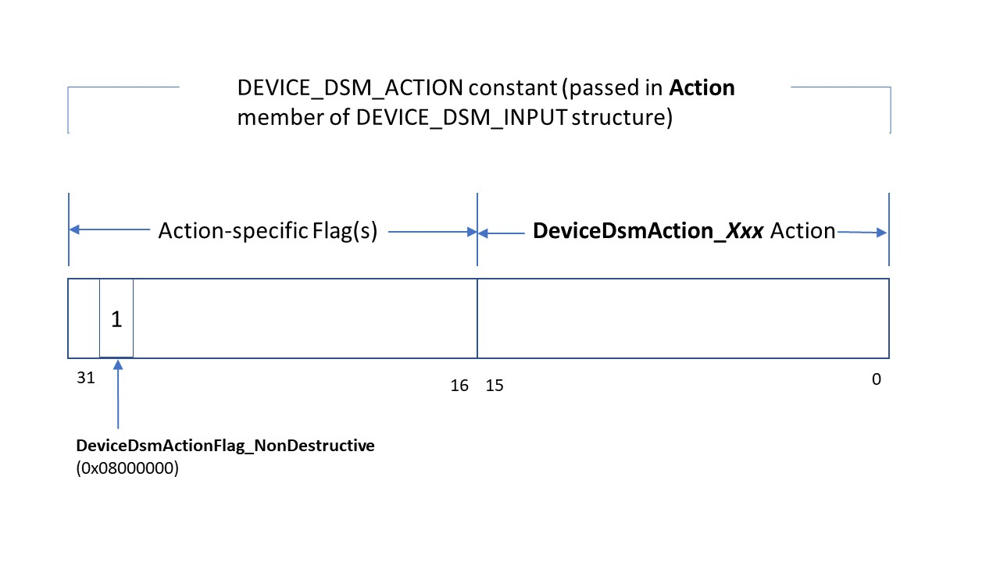

# DEVICE_DSM_ACTION Definitions

This page describes the DEVICE_DSM_ACTION constants that can be used to perform a data set management (DSM) action on a device's data-set attributes. See [Data Set Management Overview](data-set-management-overview.md) for information on how a DSM action is processed. The following diagram shows the structure of a DEVICE_DSM_ACTION constant, and the table below lists and describes each constant.

| DEVICE_DSM_ACTION Constant | Description |
| -------------------------- | ----------- |
| **DeviceDsmAction_None** (0) | For structure initialization purposes only. |
| **DeviceDsmAction_Trim** (1) | The driver will perform a trim operation. |
| **DeviceDsmAction_Notification** (2 \| **DeviceDsmActionFlag_NonDestructive**) | The driver will perform a notification operation. For this action, the **ParameterBlockOffset** and **ParameterBlockLength** members of the [DEVICE_DSM_INPUT](https://docs.microsoft.com/windows-hardware/drivers/ddi/content/ntddstor/ns-ntddstor-_device_manage_data_set_attributes) structure specify the parameters of the notification operation. These parameters are formatted as a [DEVICE_DSM_NOTIFICATION_PARAMETERS](https://docs.microsoft.com/windows-hardware/drivers/ddi/content/ntddstor/ns-ntddstor-_device_dsm_notification_parameters) structure. Supported in Windows 7 and later versions of Windows. |
| **DeviceDsmAction_OffloadRead** (3 \| **DeviceDsmActionFlag_NonDestructive**) | The driver performs an offload read operation. For this action, the **ParameterBlockOffset** and **ParameterBlockLength** members of the [DEVICE_DSM_INPUT](https://docs.microsoft.com/windows-hardware/drivers/ddi/content/ntddstor/ns-ntddstor-_device_manage_data_set_attributes) structure specify the parameters of the offload read operation. These parameters are formatted as a [DEVICE_DSM_OFFLOAD_READ_PARAMETERS](https://docs.microsoft.com/windows-hardware/drivers/ddi/content/ntddstor/ns-ntddstor-_device_dsm_offload_read_parameters) structure. Supported in Windows 8 and later versions of Windows. |
| **DeviceDsmAction_OffloadWrite** (4) | The driver will perform an offload write operation. For this action, the **ParameterBlockOffset** and **ParameterBlockLength** members of the [DEVICE_DSM_INPUT](https://docs.microsoft.com/windows-hardware/drivers/ddi/content/ntddstor/ns-ntddstor-_device_manage_data_set_attributes) structure specify the parameters of the offload write operation. These parameters are formatted as a [DEVICE_DSM_OFFLOAD_WRITE_PARAMETERS](https://docs.microsoft.com/windows-hardware/drivers/ddi/content/ntddstor/ns-ntddstor-_device_dsm_offload_write_parameters) structure. Supported in Windows 8 and later versions of Windows. |
| **DeviceDsmAction_Allocation** (5 \| **DeviceDsmActionFlag_NonDestructive**) | The driver will perform a logical block provisioning operation. The logical block range is specified in a single [DEVICE_DATA_SET_RANGE](https://docs.microsoft.com/windows-hardware/drivers/ddi/content/ntddstor/ns-ntddstor-_device_data_set_range) structure. Supported in Windows 8 and later versions of Windows. |
| **DeviceDsmAction_Repair** (6 \| **DeviceDsmActionFlag_NonDestructive**) | The driver will perform a storage spaces repair operation. The logical block range is specified in a single [DEVICE_DATA_SET_RANGE](https://docs.microsoft.com/windows-hardware/drivers/ddi/content/ntddstor/ns-ntddstor-_device_data_set_range) structure. The number of repair copies is specified in a DEVICE_DATA_SET_REPAIR_PARAMETERS structure located in the input buffer as specified by the **ParameterBlockOffset** member of the [DEVICE_DSM_INPUT](https://docs.microsoft.com/windows-hardware/drivers/ddi/content/ntddstor/ns-ntddstor-_device_manage_data_set_attributes) structure. Supported in Windows 8 and later versions of Windows. |
| **DeviceDsmAction_Scrub** (7 \| **DeviceDsmActionFlag_NonDestructive**) | The driver will perform a storage spaces scrub operation. The logical block range is specified in a single [DEVICE_DATA_SET_RANGE](https://docs.microsoft.com/windows-hardware/drivers/ddi/content/ntddstor/ns-ntddstor-_device_data_set_range) structure. Supported in Windows 8 and later versions of Windows. |
| **DeviceDsmAction_DrtQuery** (8 \| **DeviceDsmActionFlag_NonDestructive**) | The driver will perform a query for the logical block range specified and checks if it is included in storage spaces dirty range tracking. The synchronization status of the range is returned in the **OperationStatus** member of the [DEVICE_DSM_INPUT_OUTPUT](https://docs.microsoft.com/windows-hardware/drivers/ddi/content/ntddstor/ns-ntddstor-_device_manage_data_set_attributes_output) structure. The logical block range is specified, on input, in a single [DEVICE_DATA_SET_RANGE](https://docs.microsoft.com/windows-hardware/drivers/ddi/content/ntddstor/ns-ntddstor-_device_data_set_range) structure. Supported in Windows 8 and later versions of Windows. |
| **DeviceDsmAction_DrtClear** (9 \| **DeviceDsmActionFlag_NonDestructive**) | The driver will clear dirty range status for the for the logical block range specified. The logical block range is specified in a single [DEVICE_DATA_SET_RANGE](https://docs.microsoft.com/windows-hardware/drivers/ddi/content/ntddstor/ns-ntddstor-_device_data_set_range) structure. Supported in Windows 8 and later versions of Windows. |
| **DeviceDsmAction_DrtDisable** (10 \| **DeviceDsmActionFlag_NonDestructive**) | The driver will disable dirty range tracking for the logical block range specified. The logical block range is specified in a single [DEVICE_DATA_SET_RANGE](https://docs.microsoft.com/windows-hardware/drivers/ddi/content/ntddstor/ns-ntddstor-_device_data_set_range) structure. Supported in Windows 8 and later versions of Windows. |
| **DeviceDsmAction_TieringQuery** (11 \| **DeviceDsmActionFlag_NonDestructive**) |  |
| **DeviceDsmAction_Map** (12 \| **DeviceDsmActionFlag_NonDestructive**) |  |
| **DeviceDsmAction_RegenerateParity** (13 \| **DeviceDsmActionFlag_NonDestructive**) |  |
| **DeviceDsmAction_NvCache_Change_Priority** (14 \| **DeviceDsmActionFlag_NonDestructive**) | The driver will change the caching priority of specified ranges of logical blocks. The new target priority is set in a [DEVICE_DSM_NVCACHE_CHANGE_PRIORITY_PARAMETERS](https://docs.microsoft.com/windows-hardware/drivers/ddi/content/ntddstor/ns-ntddstor-_device_dsm_nvcache_change_priority_parameters) structure which is located at **ParameterBlockOffset** in [DEVICE_DSM_INPUT](https://docs.microsoft.com/windows-hardware/drivers/ddi/content/ntddstor/ns-ntddstor-_device_manage_data_set_attributes). The logical block ranges to change priority for are given in one or more [DEVICE_DATA_SET_RANGE](https://docs.microsoft.com/windows-hardware/drivers/ddi/content/ntddstor/ns-ntddstor-_device_data_set_range) structures. Supported in Windows 8.1 and later versions of Windows. |
| **DeviceDsmAction_NvCache_Evict** (15 \| **DeviceDsmActionFlag_NonDestructive**) | The driver will evict data from the caching medium. To evict all data, set the DEVICE_DSM_FLAG_ENTIRE_DATA_SET_RANGE flag in the **Flags** member of [DEVICE_DSM_INPUT](https://docs.microsoft.com/windows-hardware/drivers/ddi/content/ntddstor/ns-ntddstor-_device_manage_data_set_attributes) and do not include any [DEVICE_DATA_SET_RANGE](https://docs.microsoft.com/windows-hardware/drivers/ddi/content/ntddstor/ns-ntddstor-_device_data_set_range) structures. Specific logical block ranges to evict are given in one or more [DEVICE_DATA_SET_RANGE](https://docs.microsoft.com/windows-hardware/drivers/ddi/content/ntddstor/ns-ntddstor-_device_data_set_range) structures. The **DeviceDsmAction_NvCache_Evict** action is executed synchronously. No other actions are serviced until the evict action has either succeeded or failed. In order to limit its impact on applications using the device, each **DeviceDsmAction_NvCache_Evict** action issued should include relatively small data ranges. They should not exceed 10 MB and ideally be smaller than 2 MB. This will minimize the chance that user level applications will experience noticeable delays when accessing data on the device. Supported in Windows 8.1 and later versions of Windows. |
| **DeviceDsmAction_TopologyIdQuery** (16 \| **DeviceDsmActionFlag_NonDestructive**) |  |
| **DeviceDsmAction_GetPhysicalAddresses** (17 \| **DeviceDsmActionFlag_NonDestructive**) |  |
| **DeviceDsmAction_ScopeRegen** (18 \| **DeviceDsmActionFlag_NonDestructive**) |  |
| **DeviceDsmAction_ReportZones** (19 \| **DeviceDsmActionFlag_NonDestructive**) |  |
| **DeviceDsmAction_OpenZone** (20 \| **DeviceDsmActionFlag_NonDestructive**) |  |
| **DeviceDsmAction_FinishZone** (21 \| **DeviceDsmActionFlag_NonDestructive**) |  |
| **DeviceDsmAction_CloseZone** (22 \| **DeviceDsmActionFlag_NonDestructive**) |  |
| **DeviceDsmAction_ResetWritePointer** (23) |  |
| **DeviceDsmAction_GetRangeErrorInfo** (24 \| **DeviceDsmActionFlag_NonDestructive**) |  |
| **DeviceDsmAction_WriteZeroes** (25) |  |
| **DeviceDsmAction_LostQuery** (26 \| **DeviceDsmActionFlag_NonDestructive**) |  |
| **DeviceDsmAction_GetFreeSpace** (27 \| **DeviceDsmActionFlag_NonDestructive**) |  |
| **DeviceDsmAction_ConversionQuery** (28 \| **DeviceDsmActionFlag_NonDestructive**) |  |
