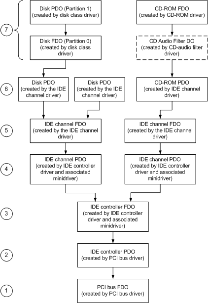

# Device Object Example for a PCI IDE Controller

## 

The following figure shows the device objects that are created for a system using a PCI IDE controller that has two IDE disks attached to one channel and an IDE CD-ROM attached to the other.

Device Object Tree for CD-ROM and Disk Devices on an IDE controller

Starting from the bottom of the figure, the following describes each device object and its associated driver:

1.  The PCI bus driver creates an FDO for the PCI bus and attaches it to the PCI bus PDO that was created by the PnP manager (not shown in this figure).

2.  The PCI bus driver enumerates the adapters and controllers on its bus, including all the IDE controllers, and creates a PDO for each one.

3.  The IDE controller driver, together with its IDE controller minidriver, create an FDO and attach it to the PDO for the controller.

4.  The IDE controller driver "enumerates" the controller's channels. In effect, this means that it creates two PDOs, one for each of the controller's channels, and that it attaches both channel PDOs to the controller FDO.

5.  The IDE channel driver creates an FDO and attaches it to the PDO for the channel.

6.  The IDE channel driver enumerates the devices on its channel and creates a PDO for each device. The figure showing a device object tree for a CD-ROM device on an IEEE 1394 controller illustrates three such PDOs that were created by the IDE channel driver: two hard disk drive PDOs that were created by the channel driver for the controller's first channel, and a CD-ROM PDO that was created by the channel driver for the controller's second channel.

7.  The disk class driver creates an FDO and attaches it to the associated disk PDO, exactly as in the case of the SCSI, and the CD-ROM driver creates an FDO and attaches it to the associated CD-ROM PDO. As in the case of the SCSI, a filter driver DO can be inserted between the device PDO and the device FDO. The figure showing a device object tree for a CD-ROM device on an IEEE 1394 controller illustrates this using a CD Audio Filter DO that can be optionally placed just above the CD-ROM PDO.

 

 

--------------------
[Send comments about this topic to Microsoft](mailto:wsddocfb@microsoft.com?subject=Documentation%20feedback%20[storage\storage]:%20Device%20Object%20Example%20for%20a%20PCI%20IDE%20Controller%20%20RELEASE:%20%285/9/2016%29&body=%0A%0APRIVACY%20STATEMENT%0A%0AWe%20use%20your%20feedback%20to%20improve%20the%20documentation.%20We%20don't%20use%20your%20email%20address%20for%20any%20other%20purpose,%20and%20we'll%20remove%20your%20email%20address%20from%20our%20system%20after%20the%20issue%20that%20you're%20reporting%20is%20fixed.%20While%20we're%20working%20to%20fix%20this%20issue,%20we%20might%20send%20you%20an%20email%20message%20to%20ask%20for%20more%20info.%20Later,%20we%20might%20also%20send%20you%20an%20email%20message%20to%20let%20you%20know%20that%20we've%20addressed%20your%20feedback.%0A%0AFor%20more%20info%20about%20Microsoft's%20privacy%20policy,%20see%20http://privacy.microsoft.com/default.aspx. "Send comments about this topic to Microsoft")

