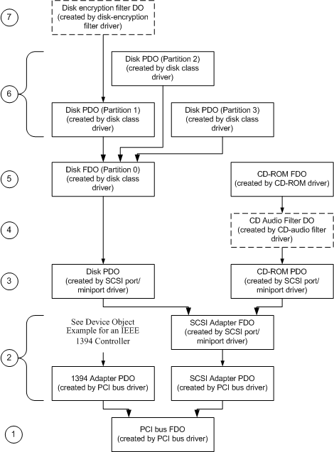

# Device Object Example for a SCSI HBA

## 

The following figure shows the device objects that are created for system with a PCI IEEE 1394 controller and a PCI SCSI adapter with a CD-ROM and partitionable disk device attached. Objects for devices attached to the IEEE 1394 controller are shown and described in [Device Object Example for an IEEE 1394 Controller](device-object-example-for-an-ieee-1394-controller.md).

Device Object Tree for CD-ROM and Disk Devices on a SCSI HBA

Starting from the bottom of the figure, the following describes each device object and its associated driver:

1.  The storage bus driver creates the FDO for the storage bus and attaches it to the storage bus PDO created by the PnP manager (not shown in this figure). The structure of the device object tree below the storage bus FDO depends on the storage bus and how it is integrated into the system. Storage drivers above the port driver level do not interact with any of these lower objects.

    This figure shows the storage bus FDO created by the PCI bus driver for a system with a PCI bus.

2.  The PCI bus driver enumerates and creates a PDO for each storage adapter on its bus. The corresponding storage port driver creates an FDO and attaches it to the PDO for its adapter.

    This figure shows two adapter PDOs: one for an IEEE 1394 controller (described in [Device Object Example for an IEEE 1394 Controller](device-object-example-for-an-ieee-1394-controller.md)) and another for a SCSI HBA. The SCSI port driver and an associated miniport driver create an FDO and attach it to the SCSI adapter PDO.

3.  The storage port driver virtualizes target devices by creating a PDO for each target device attached to its adapter. This figure shows two such PDOs created by the SCSI port/miniport drivers: one for a hard disk drive and one for a CD-ROM.

4.  One or more filter drivers can attach a filter device object (filter DO) to a target device PDO exported by a storage port driver. Such a filter driver can intercept and alter requests sent by the class driver to the target device, for example, to work around device-specific problems without requiring hardware-specific changes to the generic class or port drivers.

    This figure shows a filter DO attached by a CD audio filter driver to the CD-ROM's PDO.

5.  A storage class driver creates an FDO and attaches it to next-lower device object, which is either a target device PDO exported by a storage port driver or a filter DO attached to the stack by an intervening filter driver. The class driver issues all subsequent requests to the storage device through the lower driver's device object.

    This figure shows two such FDOs: one that represents a CD-ROM device, and one that represents Partition 0 of a hard disk drive. Partition 0 represents the entire raw disk, and always exists whether the drive is partitioned or not.

6.  A class driver can also act as a bus driver, returning a list of PDOs when the PnP manager queries for its child devices (IRP\_MN\_QUERY\_DEVICE\_RELATIONS with **BusRelations**). For example, a driver of a partitioned media device such as a removable disk might return a list of PDOs representing its partitions. Higher-level drivers attach FDOs to these PDOs.

    This figure shows three such PDOs, each representing a disk partition that can be addressed as a target device.

    In the case of a fixed disk, the partition manager attaches to the FDO that represents Partition 0 and handles PnP operations on behalf of all partitions. The activities of the partition manager are transparent to the disk class driver and any upper level filter drivers.

7.  One or more filter drivers can be attached above a class driver. Unlike a lower level filter driver, an upper level filter driver intercepts IRPs sent to the class driver, and can alter them before forwarding them to next-lower device object. The filter driver can intercept any read/write requests and transform the data as necessary, as well as define additional I/O control codes (IOCTLs), for example, to enable a user application to supply passwords or other related information.

    This figure shows a filter DO created by a disk-encryption filter driver and attached to the disk PDO for partition 1.

 

 

