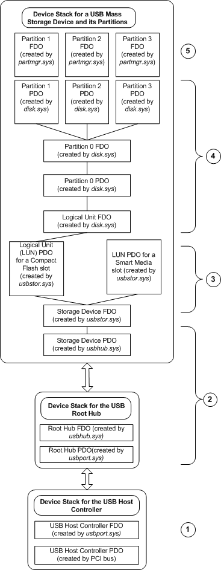

# Device Object Example for a USB Mass Storage Device

## 

The following figure shows the device objects that are created for a composite USB mass storage device containing both a Smart Media slot and a Compact Flash slot.

Device Object Tree for a Composite USB Mass Storage Device

Starting from the bottom of the figure, the following list describes each device object or device object stack and its associated driver:

1.  The PCI bus driver enumerates the USB host controller. The system loads the port driver, *usbport.sys*, and its accompanying miniports (not shown in the figure). Then, *usbport.sys* creates an FDO for the host controller.

2.  The port driver enumerates the USB hubs in the system, starting with the root hub. The *usbhub.sys* driver manages all USB hubs. The figure only shows one level of hub device objects, but USB allows daisy-chaining of hub devices, so there could potentially be many more hub device objects in the tree. The hub driver detects and enumerates the USB mass storage device and creates a PDO for it.

3.  Windows supplies a USB storage port driver, *usbstor.sys*, that serves as an interface between the USB stack and the native Windows storage class drivers. The USB storage port driver creates its own functional device object (FDO). The USB storage port driver can divide the physical storage device into as many as 16 logical units. In the example depicted in the figure, the USB storage device contains separate slots for a Compact Flash device and a Smart Media device. Therefore, in this example, the USB storage port driver creates two separate PDOs, one for the Compact Flash device and another for the Smart Media device.

4.  The stack above the USB storage port driver is managed in the usual way by the native disk class driver. The disk class driver creates a PDO and an FDO for the disk as a whole (partition zero), and PDOs for each partition on the disk.

5.  The partition manager creates an FDO for each disk partition.

 

 

