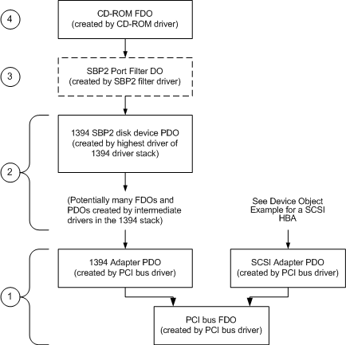

# Device Object Example for an IEEE 1394 Controller

## 

The following figure shows the device objects that are created for system with a PCI IEEE 1394 controller with an IEEE 1394 CD-ROM attached. Device objects for devices attached to the SCSI adapter are described in [Device Object Example for a SCSI HBA](device-object-example-for-a-scsi-hba.md).

Device Object Tree for a CD-ROM Device on an IEEE 1394 Controller

Starting from the bottom of the figure, the following describes each device object and its corresponding driver:

1.  For a description of the device tree from the storage bus FDO up to the adapter PDOs, see [Device Object Example for a SCSI HBA](device-object-example-for-a-scsi-hba.md).

2.  The highest driver in the IEEE 1394 driver stack creates an SBP2 disk device PDO. The IEEE 1394 driver stack ultimately issues SBP2 commands to the target CD-ROM device on the IEEE 1394 bus.

3.  The system-supplied IEEE 1394 storage port driver is implemented as a filter driver that creates a filter DO and attaches it to the SBP2 disk device PDO. The IEEE 1394 storage port driver translates SRBs from the CD-ROM class driver into SBP2 commands which are issued to the underlying IEEE 1394 driver stack. The interface this driver presents to next-lower storage drivers is identical to that presented by the SCSI port/miniport driver described in [Device Object Example for a SCSI HBA](device-object-example-for-a-scsi-hba.md).

4.  The CD-ROM class driver creates an FDO and attaches it to the next-lower device object, which is either the SBP2 port filter DO or another filter DO attached to the stack by an intervening filter driver. The class driver issues all subsequent requests to the device through the lower driver's device object.

 

 

