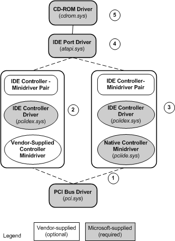

# IDE Port Driver
**NOTE** The ATA port driver and ATA miniport driver models may be altered or unavailable in the future. Instead, we recommend using the [Storport driver](https://msdn.microsoft.com/windows/hardware/drivers/storage/storport-driver) and [Storport miniport](https://msdn.microsoft.com/windows/hardware/drivers/storage/storport-miniport-drivers) driver models.

In Microsoft Windows NT 4.0, the port/miniport driver pair associated with the IDE bus is a SCSI miniport driver, *atapi.sys*, that linked to the SCSI port driver, *scsiport.sys*.

In Microsoft Windows 2000 and Windows XP, the IDE port driver *atapi.sys* is an independent driver that no longer links to *scsiport.sys*, nor to any other wrapper driver.

There are three system-supplied drivers in the IDE driver model for Windows 2000 and Windows XP: *atapi.sys* (port driver), *pciidex.sys* (controller driver), and *pciide.sys* (generic controller minidriver). All three drivers are illustrated in the following figure.

Starting from the bottom of the figure, the following describes each driver in the stack:

1.  The IDE stack in Windows 2000 and Windows XP is layered over the PCI bus driver.

2.  Microsoft provides a native IDE controller driver/minidriver pair that is capable of managing most IDE controllers. The IDE controller driver, *pciidex.sys*, handles the hardware-independent aspects of the driver pair, and the minidriver, *pciide.sys*, handles the hardware-dependent aspects.

3.  Vendors can elect to provide their own IDE controller minidriver instead of using the native minidriver, *pciide.sys*. The vendor's minidriver must work together with the Microsoft-supplied controller driver to form a controller-minidriver pair. See [Requirements for Vendor-Supplied IDE Controller Minidrivers](requirements-for-vendor-supplied-ide-controller-minidrivers.md) for an explanation of the requirements a vendor's minidriver must fulfill to work properly with the native Microsoft controller driver.

4.  Microsoft provides an IDE port driver, *atapi.sys,* which is also known as the *channel driver*, because it creates and manages a functional device object (FDO) for each IDE channel. The port driver is layered above the IDE controller/minidriver pair. It translates the SCSI request blocks (SRB) that it receives from the storage class driver into the format required by the underlying IDE controller. In particular, the command descriptor blocks (CDB) contained within an SRB are defined differently for ATAPI and SCSI devices. The port driver repackages CDBs to make them compatible with the ATAPI transport protocol, thereby insulating upper-level drivers from peculiarities of the IDE bus.

5.  Microsoft provides a CD-ROM class driver capable of managing all CD-ROM (type 5 SCSI) devices.

To see a diagram of the device object stack corresponding to the driver stack in the previous figure, see [Device Object Example for a PCI IDE Controller](device-object-example-for-a-pci-ide-controller.md).

In Windows Vista and later versions of the operating system, the IDE stack is managed by the [ATA Port Driver](ata-port-driver.md).

 

 

