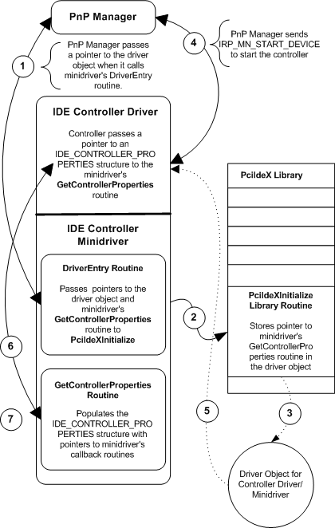

# Initializing and Calling IDE Minidriver Routines

## 

All IDE controller minidrivers must provide a series of standard routines that implement hardware-specific functionality. The following figure illustrates how an IDE controller minidriver makes its routines available to the controller driver. Note that the PciIdeX library, though conceptually separate from the IDE controller driver as illustrated in the figure that follows, is contained within the controller driver's executable file, *pciidex.sys*. When a minidriver calls a PciIdeX library routine, it is in fact calling a routine within the controller driver.

1.  The PnP manager loads the IDE controller driver-minidriver, then calls its [**DriverEntry**](https://msdn.microsoft.com/library/windows/hardware/ff544113) routine, passing it a pointer to the driver object for the controller driver.

2.  The minidriver's **DriverEntry** calls the [**PciIdeXInitialize**](https://msdn.microsoft.com/library/windows/hardware/ff563788) library routine, passing it a pointer to the minidriver's **GetControllerProperties** routine.

3.  **PciIdeXInitialize** stores the pointer to **GetControllerProperties** in the driver object.

4.  PnP manager dispatches an IRP\_MN\_START\_DEVICE request to the IDE controller driver to start the controller. The IDE controller driver receives the request in its [**DispatchPnP**](https://msdn.microsoft.com/library/windows/hardware/ff543341) routine and calls an internal routine that starts the device.

5.  The controller driver retrieves a pointer to **GetControllerProperties** that is stored in the driver object.

6.  The controller driver calls **GetControllerProperties**, passing it a pointer to an [**IDE\_CONTROLLER\_PROPERTIES**](https://msdn.microsoft.com/library/windows/hardware/ff559076) structure.

7.  **GetControllerProperties** loads pointers for a standard set of minidriver routines into IDE\_CONTROLLER\_PROPERTIES.

Once the minidriver populates the IDE\_CONTROLLER\_PROPERTIES structure with function pointers that point to the minidriver's routines, the controller driver can call them.

The routines that every minidriver must provide for the controller to call are as follows:

This routine determines whether the indicated channel is enabled.

This routine reports properties of the IDE controller hardware.

This routine indicates whether both channels of its controller can be accessed at once.

This routine returns the best PIO mode and the best DMA mode for each device indicated in *XferMode*.

This routine indicates which ultra-direct memory access (UDMA) transfer mode is current and which is best for the device.

This routine determines whether I/O can be done by means of DMA.

[**HwIdeXChannelEnabled**](https://msdn.microsoft.com/library/windows/hardware/ff557252)

[**HwIdeXGetControllerProperties**](https://msdn.microsoft.com/library/windows/hardware/ff557254)

[**HwIdeXSyncAccessRequired**](https://msdn.microsoft.com/library/windows/hardware/ff557256)

[**HwIdeXTransferModeSelect**](https://msdn.microsoft.com/library/windows/hardware/ff557260)

[**HwIdeXUdmaModesSupported**](https://msdn.microsoft.com/library/windows/hardware/ff557264)

[**HwIdeXUseDma**](https://msdn.microsoft.com/library/windows/hardware/ff557266)

 

 

