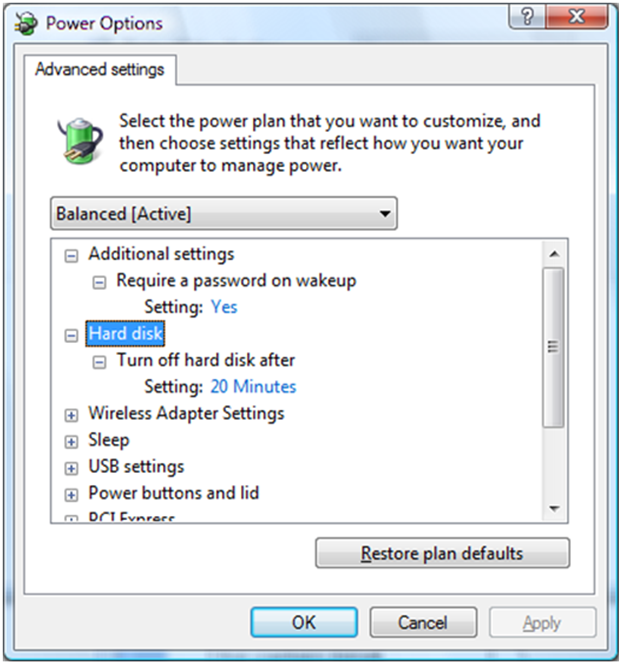

# IPM Configuration and Usage


Storport Idle Power Management (IPM) is not enabled by default. It can be enabled in the registry by setting the "EnableIdlePowerManagement" value in the "StorPort" subkey of the device's hardware key to any nonzero value. This can be done by using the device INF file or manually by using the registry editor.

The following sample text shows what you need to add to your device's INF file to enable the Storport Idle Power Management feature.

```cpp
          [DDInstall.HW]
          ; Enables Storport IPM for this adapter
          HKR, "StorPort", "EnableIdlePowerManagement", 0x00010001, 0x01
```

This can be done only from within the INF file's DDInstall.HW section where HKR points to the hardware key and not the service key. For more information about how to change an INF file, see [Introduction to Registry Keys for Drivers](http://go.microsoft.com/fwlink/p/?linkid=144533).

The Power Options control panel applet shown in the following screen shot is used to configure the system power policy and disk idle timeout value. It is accessible from **Start** &gt; **Control Panel** &gt; **Power Options**.



A command line tool (*Powercfg.exe*) can also be used. Type **powercfg /?** for usage information at the command prompt.

 

 


