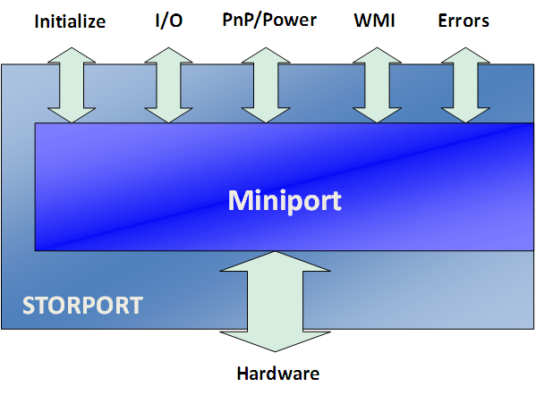
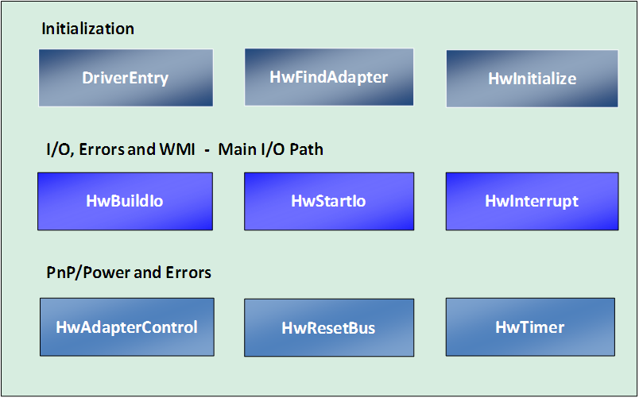

# Life Cycle of a Storport Driver

The life cycle of a Storport driver can be described in terms of the callback routines into the miniport driver from the Storport driver. The callback routines can be categorized into several main groups, as shown in Figure 1.

Several examples of each type of callback routine are shown in Figure 2. When the system starts and the driver is first loaded, the miniport driver's **DriverEntry** routine is called. This routine fills out a data structure that provides Storport with the miniport driver's entry points, also known as its callback routines, or callbacks. Near the end of this routine, the miniport driver calls [**StorPortInitialize**](/windows-hardware/drivers/ddi/storport/nf-storport-storportinitialize). The Storport driver then calls the miniport callback routine [**HwStorFindAdapter**](/windows-hardware/drivers/ddi/storport/nc-storport-hw_find_adapter), or in the case of a virtual miniport driver, [**VirtualHwStorFindAdapter**](/windows-hardware/drivers/ddi/storport/nc-storport-virtual_hw_find_adapter). After returning from that routine, the miniport driver's [**HwStorInitialize**](/windows-hardware/drivers/ddi/storport/nc-storport-hw_initialize) routine is called.

Storport then obtains the miniport driver's supported control types by calling its [**HwStorAdapterControl**](/windows-hardware/drivers/ddi/storport/nc-storport-hw_adapter_control) routine with **ScsiQuerySupportedControlTypes** as a parameter.

The main I/O path consists of a series of calls to [**HwStorBuildIo**](/windows-hardware/drivers/ddi/storport/nc-storport-hw_buildio) (except in the case of a virtual miniport driver) and [**HwStorStartIo**](/windows-hardware/drivers/ddi/storport/nc-storport-hw_startio). For more information, see [Unsynchronized HwStorBuildIo Routine](unsynchronized-hwstorbuildio-routine.md).

When the system is shutdown, [**HwStorStartIo**](/windows-hardware/drivers/ddi/storport/nc-storport-hw_startio) is called with an SRB of type SRB\_FUNCTION\_SHUTDOWN. When an adapter is removed or disabled while the system is running, or when the system is entering hibernate mode, [**HwStorAdapterControl**](/windows-hardware/drivers/ddi/storport/nc-storport-hw_adapter_control) is called with **ScsiStopAdapter** as a parameter. When the system is resuming from hibernate mode, **HwStorAdapterControl** is called with **ScsiRestartAdapter** as a parameter.

 

