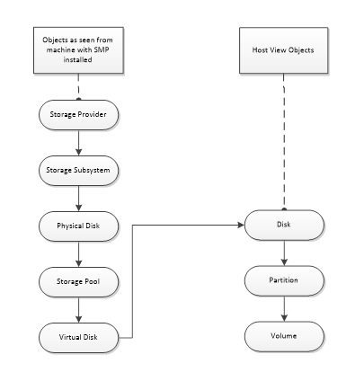

# Object Model

## High-Level Object Definition

The table below describes the objects exposed by the [Windows Storage Management API](windows-storage-management-api-portal.md) and their respective definitions. It includes objects that are visible to both Windows hosts and Storage Management Providers (SMPs), as well as objects that are “host-side only”.

| Term | Definition |
| ---- | ---------- |
| Storage Provider  | A Storage Provider enables administration of Storage Subsystems through a common management API by using a Storage Management Provider (SMP). Examples of Storage Providers include the Storage Spaces SMP, a third-party SMP, or a third-party SMI-S provider. |
| Storage subsystem | A Storage Subsystem exposes Virtual Disks to Windows. Storage Subsystems respond to administrative commands through corresponding Storage Providers. |
| Masking set       | A Masking Set contains Virtual Disks, Target Ports, and Initiator Ports, and is used for bulk mask/unmask operations. |
| Target port       | A Target Port represents an instance of an endpoint in a Storage Subsystem with associated properties for Show/Hide (Mask/Unmask) and Masking Set usage. Examples of Target Ports are FC, SAS, or iSCSI ports on corresponding controllers, present in Storage Subsystems. |
| Target portal     | TargetPortal is an endpoint used by IP based storage networks (such as iSCSI). It provides initiators the IP address for which they should discover target portals on. |
| Physical disk     | Physical Disks are units of usable storage with a basic set of attributes. Physical Disks do not have any resiliency, and have a fixed capacity. Physical Disks essentially represent physical spindles or equivalent. |
| Storage Pool      | Storage pool Storage Pools are composed of Physical Disks. Storage Pools are units of administration (e.g. for multi-tenancy) and associated isolation. All storage subsystems that support Storage Pools must expose a Primordial Pool (refer to “Primordial Pool”). |
| Virtual disk      | Virtual Disks are units of usable storage with an expanded set of attributes as compared to Physical Disks. Examples of the expanded set of attributes include resiliency, dynamic capacity extension, or others. Examples of Virtual Disks are LUNs or Storage Spaces. Virtual Disks, when exposed to Windows, show up as (Windows) Disks to the rest of the Windows stack. |
| (Windows) disk    | The (Windows) Disk object is a representation within Windows of usable storage. A Disk is instantiated either from a Physical Disk (e.g. a USB disk connected to Windows directly via a USB cable), or from a Virtual Disk (e.g. an EMC LUN that was unmasked to a particular Windows instance, OR a new Storage Space that has been activated on the Windows instance). |
| Partition         | A windows partition on a (Windows) Disk. |
| Volume            | A volume on a (Windows) partition. |
| Initiator port    | An Initiator Port represents an instance of an Initiator end point in the Windows host. This is a host side only object and is not visible to SMPs. It is a common object representing a port independent of the connection type (example - one instance of Initiator port could be representing a SAS port on SAS HBA, while another instance could be representing the iSCSI initiator). |
| Initiator Id      | Initiator Id This object represents a unique identifier for an Initiator Port. It is an array-side representation of InitiatorPort and is managed by SMPs. The InitiatorPort it is representing need not be instantiated on the machine InitiatorId is being used. This is used in conjunction with TargetPort to establish which InitiatorPort is allowed to access VirtualDisks from which TargetPort through the MaskingSet operations. |
| Resiliency setting | Resiliency setting describes the virtual disk redundancy capabilities supported by a particular Storage Pool. On the primordial pool, these settings represent capabilities supported by the Storage Subsystem. Examples of supported capabilities include resiliency modes (e.g. RAID Type) or others. |
| Offload Data Transfer setting | This describes the offload data transfer (ODX) settings for storage subsystem. |

## Windows Storage Management Object Model

The following diagram illustrates the relationships between the main objects exposed by the [Windows Storage Management API](windows-storage-management-api-portal.md).

## Mapping Between VDS and SMP Objects

The table below illustrates the mapping between VDS hardware objects and SMP objects.

| VDS Object Name | SMP Object Name |
| --------------- | --------------- |
| Provider        | StorageProvider |
| SubSystem       | StorageSubsystem |
| StoragePool     | StoragePool  |
| VDS_RAID_TYPE   | ResiliencySetting |
| Drive           | PhysicalDisk |
| LUN             | VirtualDisk |
| Controller/ControllerPort | TargetPort |
| --              | TargetPortal |
| HBAPort         | InitiatorPort (Host-side only entity) |
| --              | InitatorPort (Array-side representation of InitiatorPort) |
| --              | MaskingSet |
| IVdsAsync       | StorageJob |
| --              | OffloadDataTransferSetting |
