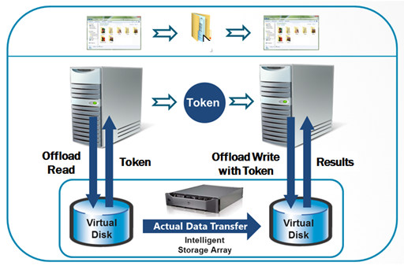
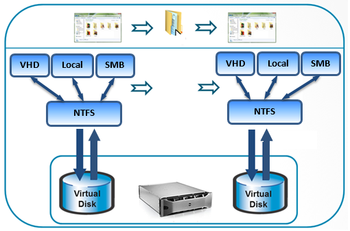

# Offloaded Data Transfer

## Overview

Offloaded Data Transfer (ODX) introduces a tokenized operation to move data on storage devices. A source file and a destination file can be on the same volume, two different volumes hosted by the same machine, a local volume and a remote volume through Server Message Block (SMB2 or SMB3), or two volumes on two different machines through SMB2 or SMB3. ODX was introduced in Windows 8.

The process of an offload copy operation on ODX-capable storage devices is shown in the following diagram and described below.

1. The copy application sends an offload read request to the copy manager of the source storage device.
2. The source copy manager returns a token. The token is a representation of data (ROD) to be copied.
3. The application sends an offload write request with token to the copy manager of the destination storage device.
4. The storage array copy manager moves the data from the source device to the destination device and returns the offload write result to the application.

## Identify an ODX-Capable Source and Destination

To support ODX, storage arrays must implement the related T10 standard specifications for ODX-capable storage arrays, including offload read and write operations with tokens. During the LUN device enumeration (a system boot or a plug-and-play event), Windows gathers or updates the ODX capability information of the storage target device through the following steps.

1. Query copy offload capability.
2. Gather the required parameters for copy offload operations and limitations.

By default, Windows tries the ODX path first for a copy operation if both the source and the destination LUNs are ODX-capable. If the storage device fails the initial ODX request, Windows marks the combination of the source and destination LUN as a “not ODX capable" path, and follows the legacy copy file code path.

## ODX Read/Write Operations

### Synchronous Command Adoption and APIs

A large offload write request is split using the following algorithm to ensure a robust synchronous offload write.

- If the target storage device does not provide an optimal transfer size, set the optimal transfer size at 64 MB.
- If the optimal transfer size set by the target device is greater than 256 MB, set the optimal transfer size at 256 MB.
- The optimal transfer size specified by the storage target device is greater than zero and less than 256 MB.

Synchronous offload read and offload write SCSI commands reduce the complication of MPIO and cluster failover scenarios. Windows expects the copy manager to complete the synchronous offload read/write SCSI commands within 4 seconds.

Applications can use [FSCTL](../ifs/offloaded-data-transfers.md), [DSM IOCTL](./data-set-management-overview.md), or [SCSI_PASS_THROUGH](./handling-scsi-pass-through-requests.md) APIs to interact with storage arrays and execute copy offload operations. To avoid data corruption or system instability, Windows restricts applications from writing directly to a volume that is mounted by a file system without first obtaining exclusive access to the volume. This is due to the condition that a write to the volume may collide with the file system writes. When such collisions occur, the contents of the volume may be left in an inconsistent state.

### Offload Read Operations

The offload read request of an application can specify the token lifetime (inactivity time-out). If the application sets the token lifetime to zero, the default inactivity timer is used as the token lifetime. The copy manager of the storage array maintains and validates the token according to its inactivity time-out value and credentials. The Windows host also limits the number of file fragments to 64. If the offload read request consists of more than 64 fragments, Windows fails the copy offload request and falls back to the traditional copy operation.

After completing the offload read request, the copy manager prepares a representation of data (ROD) token for the receive offload read result command. The ROD token field specifies the point-in-time representation of user data and protection information. The ROD can be user data in “open exclusively” or “open with share” format. The copy manager can invalidate the token according to its ROD policy setting. If the ROD is "open exclusively" for a copy offload operation, the ROD token can be invalidated when the ROD is modified or moved. If ROD is in “open with share” format, the ROD token remains valid when the ROD is modified. A ROD token is 512 bytes with the following format:

| Size in Bytes | Token Contents |
|---------------|----------------|
| 4             | ROD Token Type |
| 508           | ROD Token ID   |

Because the ROD token is granted and consumed only by the storage array, its format is opaque, unique, and highly secure. If the token is modified, not validated, or expired, the copy manager can invalidate the token during the offload write operation. The returned ROD token from the offload read operation has an inactive time-out value to indicate the number of seconds that the copy manager must keep the token valid for the next Write Using Token usage.

### Offload Write Operations

After receiving the ROD token from the copy manager, the application sends the offload write request with the ROD token to the copy manager of the storage array. When a synchronous offload write command is sent to the target device, Windows expects the copy manager to complete the command within 4 seconds. If the command is terminated because of command time-out or other error conditions, Windows fails the command. The application falls back to the legacy copy operation according to the returned status code.

The offload write request can be completed with one or multiple Receive Offload Write Result commands. If the offload write is partially completed, the copy manager returns with the estimated delay and the number of transfer counts to indicate the copy progress. The number of transfer counts specifies the number of contiguous logical blocks that were written without error from the source to the destination media. The copy manager can perform offload writes in a sequential or scatter/gather pattern.

When a write failure occurs, the copy progress counts contiguous logical blocks from the first logical block to the failure block. The client application or copy engine resumes the offload write from the write failure block. When the offload write is completed, the copy manager completes the Receive ROD Token Information command with the estimated status update delay set to zero and the progress of the data transfer count at 100 percent. If the receive offload write result returns the same progress of the data transfer count, Windows fails the copy operation back to the application after four retries.

A client application can also perform the offload write operation with a well-known ROD token. This is a predefined ROD token with a known data pattern and token format. One common implementation is called a zero token. A client application can use a zero token to fill one or more ranges of logical blocks with zeros. If the well-known token is not supported or recognizable, the copy manager fails the offload write request with “Invalid Token”. A well-known ROD token is 512 bytes with the following format:

| Size in Bytes | Token Contents     |
|---------------|--------------------|
| 4             | ROD Token Type     |
| 2             | Well Known Pattern |
| 506           | ROD Token ID       |

In an offload write with a well-known ROD token, a client application cannot use an offload read to request a well-known token. The copy manager verifies and maintains the well-known ROD tokens according to its own policy.

### Performance Tuning Parameters of ODX Implementation

Performance of ODX does not depend on the transport link speeds of the client-server network or storage area network (SAN) between the server and storage array. The data is moved by the copy manager and the device servers of the storage array.

Not every copy offload benefits from ODX technology. For example, the copy manager of a 1 Gbit iSCSI storage array could complete a 3 GB file copy within 10 seconds, and the data transfer rate will be greater than 300 MB per second. The data transfer rate already outperforms the maximum theoretical transfer speed of the 1 Gbit Ethernet interface.

Additionally, it is possible that copy performance for files of a certain size may not benefit from ODX technology. To optimize performance, use of ODX can be restricted to an allowable a minimum file size and maximum copy lengths. Note:

- Windows sets a minimum file size requirement for copy offload operations at 256 KB in the copy engine. If a file is less than 256 KB, the copy engine falls back to the legacy copy process.

- The Windows host uses a maximum token transfer size and optimal transfer count to prepare the optimal transfer size of an offload read or write SCSI command. The total transfer size in number of blocks must not exceed the maximum token transfer size. If the storage array does not report an optimal transfer count, Windows uses 64 MB as the default count.

The optimal and maximum transfer length parameters specify the optimal and maximum number of blocks in one range descriptor. Copy offload applications can comply with these parameters to achieve the optimal file transfer performance.

## ODX Error Handling and High Availability Support

When an ODX operation fails a file copy request, the copy engine and the Windows file system (NTFS) fall back to the legacy copy operation. If the copy offload fails in the middle of the offload write operation, the copy engine and NTFS resume with the legacy copy operation from the first failure point in the offload write.

The following is the algorithm of the copy offload operation using ODX.

### ODX Error Handling

ODX uses a robust error handling algorithm in accordance with the storage array’s features. If the copy offload fails in an ODX-capable path, the Windows host expects the application to fall back to the legacy copy operation. At this point, the Windows copy engine has already implemented the “fallback to traditional copy” mechanism. After the copy offload failure, NTFS marks the source and destination LUN as not ODX-capable for three minutes. After this period of time passes, the Windows copy engine retries the ODX operation. A storage array could use this feature to temporarily disable ODX support in some paths during highly stressful situations.

### ODX Failover in MPIO and Cluster Server Configurations

Offload read and write operations must be completed or canceled from the same storage link (I_T nexus).

When an MPIO or a cluster server failover occurs during a synchronous offload read or write operation, Windows handles the failover as follows:

- In the event of an MPIO path failover, Windows retries the failed ODX command. If the command fails again, Windows:
  - Initiates a cluster server node failover when part of a cluster server.
  - Issues a LUN reset to the storage device and returns an I/O failure status to the application if cluster server failover is not an option.

- In a cluster server configuration, the cluster storage service fails over to the next preferred cluster node and then resumes the cluster storage service. The offload application must be cluster-aware to be able to retry the offload read/write command after the cluster storage service failover.

If the offload read or write command failed after the MPIO path and cluster node failover, Windows issues a LUN reset to the storage device after the failover. The storage device terminates all outstanding commands and pending operations on the LUN.

Currently, Windows does not issue asynchronous offload read or write SCSI commands from the storage stack.

## ODX Usage Models

### ODX across Physical Disk, Virtual Hard Disk and SMB Shared Disk

To perform ODX operations, the application server must have access to both the source LUN and destination LUN with read/write privileges. The copy offload application issues an offload read request to the source LUN and receives a token from the copy manager of the source LUN. The copy offload applications use the token to issue an offload write request to the destination LUN. The copy manager then moves the data from the source LUN to the destination LUN through the storage network. The following diagram illustrates the most basic supported source and destination targets for offloaded data transfers.

### ODX Operation with One Server

In a single-server configuration, the copy offload application issues the offload read and write requests from the same server system.

The source server (or source VM) has access to both the source LUN (VHD or Physical Disk) and destination LUN (VHD or Physical Disk). The copy offload application issues an offload read request to the source LUN and receives the token from the source LUN. The copy offload application then uses the token to issue an offload write request to the destination LUN. The copy manager moves the data from the source LUN to the destination LUN within the same storage array.

### ODX Operation with Two Servers

In the two-server configuration, there are two servers and multiple storage arrays managed by the same copy manager.

- One server (or VM) is the host of the source LUN, and the other server (or VM) is the host of the destination LUN. The source server shares the source LUN with the application client through SMB protocol, and the destination server also shares the destination LUN with the application client through SMB protocol. The application client thus has access to both the source LUN and destination LUN.
- The source and destination storage arrays are managed by the same copy manager in a SAN configuration.
- From the application client system, the copy offload application issues an offload read request to the source LUN and receives the token from the source LUN, and then issues an offload write request with the token to the destination LUN. The copy manager moves the data from the source LUN to the destination LUN across two different storage arrays in two different locations.

### Massive Data Migration

Massive data migration is the process of importing a large amount of data such as database records, spreadsheets, text files, scanned documents, and images to a new system. Data migration could be caused by a storage system upgrade, a new database engine, or changes in application or business process. ODX can be used to migrate data from a legacy storage system to a new storage system, if the legacy storage system can be managed by the copy manager of the new storage system.

- One server is the host of the legacy storage system, and the other server is the host of the new storage system. The source server shares the source LUN as the data migration application client through SMB protocol, and the destination server shares the destination LUN as the data migration application client through SMB protocol. The application client thus has access to both the source and destination LUN.
- The legacy storage system and new storage system are managed by the same copy manager in a SAN configuration.
- From the data migration application client system, the copy offload application issues an offload read request to the source LUN and receives the token from the source LUN, and then issues an offload write request with the token to the destination LUN. The copy manager moves the data from the source LUN to the destination LUN across two different storage systems at two different locations.
- Massive data migration could be also operated with one server at the same location.

### Host-Controlled Data Transfer within a Tiered Storage Device

A tiered storage device categorizes data into different types of storage media to reduce costs, increase performance, and address capacity issues. Categories can be based on levels of protection needed, performance requirements, frequency of usage, and other considerations.

Data migration strategy plays an important role in the end result of a tiered storage strategy. ODX enables the host-controlled data migration within the tiered storage device. The following example describes ODX in a two-tiered storage device:

- The server is the host of the tiered storage system. The source LUN is the Tier1 storage device, and the destination LUN is the Tier2 storage device.
- All tiered storage devices are managed by the same copy manager.
- From the server system, the data migration application issues an offload read request to the source LUN and receives the token from the source LUN, and then issues an offload write request with the token to the destination LUN. The copy manager moves the data from the source LUN to the destination LUN across two different tier storage devices.
- When the data migration task is completed, the application deletes the data from the Tier1 storage device and reclaims the storage space.
