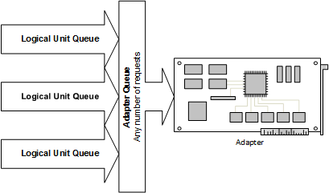

# Storport Queue Management

## 

To take advantage of the capabilities of high-performance storage adapters, miniport drivers must exert control over their device queues, pausing and resuming these queues in ways that will maximize efficiency.

In the SCSI Port queue model, queue management is the exclusive domain of the port driver. In the Storport queue model, the port driver supplies several queue management support routines that give the miniport driver a significant amount of queue management control.

In the Storport queue model, all requests are queued in the port driver in per-logical-unit queues. Without extended SRB support, each logical unit can have a maximum of 255 outstanding requests. Otherwise, the queue depth is only limited by available system resources or the capabilities of the adapter. When limit set for the queue depth is reached, Storport holds further requests to that logical unit until the number of outstanding requests to the unit drops below the queue maximum.

There are no predefined limits from Storport on the number of outstanding requests that an adapter can have. For example, an adapter with 55 logical units attached to it with a queue depth of 255 could post up to a maximum of 14,025 (55 x 255) requests at a time. See the following diagram for a description of the port driver's queuing model.

Port Driver's Queuing Model

If the adapter and a logical unit are both ready to receive a request, the system calls the miniport driver's [**HwStorBuildIo**](https://msdn.microsoft.com/library/windows/hardware/ff557369) and [**HwStorStartIo**](https://msdn.microsoft.com/library/windows/hardware/ff557423) routines in that order.

Unlike SCSI Port, Storport allows miniport drivers to notify the port driver of busy conditions. These communications are handled by the following eight routines, which allow the miniport driver to signal when either the logical unit or the adapter is paused or busy.

<table>
<colgroup>
<col width="50%" />
<col width="50%" />
</colgroup>
<thead>
<tr class="header">
<th align="left">Storport Routine</th>
<th align="left">Action Taken</th>
</tr>
</thead>
<tbody>
<tr class="odd">
<td align="left">
<a href="https://msdn.microsoft.com/library/windows/hardware/ff567461" data-raw-source="[&lt;strong&gt;StorPortPauseDevice&lt;/strong&gt;](https://msdn.microsoft.com/library/windows/hardware/ff567461)"><strong>StorPortPauseDevice</strong></a>
</td>
<td align="left">
Pause a device for a specified period of time.
</td>
</tr>
<tr class="even">
<td align="left">
<a href="https://msdn.microsoft.com/library/windows/hardware/ff567501" data-raw-source="[&lt;strong&gt;StorPortResumeDevice&lt;/strong&gt;](https://msdn.microsoft.com/library/windows/hardware/ff567501)"><strong>StorPortResumeDevice</strong></a>
</td>
<td align="left">
Resume a paused device.
</td>
</tr>
<tr class="odd">
<td align="left">
<a href="https://msdn.microsoft.com/library/windows/hardware/ff567459" data-raw-source="[&lt;strong&gt;StorPortPause&lt;/strong&gt;](https://msdn.microsoft.com/library/windows/hardware/ff567459)"><strong>StorPortPause</strong></a>
</td>
<td align="left">
Pause an adapter for a specified period of time.
</td>
</tr>
<tr class="even">
<td align="left">
<a href="https://msdn.microsoft.com/library/windows/hardware/ff567499" data-raw-source="[&lt;strong&gt;StorPortResume&lt;/strong&gt;](https://msdn.microsoft.com/library/windows/hardware/ff567499)"><strong>StorPortResume</strong></a>
</td>
<td align="left">
Resume a paused adapter.
</td>
</tr>
<tr class="odd">
<td align="left">
<a href="https://msdn.microsoft.com/library/windows/hardware/ff567050" data-raw-source="[&lt;strong&gt;StorPortDeviceBusy&lt;/strong&gt;](https://msdn.microsoft.com/library/windows/hardware/ff567050)"><strong>StorPortDeviceBusy</strong></a>
</td>
<td align="left">
Make a device busy until the device queue has completed a specified number of I/O requests.
</td>
</tr>
<tr class="even">
<td align="left">
<a href="https://msdn.microsoft.com/library/windows/hardware/ff567053" data-raw-source="[&lt;strong&gt;StorPortDeviceReady&lt;/strong&gt;](https://msdn.microsoft.com/library/windows/hardware/ff567053)"><strong>StorPortDeviceReady</strong></a>
</td>
<td align="left">
Make a busy device ready to receive requests again.
</td>
</tr>
<tr class="odd">
<td align="left">
<a href="https://msdn.microsoft.com/library/windows/hardware/ff567041" data-raw-source="[&lt;strong&gt;StorPortBusy&lt;/strong&gt;](https://msdn.microsoft.com/library/windows/hardware/ff567041)"><strong>StorPortBusy</strong></a>
</td>
<td align="left">
Make an adapter busy until it has completed a specified number of I/O requests.
</td>
</tr>
<tr class="even">
<td align="left">
<a href="https://msdn.microsoft.com/library/windows/hardware/ff567489" data-raw-source="[&lt;strong&gt;StorPortReady&lt;/strong&gt;](https://msdn.microsoft.com/library/windows/hardware/ff567489)"><strong>StorPortReady</strong></a>
</td>
<td align="left">
Make a busy adapter ready to receive requests again.
</td>
</tr>
</tbody>
</table>

 

While a device is paused or busy, the port driver sends no requests to the device. If a miniport driver completes a request with a busy status (SRB\_STATUS\_BUSY or SCSISTAT\_BUSY), the port driver will retry the request an indefinite number of times, until the request fails or is completed.

In addition to supplying a set of explicit queue management routines that are not available in the SCSI Port queue model, the Storport queue model does not use the implicit queue management routines that the SCSI Port employed. In particular, the **NextRequest** and **NextLuRequest** notifications are ignored.

 

 

