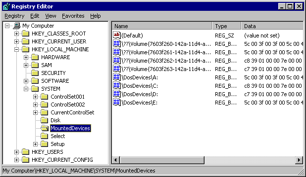

# Supporting Mount Manager Requests in a Storage Class Driver

## 

The mount manager (MM) is responsible for managing volume names. For each volume, it stores a name that is unique and is permanently identified with the volume, even after the volume has been removed from the system. It also manages less permanent names, like drive letters, that persist across reboots, but whose assignments can change as volumes are added to or removed from the system.

The mount manager provides a unique interface to each volume in the system by creating a symbolic link to the volume's device object. Since the symbolic links themselves and the device objects they target do not persist when the system restarts, the mount manager preserves the *name* of the symbolic link in a *persistent name database* in the registry.

This symbolic link name is called a *unique volume name*. Like a traditional volume label, it persists when the system restarts, but like a drive letter, and unlike a volume label, it is unique. The format for unique volume names is:

"**\\??\\Volume{**<em>GUID</em>**}\\**

where *GUID* is a globally unique identifier that identifies the volume.

Mount manager's persistent name database is located in the **MountedDevices** registry key of the SYSTEM hive (**HKLM/SYSTEM/MountedDevices**) of the registry. In addition to unique volume names, the mount manager also stores *mount point* names in its persistent name database. Mount point names can be further subdivided into two categories: Win32-style pathnames that serve as the root directory of the mounted volume's file system, and drive letters.

Each persistent symbolic link name in the database appears as the name of a registry value under the **MountedDevices** key accompanied by a *unique ID*. The unique ID is another unique identifier of a volume (different from the unique volume name). It helps identify which of the potentially numerous persistent symbolic link names refer to the same volume.

For instance, a single volume with a unique volume name of <strong>"\\\\?\\Volume{</strong>7603f260-142a-11d4-ac67-806d6172696f **}\\"** might have an accompanying drive letter "\\DosDevices\\D:" and two mount points "\\DosDevices\\C:\\mymount" and "\\DosDevices\\E:\\FilesysD\\mnt". This would produce four entries in mount manager's persistent symbolic link name database: one for the unique volume name, one for the drive letter, and two for the two mount point names. All four entries would share the same unique id. Thus someone viewing the **MountedDevices** registry key would be able to detect that all four persistent names point to the same volume.

The following acreen shot illustrates how persistent names appear in the **MountedDevices** registry key.

The mount manager relies on the Plug and Play device interface notification mechanism to alert it of volume arrival and removal. Therefore every client (that is, every volume driver, usually a class driver) must create an interface in the MOUNTDEV\_MOUNTED\_DEVICE\_GUID interface class by calling [**IoRegisterDeviceInterface**](https://msdn.microsoft.com/library/windows/hardware/ff549506) to notify the mount manager of the arrival in the system of the volume it manages. The MOUNTDEV\_MOUNTED\_DEVICE\_GUID interface class GUID is defined in *mountmgr.h*.

Upon receiving a Plug and Play notification of the arrival of a volume interface, mount manager sends the client three device control IRPs:

* [**IOCTL\_MOUNTDEV\_QUERY\_DEVICE\_NAME**](https://msdn.microsoft.com/library/windows/hardware/ff560437)
* [**IOCTL\_MOUNTDEV\_QUERY\_UNIQUE\_ID**](https://msdn.microsoft.com/library/windows/hardware/ff560441)
* [**IOCTL\_MOUNTDEV\_QUERY\_SUGGESTED\_LINK\_NAME**](https://msdn.microsoft.com/library/windows/hardware/ff560440)

In response to these three IOCTLs the client should return the volume's nonpersistent device object name (or target name) located in the **Device** directory of the system object tree (for example: "\\Device\\HarddiskVolume1"), the unique volume ID, and a suggested persistent symbolic link name for the volume, respectively. Although clients may elect to ignore [**IOCTL\_MOUNTDEV\_QUERY\_SUGGESTED\_LINK\_NAME**](https://msdn.microsoft.com/library/windows/hardware/ff560440), they are required to provide a unique volume ID upon receiving [**IOCTL\_MOUNTDEV\_QUERY\_DEVICE\_NAME**](https://msdn.microsoft.com/library/windows/hardware/ff560437) or IOCTL\_MOUNTDEV\_QUERY\_UNIQUE\_ID. The mount manager relies entirely upon the client to provide the unique volume ID, and if the client does not provide it, then the mount manager is not able to assign mount points, such as drive letters, to the volume.

For more information about these IOCTLs, see [I/O Control Codes Sent by the Mount Manager](https://msdn.microsoft.com/library/windows/hardware/ff561594).

If a client alerts the mount manager of the arrival of its volume but fails to provide a unique ID for the volume when queried, the volume is placed on a *dead mounted device* list. When this occurs, clients can send an [**IOCTL\_MOUNTMGR\_CHECK\_UNPROCESSED\_VOLUMES**](https://msdn.microsoft.com/library/windows/hardware/ff560454) IOCTL to the mount manager to request that the mount manager rescan its dead mounted device list and make another attempt to query the clients on the list for the unique IDs of their respective volumes. For more information about the IOCTL\_MOUNTMGR\_xxx IOCTLs, see [I/O Control Codes Sent by Mount Manager Clients](https://msdn.microsoft.com/library/windows/hardware/ff561593)

After the mount manager receives a unique volume ID for a newly introduced volume, then it searches its database for all of the persistent names assigned to that unique ID and creates symbolic links to the volume for each persistent symbolic link name.

When the mount manager detects that a volume has gone off line then it deletes the symbolic links pointing to the device object without deleting the corresponding symbolic link names in the mount manager's database.

For information about how mount manager clients create persistent symbolic names, see [**IOCTL\_MOUNTMGR\_CREATE\_POINT**](https://msdn.microsoft.com/library/windows/hardware/ff560457).

 

 

