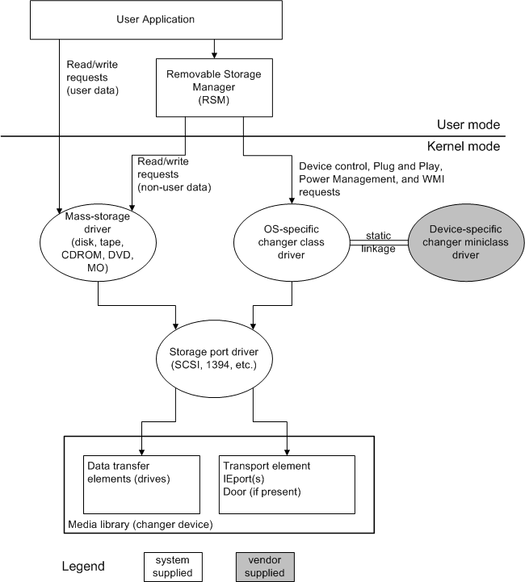

# The Changer Driver Model

## 

The following figure shows the relationship between a changer driver, user-mode applications and services, mass storage and port drivers, and a changer device.

Changer Driver Model

As shown in this figure, transfers of user data are handled by the appropriate mass storage driver for changer's drives, using the same Microsoft Win32 requests as for a stand-alone drive. However, a mass storage driver must handle the [**IOCTL\_STORAGE\_GET\_MEDIA\_TYPES\_EX**](https://msdn.microsoft.com/library/windows/hardware/ff560563) I/O request in order to control changer's drives.

User-mode applications access changer's elements through a user-mode service called the removable storage manager (RSM). RSM is the only client of a changer driver and it reserves the changer for exclusive use. RSM sends requests involving changer's elements (for example, to mount a piece of media in a drive) to the changer driver. User-mode applications cannot send requests directly to the changer driver. For details on RSM, see the Microsoft Windows SDK documentation.

The elements of a changer include:

-   *Transport element*

    The robotic component that moves media between other elements in the changer. Most changers have a single transport element with either one or two pickers that hold the media being moved. A high-end, fault-tolerant changer might have more than one transport element.

-   *Data transfer elements*

    The drives from which the data is read and written to media. For example, magnetic or optical disk, tape, CD-ROM, or DVD. Typically, a changer contains only one kind of drive.

-   *Storage elements*

    The slots in which media are stored when not mounted in drives.

A changer might also have either one or both of the following elements:

-   *Import/export*(IEport)

    An element where an operator can insert or remove one or more, but not all, media in the changer.

-   *Door*

    Provides access to all media in the changer at one time. A changer's door can be a physical door that an operator opens, or a single magazine that holds all media.

A changer miniclass driver reports the type and number of a changer's elements in a [**GET\_CHANGER\_PARAMETERS**](https://msdn.microsoft.com/library/windows/hardware/ff554979) structure when requested by the changer class driver. In particular, the miniclass driver must report IEports and doors according to these definitions, regardless of the elements' physical appearance, so that an application can issue appropriate requests to those elements.

 

 

