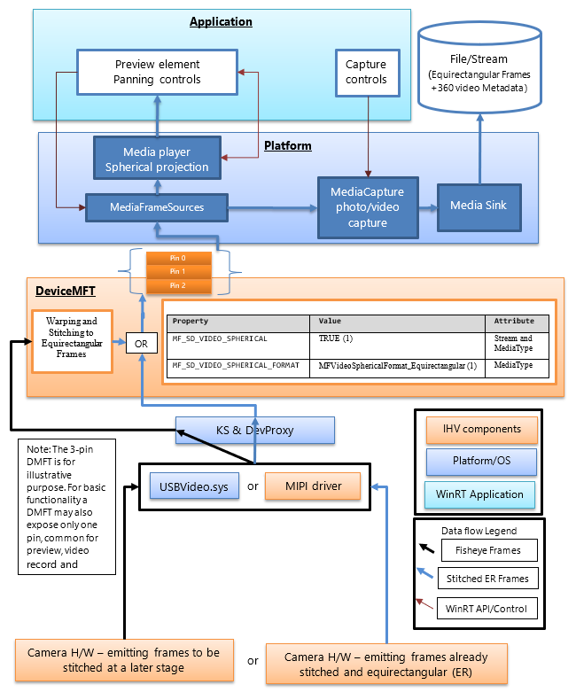
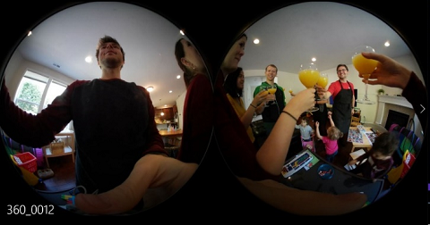
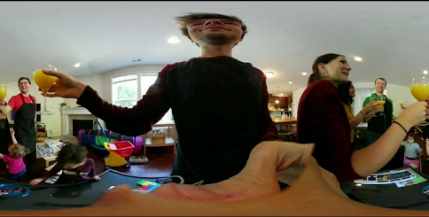
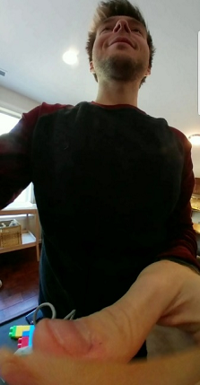

# 360 camera video capture

Windows 10, version 1803 provides support for 360 camera preview, capture, and record with existing MediaCapture APIs. This enables the platform to expose spherical frame sources (for example, equirectangular frames), enabling apps to detect and handle 360 video camera streams as well as to provide a 360 capture experience.

> [!NOTE]
> The [Cam360](https://github.com/Microsoft/Windows-Camera/tree/master/Tools/Cam360) sample available on GitHub shows how to support preview, video record, and photo capture scenarios with a 360 camera on Windows.

## Overview

A 360 camera IHV can provide DMFT plugins (with or without custom UVC drivers) which will expose the spherical format of each stream and media type that emits spherical frames, as well as process the camera driver output and provide equirectangular frames with appropriate attribute and metadata.

Most 360 cameras come with 2 sensors back-to-back and cover a 360 FoV with some overlap. An IHV would typically be capturing synchronously with the two fisheye sensors, unwarp and stitch the frames inside the DMFT to then output equirectangular frames.

These equirectangular frames can then be acquired and consumed by the apps via MediaCapture and MediaPlayer APIs to project a 360, spherical, panning video preview experience. The metadata provided via the DMFT will be leveraged by the platform to record the videos in MP4 format and enclose implicitly the proper standardized metadata. When played from within a 360-playback video player such as the **Movies & TV** app on Windows 10, the resulting recorded video will offer the expected spherical view panning experience.

360 camera usage:

-   For previewing a 360 frame, an application does need to explicitly use the XAML [MediaPlayerElement](https://docs.microsoft.com/uwp/api/windows.ui.xaml.controls.mediaplayerelement) for preview. An application also needs to explicitly handle UI interaction for panning around, via the [MediaPlaybackSphericalVideoProjetion.ViewOrientation](https://docs.microsoft.com/uwp/api/windows.media.playback.mediaplaybacksphericalvideoprojection) quaternion.

-   For 360 video record, a capture application does not need to be configured explicitly for 360 content if it is using [MediaCapture WinRT APIs](https://docs.microsoft.com/windows/uwp/audio-video-camera/basic-photo-video-and-audio-capture-with-mediacapture), as the spherical format is implicitly passed on to the record sink and written to the file header.

-   For 360 photo capture, an application needs to explicitly add the appropriate standardized metadata that specifies its spherical format using available [WIC WinRT APIs](https://docs.microsoft.com/windows/uwp/audio-video-camera/image-metadata).

It is up to the 360 camera IHV to implement a stream with a projected view and expose Pan/Tilt/Zoom controls.

The application may implement and insert an effect to generate a projection. The effect can leverage the attributes on the mediatype to identify equirectangular frames.


## Architecture


The following diagram illustrates the relationship of the DMFT to the 360 camera stack:



360 camera IHVs will publish a DMFT that will expose 360 video streams providing spherical frames of a defined format. The DMFT can be installed and associated with the particular camera via the use of INF file for driver extension as described in the example .INF below.

The stitching and conversion to equirectangular frames can take place in the camera hardware or inside the DMFT. It may be preferable to leverage the DMFT for this purpose, as it will allow use of hardware resources like GPU for efficient processing. The DMFT will also populate the following stream and media type properties (as shown in the table below) to identify them as 360 content streams.

Even if the IHV decides to have the stiching done in the camera hardware, a DMFT is still a mandatory requirement to populate the stream and media type attribute properties for 360 video.

The following table shows the required stream attribute to identify a spherical frame source:

<table>
<thead>
<tr class="header">
<th>Property name and GUID</th>
<th>
<p>Value</p>
</th>
<th>
<p>Attribute</p>
</th>
</tr>
</thead>
<tbody>
<tr class="odd">
<td><span id="_Hlk495398335" class="anchor"><span id="_Hlk495398374" class="anchor"></span></span>MF_SD_VIDEO_SPHERICAL<br />
{A51DA449-3FDC-478C-BCB5-30BE76595F55}</td>
<td>
<p>TRUE (1)</p>
</td>
<td>
<p>Stream and MediaType</p>
</td>
</tr>
<tr class="even">
<td><span id="_Hlk495398361" class="anchor"><span id="_Hlk495398391" class="anchor"></span></span>MF_SD_VIDEO_SPHERICAL_FORMAT<br />
{4A8FC407-6EA1-46C8-B567-6971D4A139C3}</td>
<td>
<p>MFVideoSphericalFormat_Equirectangular (1)</p>
</td>
<td>
<p>MediaType</p>
</td>
</tr>
</tbody>
</table>

The above property already exists as a part of **mfidl.idl**.

To leverage custom apps which perform stitching as well, an IHV has the option of exposing another unstitched 360 video media type with attributes set as
MF\_SD\_VIDEO\_SPHERICAL\_FORMAT to MFVideoSphericalFormat\_Unsupported(0). The custom application would have to select the unprocessed stream and handle it.

## Platform guidance

The platform already exposes all the stream attributes to the WinRT layer for applications via [MediaFrameSourceInfo.Properties](https://docs.microsoft.com/uwp/api/windows.media.capture.frames.mediaframesourceinfo), which can be searched for the MF\_SD\_VIDEO\_SPHERICAL GUID defined in the table above. However, most of the spherical configurations of platform elements will be managed implicitly by the platform. The properties can be queried by the application only for any extra functionality that the application developer may want to implement, for example, any custom effects that need to be inserted or removed depending on the sphericalness of the video.

The platform bypasses the inbox effects like face detection, scene analyzer and video stabilization (if added) when it detects the stream attribute property value indicating a spherical frame source.

The platform implicitly configures the media player element connected for preview for 360 video projection experience. The application has to call appropriate platform APIs to select media player element for preview. The application also has to implement the UI to control media player’s projection direction and angle. If the application chooses capture element for preview, the spherical projection experience cannot be leveraged.

The platform also implicitly configures the MP4 sink to record a 360 video (pass the appropriate video spherical format and related metadata if any available and supported) when the stream used contains the property defined in Table 1 – required stream atribute to indentify a spherical frame source.

| **MF\_SD\_VIDEO\_SPHERICAL\_FORMAT value (MFVideoSphericalFormat)**  | **SphericalVideoFrameFormat value** | **Interpretation**  |
|---|---|---|
| Property found in media type attributes set to value MFVideoSphericalFormat\_Equirectangular (1) | SphericalVideoFrameFormat. Equirectangular | The stream provides spherical frames in equirectangular format viewable via MediaPlayer Element. |
| Property found in media type attributes set to value MFVideoSphericalFormat\_Unsupported (0)     | SphericalVideoFrameFormat. Unsupported     | The stream provides spherical frames in another format which is not compatible with MediaPlayer Element. (May be a custom format supported by some Apps) |
| Property is absent from media type attributes.                                                   | SphericalVideoFrameFormat. None            | The stream provides regular non-spherical frames. (non-360) |

## Application guidance

The application can use the [MediaPlayerElement](https://docs.microsoft.com/uwp/api/windows.ui.xaml.controls.mediaplayerelement) XAML control, to leverage the 360 video spherical projection experience.

If the MF\_SD\_VIDEO\_SPHERICAL\_FORMAT property exists on the media type and is set to MFVideoSphericalFormat\_Equirectangular, the frames are then expected to be spherical and can be rendered appropriately via the [MediaPlayerElement](https://docs.microsoft.com/uwp/api/windows.ui.xaml.controls.mediaplayerelement) XAML control. The application can query the spherical format detected by the media player by checking the properties of MediaPlaybackSphericalVideoProjection obtained from the media player playback session (objMediaPlayer.PlaybackSession.SphericalVideoProjection). The application has to set the **isEnabled** property to **TRUE** to start the spherical projection.

If the application implements its own custom spherical projection component, then it can query the frame source via its [MediaFrameSourceInfo.Properties](https://docs.microsoft.com/uwp/api/windows.media.capture.frames.mediaframesourceinfo) for the spherical stream level video properties as described in the table above. However, all platform element configuration like media player preview and record sink will be configured implicitly by the platform on detection of the spherical video properties exposed by the camera DMFT on stream and mediatype attribuites.


## .INF file example to publish a DMFT

```INF
;=================================================================================
; Microsoft Sample Extension INF for USB Camera SampleDeviceMFT installation
; Copyright (C) Microsoft Corporation. All rights reserved.
;=================================================================================

[Version]
Signature="$WINDOWS NT$"
Class=Extension
ClassGUID={e2f84ce7-8efa-411c-aa69-97454ca4cb57}
Provider=%CONTOSO%
ExtensionId = {E4FE3A00-68CF-45A3-83C8-8347A6A38069} ; replace with your own GUID
CatalogFile.NT = SampleExtensionInfForDmftInstallation.cat
DriverVer=08/28/2017,10.0.17000.2000

[Manufacturer]
%CONTOSO% = ContosoSampleDeviceMFT,ntamd64

[ContosoSampleDeviceMFT.ntamd64]
%ContosoCamera.DeviceDesc% = ContosoSampleDeviceMFT_Install, usb\vid_xxxx&pid_xxxx&mi_xx  ; replace with your camera device VID PID

[ContosoSampleDeviceMFT_Install]
CopyFiles=ContosoSampleDeviceMFTCopy
AddReg=ContosoSampleDeviceMFT_COM.AddReg

;-----------------------------------------------------------------------------------
;
; Registers Device MFT COM object
;
;-----------------------------------------------------------------------------------

[ContosoSampleDeviceMFT_COM.AddReg]
HKCR,CLSID\%SampleDeviceMFT.CLSID%,,,%SampleDeviceMFT.FriendlyName%
HKCR,CLSID\%SampleDeviceMFT.CLSID%InProcServer32\,,,%%SystemRoot%%\ContosoSampleDeviceMFT.dll
HKCR,CLSID\%SampleDeviceMFT.CLSID%InProcServer32\,ThreadingModel,,"Both"

[ContosoSampleDeviceMFT_Install.Interfaces]
AddInterface=%KSCATEGORY_VIDEO_CAMERA%,,ContosoSampleDeviceMFT.Interfaces,

[ContosoSampleDeviceMFT.Interfaces]
AddReg=ContosoSampleDeviceMFT.AddReg

;-----------------------------------------------------------------------------------
;
; Add DeviceMFT CLSID to device interface instance registry key
;
;-----------------------------------------------------------------------------------

[ContosoSampleDeviceMFT.AddReg]
HKR,,CameraDeviceMftClsid,,%SampleDeviceMFT.CLSID%

;-----------------------------------------------------------------------------------
;
; File copy sections
;
;-----------------------------------------------------------------------------------

[SourceDisksFiles]
ContosoSampleDeviceMFT.dll=1

[SourceDisksNames]
1 = %MediaDescription%

[DestinationDirs]
ContosoSampleDeviceMFTCopy=11
DefaultDestDir = 11

[ContosoSampleDeviceMFTCopy]
ContosoSampleDeviceMFT.dll

[Strings]
CONTOSO = "Contoso Inc."
ContosoCamera.DeviceDesc = "Contoso Camera Extension"
MediaDescription="Contoso Camera Sample Device MFT Installation Media"
SampleDeviceMFT.CLSID = "{zzzzzzzz-zzzz-zzzz-zzzz-zzzzzzzzzzzz}" ; replace with your Device MFT COM object's CoClass ID
SampleDeviceMFT.FriendlyName = "Contoso Camera Device MFT"
KSCATEGORY_VIDEO_CAMERA="{E5323777-F976-4f5b-9B55-B94699C46E44}"
```

## Example frame flow with a UVC device

(1) Unstitched combined frame coming out of USBVdeo.sys:



(2) Frame unwarped, stitched and transformed to equirectangular inside a DMFT sent to the application's rendering element for preview, to a video sink or photo sink to be stored to file:



(3) Rendered viewport inside an application using a UI element that applies a spherical projection as well as provide viewport rotation panning and field of view interaction:




