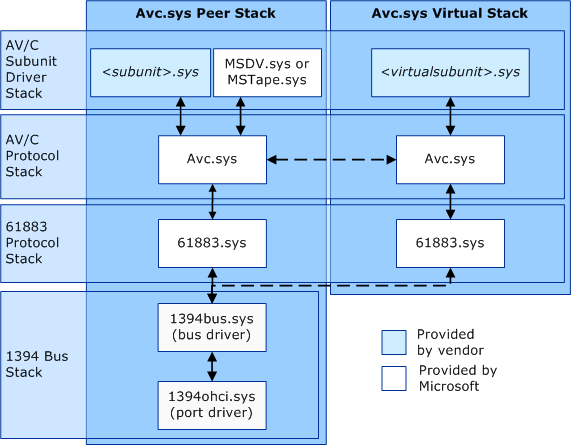

# AV/C Driver Stacks

## 

As AV/C devices are added to and removed from the IEEE 1394 bus, the Plug and Play manager loads and unloads the corresponding subunit drivers. Vendors implement unique AV/C subunit functionality by writing a subunit driver that Windows loads onto the IEEE 1394 stack above *Avc.sys*. *Avc.sys* uses functionality provided by the underlying IEEE 1394 and IEC-61883 drivers to control devices and to connect and manage plugs. For more information about these underlying driver stacks, see [The IEEE 1394 Driver Stack](https://msdn.microsoft.com/library/windows/hardware/ff538867) and [IEC-61883 Client Drivers](https://msdn.microsoft.com/library/windows/hardware/ff537188).

The peer driver stack is for subunits on external AV/C devices. In contrast, the virtual driver stack is a separate driver stack that exposes the computer as an AV/C device to other AV/C devices that are connected on the IEEE 1394 bus. The following diagram demonstrates the two different *Avc.sys* stacks.

At the base of the driver stacks are *1394ohci.sys* and *1394bus.sys*. These drivers provide the basic IEEE 1394 bus infrastructure support. There are instances of these drivers for each physical IEEE 1394 adapter in the system.

Stacked above *1394ohci.sys* and *1394bus.sys* is *61883.sys*. There is an instance of *61883.sys* for each IEC-61883-enabled node on the IEEE 1394 bus. The driver's *61883.sys* provides the following support for the IEC 61883 protocol:

-   Connection Management Protocol (CMP) IEC 61883-1

-   Common Isochronous Packet (CIP) IEC 61883-1

-   Function Control Protocol (FCP) IEC 61883-1

Stacked above *61883.sys* is *Avc.sys*, which supports the AV/C protocol, the Plug and Play enumeration of active subunits on each AV/C device, and AV/C subunit plug connection management and control. For more information about plug connection and format management, see [AV/C Subunit Plug Connection and Format Management](av-c-subunit-plug-connection-and-format-management.md).

Subunit drivers are stacked above *Avc.sys*. This is the layer where vendors implement the functionality that is unique to their AV/C subunit. Generally, for every physical instance of an AV/C subunit, there is a corresponding instance of that subunit's driver. That is, each device identifier (ID) is represented by an instance of *Avc.sys*. However, *Avc.sys* permits this behavior to be overridden based on the ***Vendor*** and/or ***Model*** fields of the device identifier of the AV/C unit. For more information about the ***Vendor***, ***Model***, ***SubunitType***, and ***SubunitID*** fields of device identifier strings generated by *Avc.sys* see [AV/C Device IDs](av-c-device-identifiers.md).

 

 

--------------------
[Send comments about this topic to Microsoft](mailto:wsddocfb@microsoft.com?subject=Documentation%20feedback%20%5Bstream\stream%5D:%20AV/C%20Driver%20Stacks%20%20RELEASE:%20%288/23/2016%29&body=%0A%0APRIVACY%20STATEMENT%0A%0AWe%20use%20your%20feedback%20to%20improve%20the%20documentation.%20We%20don't%20use%20your%20email%20address%20for%20any%20other%20purpose,%20and%20we'll%20remove%20your%20email%20address%20from%20our%20system%20after%20the%20issue%20that%20you're%20reporting%20is%20fixed.%20While%20we're%20working%20to%20fix%20this%20issue,%20we%20might%20send%20you%20an%20email%20message%20to%20ask%20for%20more%20info.%20Later,%20we%20might%20also%20send%20you%20an%20email%20message%20to%20let%20you%20know%20that%20we've%20addressed%20your%20feedback.%0A%0AFor%20more%20info%20about%20Microsoft's%20privacy%20policy,%20see%20http://privacy.microsoft.com/default.aspx. "Send comments about this topic to Microsoft")

