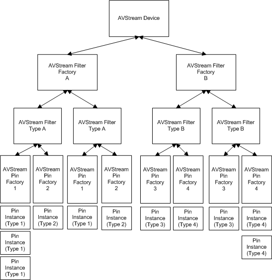

# AVStream Object Hierarchy

An AVStream minidriver can expose many different types of filters through a hierarchy such as the one in the following diagram.

The elements of this hierarchy are described in the next topic, [AVStream Descriptors](avstream-descriptors.md).

 

 

