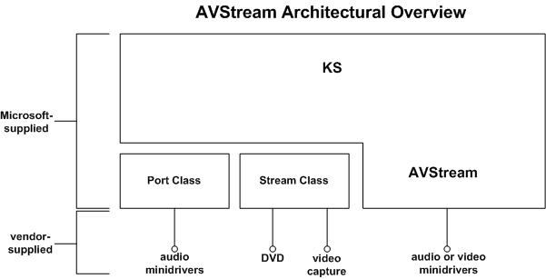

# AVStream Overview

AVStream is a Microsoft-provided multimedia class driver that supports video-only streaming and integrated audio/video streaming. Microsoft provides AVStream as part of the operating system, in the export driver *Ks.sys*. Hardware vendors write minidrivers that run under *Ks.sys*.

The preferred class driver for audio drivers is the Microsoft-provided audio [port class](https://msdn.microsoft.com/library/windows/hardware/ff536829) driver. Audio vendors should write minidrivers that run under *Portcls.sys*.

Microsoft supports the [stream class](https://msdn.microsoft.com/library/windows/hardware/ff568275) driver only for existing minidrivers.

AVStream drivers build on Microsoft Windows XP, Microsoft Windows Server 2003, or any platform Windows 98 Gold or later version that has DirectX 8.0 or later version installed.

If you build on an operating system earlier than Windows XP, make sure that you use the latest available DirectX Driver Development Kit (DDK). DirectX 9.0 contains updates for AVStream, kernel streaming components, and stream class.

AVStream offers significant advantages to the vendor by:

-   Requiring minidriver writers to produce less code.

-   Providing a unified kernel streaming class model for both audio and video minidrivers.

-   Providing support for vendors to write user-mode plug-ins. These are COM interfaces that provide methods to access property values. You can provide plug-ins without altering existing minidriver binaries. For more information, see [Kernel Streaming Proxy Plug-ins](kernel-streaming-proxy-plug-ins-design-guide.md).

In the AVStream driver model, vendors provide a minidriver that interacts with a Microsoft-provided class driver, as shown in the following diagram:

 

 

