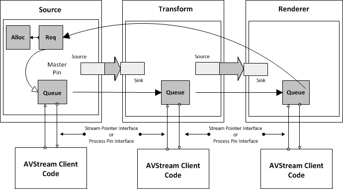
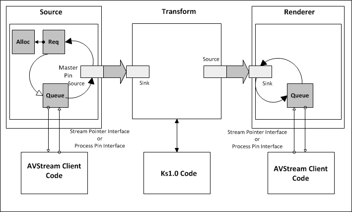
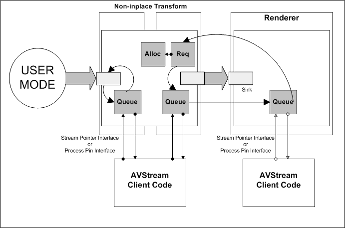

# AVStream Pipes and Circuits

A *pipe* is a set of AVStream filters that share a common [allocator](avstream-allocators.md).

The following illustration shows a pipe composed of three AVStream filters: a source filter, an [*inplace*](https://msdn.microsoft.com/library/windows/hardware/ff556290#wdkgloss-inplace) transform filter, and a renderer filter.

In this example, [KSProxy](https://msdn.microsoft.com/library/windows/hardware/ff560877) (not shown) has chosen an allocator, represented by the **Alloc** block in the diagram.

AVStream creates an internal requester object associated with the source filter. In the diagram, the requester appears as **Req**. The minidriver specifies in the **AllocatorFraming** member of [**KSPIN\_DESCRIPTOR\_EX**](https://msdn.microsoft.com/library/windows/hardware/ff563534) the type of memory and amount of continuous memory to assign to a frame. Accordingly, the requester obtains frames from the allocator and passes them to the next component in the circuit.

Data from the source filter flows into a transform filter implemented by another AVStream driver.

Finally, data flows into the renderer filter implemented by a third AVStream filter.

Since all of the pins in this graph are AVStream pins, AVStream uses its own internal transport interfaces instead of sending IRPs by means of [**IoCallDriver**](https://msdn.microsoft.com/library/windows/hardware/ff548336), reducing latency and improving performance.

Specifically, when the application causes the graph to transition to [**KSSTATE\_ACQUIRE**](https://msdn.microsoft.com/library/windows/hardware/ff566856) (for instance, when the user clicks **Play** in GraphEdit), AVStream directly connects the filter queues as shown above.

Therefore, frames sent downstream return to the requester, where they can be recycled when rendering is complete. This AVStream data path is a *circuit*.

Consider a second example, shown in the illustration below, in which the transform filter is not an AVStream filter, but is still a kernel-mode filter.

As in the first example, this example includes three filters: an AVStream source, a KS transform (this could be a driver that uses KS directly or a minidriver under stream class), and an AVStream renderer.

As in the first illustration, the pins are first interconnected. When the filter graph transitions to **KSSTATE\_ACQUIRE**, however, the Kernel Streaming 1.0 filter does not support the AVStream transport interface. As a result, AVStream does not bypass the pins; instead, it must use I/O to move data between filters.

Specifically, when a frame leaves the source filter's queue, AVStream calls [**IoCallDriver**](https://msdn.microsoft.com/library/windows/hardware/ff548336). In this call, the *Irp* parameter contains the frame to pass from the output pin of the source to the transform filter.

When the input pin of the renderer receives the IRP, the pin places the IRP in the queue. When the renderer driver completes a frame, it returns the frame to the input pin of the renderer, as shown in the second example.

AVStream now calls [**IoCompleteRequest**](https://msdn.microsoft.com/library/windows/hardware/ff548343) to return the frame upstream. The output pin of the source filter receives a completion notification. The minidriver's [*pin process callback*](https://msdn.microsoft.com/library/windows/hardware/ff556351) routine can then call [**KsStreamPointerUnlock**](https://msdn.microsoft.com/library/windows/hardware/ff567137) and move frames back to the requester to be recycled into the circuit.

Consider a final example in which the frame source is in user-mode. (Alternatively, the final frame destination could be in user-mode.)

In the illustration below, a kernel-mode [*non-inplace*](https://msdn.microsoft.com/library/windows/hardware/ff556313#wdkgloss-non-inplace) transform filter receives frames from a user-mode DirectShow filter and sends the transformed frame to a kernel-mode AVStream renderer:

When frames arrive from user mode, the AVStream pin object places them in the queue for the input pipe section.

The non-inplace transform filter allocates the transformed frames in kernel mode and then uses the second pipe as a circuit for these frames. Because the renderer is an AVStream filter, AVStream bypasses the pins and uses the AVStream transport interface to place the frames directly in the queue of the rendering filter.

The minidriver can [inject frames](frame-injection.md) into the circuit by calling [**KsPinSubmitFrame**](https://msdn.microsoft.com/library/windows/hardware/ff563529) or [**KsPinSubmitFrameMdl**](https://msdn.microsoft.com/library/windows/hardware/ff563530). If the minidriver uses this method, the AVStream requester receives frames as a result of these calls, rather than from a kernel-mode allocator.

 

 

