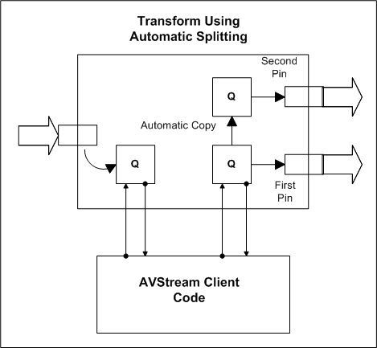
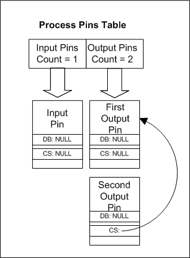
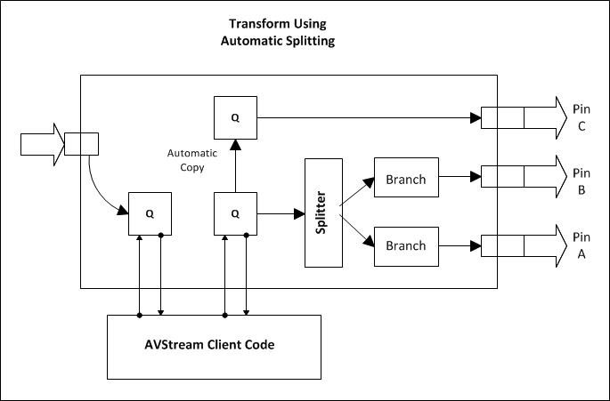
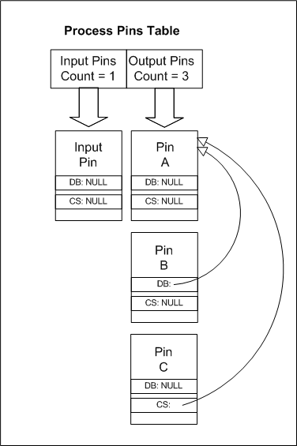

# AVStream Splitters

An AVStream minidriver can use AVStream class driver functionality to split a data stream into several copies as the stream passes through a given pin. This splitting process can be useful if your driver needs to copy an input stream to produce two identical output streams.

To do this, set KSPIN\_FLAG\_SPLITTER in the **Flags** member of the pin's [**KSPIN\_DESCRIPTOR\_EX**](https://msdn.microsoft.com/library/windows/hardware/ff563534) structure. When this flag is set on a pin, the pin acts as an automatic splitter. AVStream automatically copies all data necessary to split the stream.

In releases later than DirectX8.0, the KSPIN\_FLAG\_SPLITTER flag works for pins on both [filter-centric](filter-centric-processing.md) and [pin-centric](pin-centric-processing.md) filters. Prior releases support this flag only for pins on filter-centric filters.

The following diagram shows the configuration of a filter in which the input pin splits a stream into two output pins. The downstream filters of this output pin change data [*inplace*](https://msdn.microsoft.com/library/windows/hardware/ff556290#wdkgloss-inplace).

Frames arrive on the input pin and are placed into the input queue. The minidriver interacts only with the input queue and the output queue for the original pin. AVStream automatically copies data from the first pin's queue to the second pin's queue.

For simplicity, this diagram does not show how frames are supplied to the output pin. To supply frames to the output pin, for instance, there could be a requester and an allocator associated with each queue and belonging to this pipe section. Alternatively, the frames could come from a downstream filter.

In the [**KSFILTER\_DISPATCH**](https://msdn.microsoft.com/library/windows/hardware/ff562554) structure, the minidriver specifies a pointer to a vendor-supplied [*AVStrMiniFilterProcess*](https://msdn.microsoft.com/library/windows/hardware/ff556315) callback routine. This callback routine is where the minidriver receives a pointer to a [**KSPROCESSPIN\_INDEXENTRY**](https://msdn.microsoft.com/library/windows/hardware/ff564260) structure containing the array of [**KSPROCESSPIN**](https://msdn.microsoft.com/library/windows/hardware/ff564256) structures depicted below.

This diagram shows how the minidriver distinguishes between the two output pins in the process pins list:

In this diagram, DB refers to the **DelegateBranch** member of the [**KSPROCESSPIN**](https://msdn.microsoft.com/library/windows/hardware/ff564256) structure and CS refers to the **CopySource** member. Both the **DelegateBranch** and **CopySource** members of the input pin and the first output pin are **NULL**. This indicates that the minidriver is responsible for handling frames on these pins.

The second output pin, however, has a **CopySource** that points back to the first output pin. This indicates that the second output pin is in a separate pipe from the first output pin and that AVStream is automatically copying any data that is placed into the first output pin's queue into the second output pin's queue.

More complicated splitter cases can arise when two output pins are built into the same pipe. A minidriver could include two splitter-based output pins in the same pipe, for example, as long as downstream filters do not change the data sent from these pins. Because data is not modified, the output pins are considered read-only; both downstream filters receive the same buffers.

It is also possible that some of the downstream filters that automatically attach to the splitter pin change the data while others do not.

In this case, the filter layout could be similar to the following diagram, which depicts a filter that contains three instances of the split output pin:

Pins A and B are assigned to the same pipe because the downstream filters do not change the data; the filters downstream of A and B receive the same buffer pointers.

*The minidriver interacts only with the input queue and a single output queue.* AVStream automatically copies from the A/B queue and the C queue. It also creates a splitter object that sends the same data frames through pin A and pin B (note that the stream headers differ).

The array of [**KSPROCESSPIN**](https://msdn.microsoft.com/library/windows/hardware/ff564256) structures is as follows:

The only pin that the minidriver must interact with under normal circumstances is pin A.

To simplify the diagrams above, requesters and allocators were omitted from the diagrams. The diagrams are intended to demonstrate only the frame splitting process.

 

 

