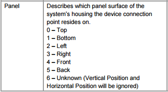
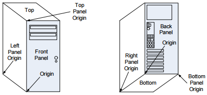
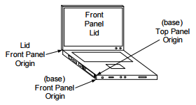
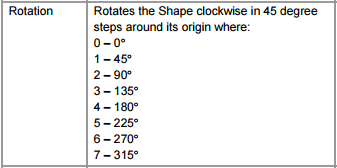
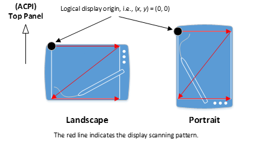
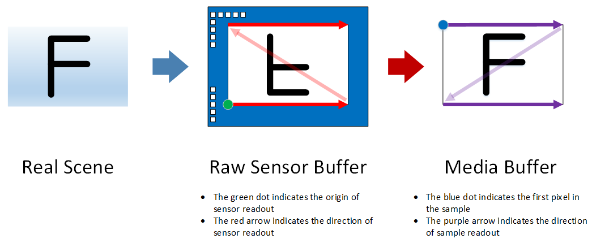
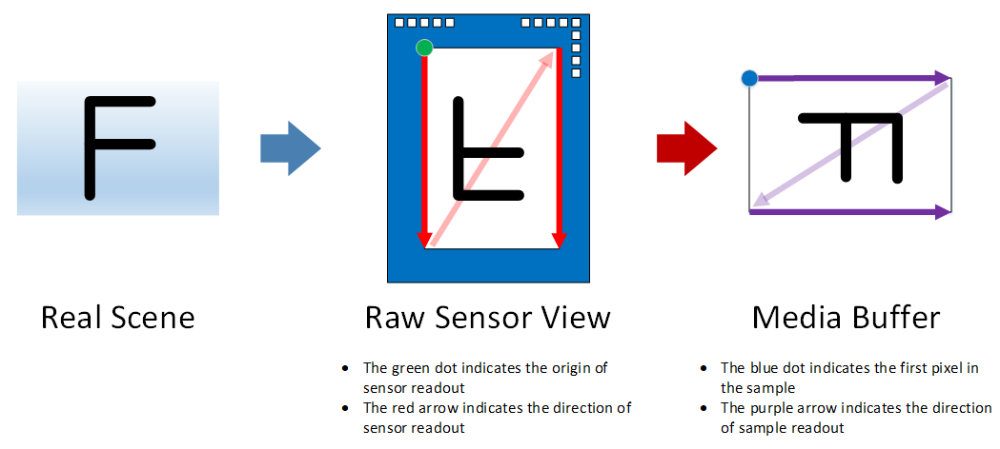
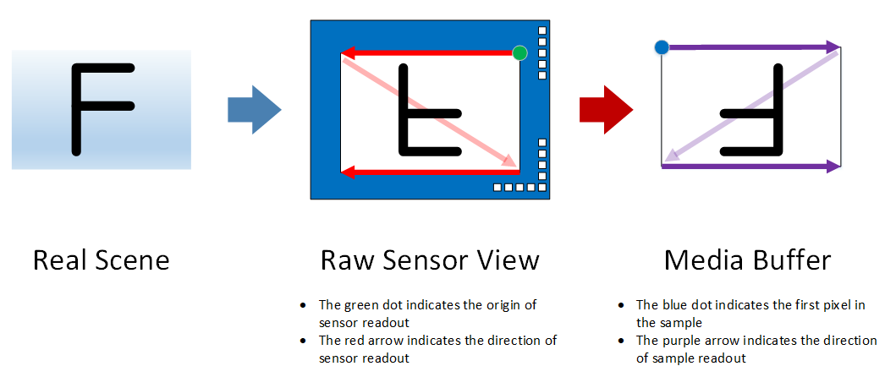
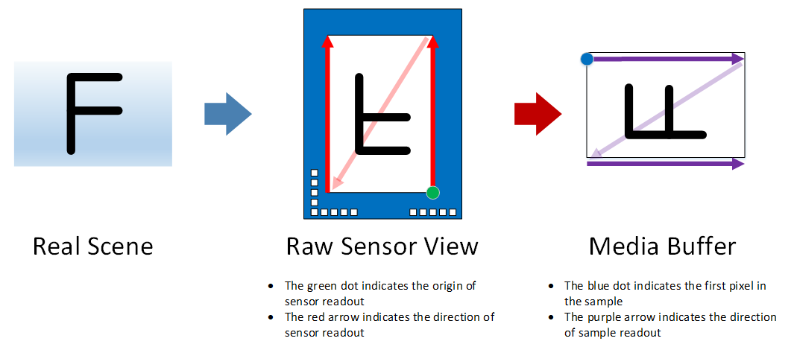

# Driver support for camera orientation

> [!IMPORTANT]
> The Auto-correct method discussed later in this topic is the *recommended* solution to non-reference orientation mounting of camera sensors. This is to ensure app compatibility since the majority of the applications already written to use camera feeds do not know to check for, nor correct for rotation information. Please carefully review the information in the auto-correct section below.

As different form factors computing devices are introduced, some of the physical constraints result in camera sensors being mounted in a non-traditional orientation. Because of this, it is necessary to properly describe to the OS and application, how the sensors are mounted so the resulting video can be rendered/recorded properly.

Starting with Window 10, version 1607, all camera drivers are required to explicitly specify the camera orientation regardless if the camera is mounted in accordance with the [Minimum hardware requirements](/windows-hardware/design/minimum/minimum-hardware-requirements-overview).
Specifically, a camera driver must set a newly introduced field, *Rotation*, in the ACPI \_PLD structure associated with a capture device interface:

```cpp
typedef struct _ACPI_PLD_V2_BUFFER {

    UINT32 Revision:7;
    UINT32 IgnoreColor:1;
    UINT32 Color:24;
    // …
    UINT32 Panel:3;         // Already supported by camera.
    // …
    UINT32 CardCageNumber:8;
    UINT32 Reference:1;
    UINT32 Rotation:4;      // 0 – Rotate by 0° clockwise
                            // 1 – Rotate by 45° clockwise (N/A to camera)
                            // 2 – Rotate by 90° clockwise
                            // 3 – Rotate by 135° clockwise (N/A to camera)
                            // 4 – Rotate by 180° clockwise
                            // 5 – Rotate by 225° clockwise (N/A to camera)
                            // 6 – Rotate by 270° clockwise
    UINT32 Order:5;
    UINT32 Reserved:4;

    //
    // _PLD v2 definition fields.
    //

    USHORT VerticalOffset;
    USHORT HorizontalOffset;
} ACPI_PLD_V2_BUFFER, *PACPI_PLD_V2_BUFFER;
```

For camera, the **Rotation** field in an ACPI \_PLD structure specifies the number of degrees ('0' for 0°, '2' for 90°, '4' for 180°, and '6' for 270°) a captured frame is rotated relative to the screen while the display is in its native orientation.

Based on the value in the **Rotation** field, an application can perform additional rotation, if necessary, in order to render captured frames correctly.

## Rotation Values

For those devices whose cameras and displays share the same housing (or *enclosure*/*casing*), it is possible to have these peripherals be mounted on different surfaces with each of them being rotated by a fixed yet arbitrary degrees on its respective plane. Consequently, an application needs a mechanism to describe the spatial relationship between the two peripherals such that a captured frame can be transposed onto the rendering surface in the correct orientation.

One way to solve the problem is to use the ACPI \_PLD structure which already has the concepts of *surface* and *degrees of rotation* defined. For example, the \_PLD structure already has *panel* field which specifies the surface on which a peripheral reside:



### Definition of ACPI \_PLD Panel field (Rev. 5.0a)

The next two diagrams illustrate the definition of each panel visually:

#### Panel definitions for desktop PCs and most devices



#### Panel definitions for foldable devices



In fact, the concept of an ACPI "panel" is already adopted by Windows where:

- A camera device interface is associated with a \_PLD structure with the Panel field being set accordingly if a capture device is statically mounted at a fixed location.

- An application can retrieve the panel on which a capture device resides by calling the [Windows.Devices.Enumeration.DeviceInformation.EnclosureLocation.Panel](/uwp/api/Windows.Devices.Enumeration.EnclosureLocation) property.

The ACPI \_PLD structure also has a Rotation field defined as follow:

#### Definition of ACPI \_PLD Rotation field (Rev 5.0a)



Instead of using the definition above as is, we further refine it to avoid ambiguity:

- For camera, the Rotation field in an ACPI \_PLD structure specifies the number of degrees (‘0’ for 0°, ‘2’ for 90°, ‘4’ for 180°, and ‘6’ for 270°) a captured frame is rotated relative to the screen while the display is in its native orientation.

## Landscape Primary vs Portrait Primary

In Windows, one can query the native display orientation by calling the property, [Windows.Graphics.Display.DisplayInformation.NativeOrientation](/uwp/api/Windows.Graphics.Display.DisplayInformation), which returns either **Landscape** or **Portrait**:



No matter which value **NativeOrientation** returns, the logical display scanning pattern starts from the top-left corner of the display moving from left to right downwards (see Figure 5). For those devices whose default physical orientation is inexplicit, this property not only implies the location of an ACPI *Top* panel but also provides the spatial relationship between a camera output buffer and the rendering surface.

Note that, unlike camera, the **NativeOrientation** property is not based on ACPI and thus does not have a \_PLD structure. This is true even if a display is statically mounted to a device.

When mounting on a Portrait Primary device, camera drivers must be aware that most applications will treat the device as outputting a landscape camera output buffer regardless of the actual camera output buffer orientation. Because of this, we recommend that camera drivers output a camera buffer that has a 90 degree orientation offset from the NativeOrientation Portrait when on a Portrait Primary device. This will then allow applications that are performing this additional rotation on portrait devices to correct the rotation to the expected orientation. This can be verified using the [Camera Application with Rotation Sample](https://github.com/microsoft/Windows-universal-samples/tree/master/Samples/CameraStarterKit/cs).

## Offset Mounting

IHV/OEMs are strongly encouraged to avoid mounting the sensor in a non-0 degree offset to maintain app compatibility. Many existing and legacy apps do not know to look for the ACPI’s PLD table, nor will attempt to correct the non-0 degree offset. Consequently, for such apps the resulting video will be rendered incorrectly.

In cases where IHV/OEMs are unable to mount the sensor in 0 degree orientation as described above, the following mitigation steps are recommended in the order of preference:

1. Auto-Correct the non-0 degree orientation within the Camera Driver (either in kernel mode with the AV stream miniport driver or in user mode using a plug in such as Device MFT or MFT0) so the resulting output frames are in the 0 degree orientation.

1. Declare the non-0 degree orientation via FSSensorOrientation tag so the Camera Pipeline can correct the captured image.

1. Declare the non-0 degree orientation in the ACPI’s PLD table as described above.

### Compressed/Encoded Media Types

For Compressed and/or Encoded Media Types (such as MJPG, JPEG, H264, HEVC), pipeline correct cannot be used. Because of this, Compressed/Encoded Media Types will be filtered out if the FSSensorOrientation is set to a non-zero value.

In the case of MJPG media types (such as those from a UVC camera), the Frame Server pipeline provides an auto-decoded media type (NV12 or YUY2 for DShow based applications). The auto-decoded and corrected media type will be presented, but the original MJPG format will not.

> [!NOTE!]
> If Compressed/Encoded Media Types must be exposed to applications, IHV/ODMs must not utilize the FSSensorOrientation correction. Instead, the correction must be done by the camera driver (either in kernel mode via the AV Stream driver or in user mode via DMFT/MFT0).

### Auto-Correct via AV Stream Miniport/Device MFT/MFT0

The *recommended* scenario if the sensors cannot be mounted with a 0 degree offset, is to have the AV Stream miniport driver (or the user mode plug ins in the form of either DMFT or MFT0) correct the resulting captured frame so it is exposed to the pipeline in a 0 degree offset.

When correcting the video frame from the AV Stream Miniport and/or the Device MFT/MFT0 plug in, the resulting media type declaration must be based on the corrected frame. If the sensor is mounted at a 90 degree offset so the resulting video is 9:16 aspect ratio from the sensor, but the corrected video would be 16:9, the media type must declare the 16:9 aspect ratio.

This includes the resulting stride information. This is necessary as the component responsible for doing the correction is controlled by the IHV/OEM and the camera pipeline does not have visibility into the video frame except after it has been corrected.

It is strongly encouraged that the correction be done in user mode and the API contract between the pipeline and the user mode plugin must be followed. Specifically, when using either the DMFT or MFT0, when the IMFDeviceTransform::ProcessMessage or IMFTransform::ProcessMessage is invoked with a MFT\_MESSAGE\_SET\_D3D\_MANAGER message, the user mode plugin must adhere to the following guideline:

- If no D3D manager is provided (the ulParam of the message is 0), the user mode plugin must NOT invoke any GPU operations to handle the Rotation correction. And the resulting frame must be provided in system memory.
- If D3D manager is provided (the ulParam of the message is the IUnknown of a DXGI Manager), that DXGI Manager must be used for Rotation correction and the resulting frame must be GPU memory.
- The user mode plugin must also handle the D3D manager message during runtime. When the MFT\_MESSAGE\_SET\_D3D\_MANAGER message is issued, the next frame produced by the plugin must correspond to the requested type of memory (i.e., GPU if DXGI Manager was provided, CPU otherwise).
- When the AV Stream driver (or the user mode plugin) handles the Rotation correction, the ACPI’s PLD structure’s Rotation field must be set to 0.

> [!NOTE]
> When Auto Correct is used, OEMs and IHVs must NOT advertise the actual orientation of the sensor via the \_PLD **Rotation** field. In this case, the **Rotation** field must indicate the orientation after the correction: 0 degrees.

## Declare via FSSensorOrientation

```INF
; Defines the sensor mounting orientation offset angle in
; degrees clockwise.
FSSensorOrientation: REG_DWORD: 90, 180, 270
```

By declaring the non-0 degree orientation of the sensor via the FSSensorOrientation registry tag, the camera pipeline can correct the captured frame before presenting it to the application.

The pipeline will optimize the rotation logic by leveraging GPU or CPU resources based on the use case and app request/scenario.

### ACPI PLD Rotation

ACPI PLD structure’s Rotation field must be 0. This is to avoid confusing applications which may use the PLD information to correct the frame.

### Media Type Information

Media Type presented by the driver must be the uncorrected media type. When informing the camera pipeline of the non-0 degree offset using the FSSensorOrientation entry, the media type information presented by the sensor must be the uncorrected media type. For example, if the sensor is mounted 90 degree clockwise offset, so instead of 16:9 aspect ratio, the resulting video is 9:16, the 9:16 aspect ratio media type must be presented to the camera pipeline.

This is necessary to ensure the pipeline can correctly configure the counter rotation process: The pipeline needs the input media type and the desired output media type of the application.

This includes the stride information. The stride information must be presented for the uncorrected media type to the camera pipeline.

### Registry Subkey

The FSSensorOrientation registry entry must be published on the Device Interface node. The recommended approach is to declare this as an AddReg directive during the AddInterface directive declaration in the camera driver’s INF.

The data presented in the FSSensorOrientation must be a REG\_DWORD and the only valid values accepted will be 90, 180, and 270. Any other value will be treated as 0 degrees offset (i.e., ignored).

Each value represents the sensor orientation in degrees clockwise. The camera pipeline will correct the resulting video frame by counter rotating the video by the same amount counter clockwise: i.e., a 90 degree clockwise declaration will result in a 90 degree counter clockwise rotation to bring the resulting video frame back to 0 degree offset.

### MS OS Descriptor 1.0

For USB based cameras, FSSensorOrientation may also be published via MSOS descriptors.

<!-- FIXME: Overview of OS descriptor could be removed -->
MS OS Descriptor 1.0 has two components:

- A fixed-length header section
- One or more variable length custom properties sections, which follows the header section

#### MS OS DESCRIPTOR 1.0 Header Section

The Header Section describes a single custom property (Face Auth Profile).

| Offset | Field      | Size (bytes) | Value  | Description                     |
| ------ | ---------- | ------------ | ------ | ------------------------------- |
| 0      | dwLength   | 4            | \<\>   |                                 |
| 4      | bcdVersion | 2            | 0x0100 | Version 1.0                     |
| 6      | wIndex     | 2            | 0x0005 | Extended property OS descriptor |
| 8      | wCount     | 2            | 0x0001 | One custom property             |

#### Custom MS OS DESCRIPTOR 1.0 Property Section

| Offset | Field                | Size (bytes) | Value                              | Description                                  |
| ------ | -------------------- | ------------ | ---------------------------------- | -------------------------------------------- |
| 0      | dwSize               | 4            | 0x00000036 (54)                    | Total size (in bytes) for this property.     |
| 4      | dwPropertyDataType   | 4            | 0x00000004                         | REG\_DWORD\_LITTLE\_ENDIAN                   |
| 8      | wPropertyNameLength  | 2            | 0x00000024 (36)                    | Size (in bytes) of the property name.        |
| 10     | bPropertyName        | 50           | UVC-FSSensorOrientation            | “UVC-FSSensorOrientation” string in Unicode. |
| 60     | dwPropertyDataLength | 4            | 0x00000004                         | 4 bytes for property data (sizeof(DWORD)).   |
| 64     | bPropertyData        | 4            | Offset angle in degrees clockwise. | Valid values are 90, 180, and 270.           |

### MS OS Descriptor 2.0

MSOS Extended Descriptor 2.0 can be used to define the registry values to add FSSensorOrientation support. This is done using the [Microsoft OS 2.0 Registry Property Descriptor](uvc-camera-implementation-guide.md#microsoft-os-20-registry-property-descriptor).

For the UVC-FSSensorOrientation registry entry, the following shows a sample MSOS 2.0 descriptor set:

```cpp
UCHAR Example2_MSOS20DescriptorSet_UVCFSSensorOrientationForFutureWindows[0x3C] =
{
    //
    // Microsoft OS 2.0 Descriptor Set Header
    //
    0x0A, 0x00,                 // wLength - 10 bytes
    0x00, 0x00,                 // MSOS20_SET_HEADER_DESCRIPTOR
    0x00, 0x00, 0x0?, 0x06,     // dwWindowsVersion – 0x060?0000 for future Windows version
    0x4A, 0x00,                 // wTotalLength – 74 bytes

    //
    // Microsoft OS 2.0 Registry Value Feature Descriptor
    //
    0x40, 0x00,                 // wLength - 64 bytes
    0x04, 0x00,                 // wDescriptorType – 4 for Registry Property
    0x04, 0x00,                 // wPropertyDataType - 4 for REG_DWORD_LITTLE_ENDIAN
    0x32, 0x00,                 // wPropertyNameLength – 50 bytes
    0x55, 0x00, 0x56, 0x00,     // Property Name - "UVC-FSSensorOrientation"
    0x43, 0x00, 0x2D, 0x00,
    0x46, 0x00, 0x53, 0x00,
    0x53, 0x00, 0x65, 0x00,
    0x6E, 0x00, 0x73, 0x00,
    0x6F, 0x00, 0x72, 0x00,
    0x4F, 0x00, 0x72, 0x00,
    0x69, 0x00, 0x65, 0x00,
    0x6E, 0x00, 0x74, 0x00,
    0x61, 0x00, 0x74, 0x00,
    0x69, 0x00, 0x6F, 0x00,
    0x6E, 0x00, 0x00, 0x00,
    0x00, 0x00,
    0x04, 0x00,                 // wPropertyDataLength – 4 bytes
    0x5A, 0x00, 0x00, 0x00      // PropertyData – 0x0000005A (90 degrees offset)
}
```

## Declare via ACPI PLD Information

As an option of last resort, PLD information can be leveraged as described above to indicate to the application that the video frame must be corrected before being rendered/encoded. However, as stated, many existing applications do not use the PLD information nor handle the frame rotation, so there will be scenarios where apps may not be able to render the resulting video properly.

The following figures illustrate the values of the \_PLD Rotation field for each hardware configuration:

### Rotation: 0 degree clockwise



In the figure above:

- The picture on the left illustrates the scene to capture.

- The picture in the middle depicts how a scene is viewed by a CMOS sensor whose physical readout order starts from the bottom-left corner moving from left to right upwards.

- The picture on the right represents the output of the camera driver. In this example, the content of the media buffer can be rendered directly while the display is its native orientation without additional rotation. Consequently, the ACPI \_PLD Rotation field has a value of 0.

### Rotation: 90 degrees clockwise



In this case, the content of the media buffer is rotated by 90 degrees clockwise compared to the original scene. As a result, the ACPI \_PLD Rotation field has a value of 2.

### Rotation: 180 degrees clockwise



In this case, the content of the media buffer is rotated by 180 degrees clockwise compared to the original scene. As a result, the ACPI \_PLD Rotation field has a value of 4.

### Rotation: 270 degrees clockwise



In this case, the content of the media buffer is rotated by 270 degrees clockwise compared to the original scene. As a result, the ACPI \_PLD Rotation field has a value of 6.