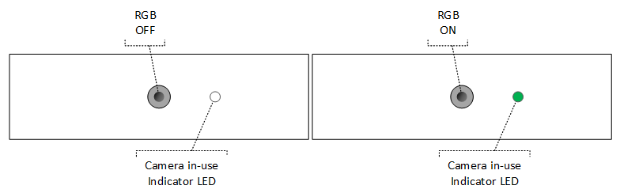
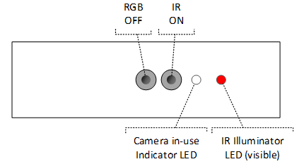
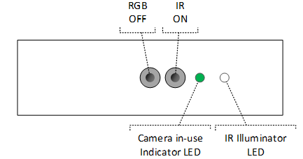
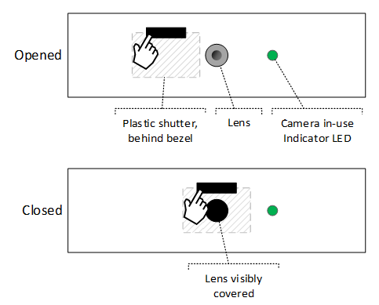
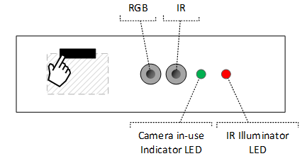
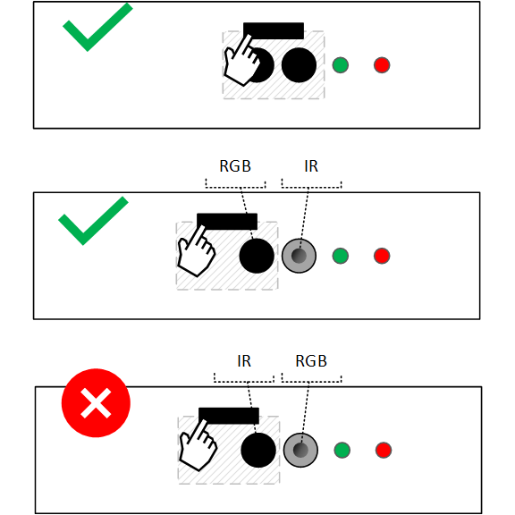
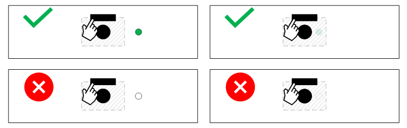
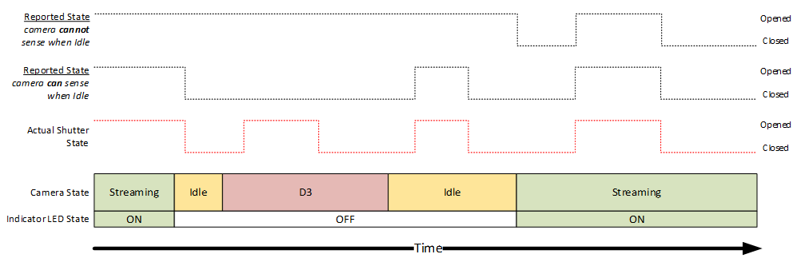
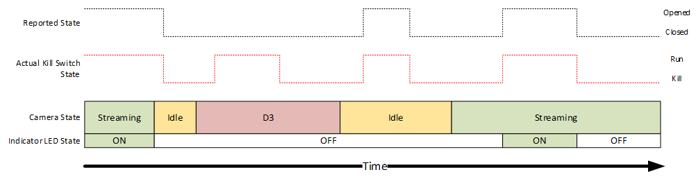

# Camera privacy controls

This topic provides device design guidance for privacy shutters or kill switches, considerations for shutter state sensing, and how shutters are expected to interact with existing HLK requirements for indicator LEDs.

## Common LED requirements

Regardless of shutters or kill switches, HLK requires that a visible indicator LED be ON when the ISP is capturing sensor data. For RGB cameras, if the camera is active, a single visible wavelength LED (for example, white, green, blue, and so on) must be ON:

For cameras with an RGB+IR sensor, this can be more complex because the IR camera requires an illuminator LED, and the illuminator LED may use a visible wavelength (850nm) or invisible wavelength (940nm). Additionally, apps may stream from the IR sensor by itself, the RGB sensor by itself, or both concurrently.

Designs using a visible wavelength IR illuminator may choose to use the IR illuminator LED as the visible indicator LED. This means that if the IR camera is on by itself, HLK requirements are satisfied by the IR illuminator LED being lit:

Designs using an invisible wavelength IR illuminator must use a visible wavelength LED to indicate when the IR camera is active, to satisfy HLK requirements. We recommend sharing the camera in-use indicator LED, so that the same visible wavelength LED turns on when the IR sensor and/or RGB sensor is ON:

We recommend all designs turn the regular in-use indicator LED ON when the IR **or** RGB camera is used, regardless of if the IR illuminator LED uses a visible wavelength or not. Here is the full table of core LED requirements:

| Stream state | Visible IR LED (850nm) | Invisible IR LED (940nm) |
|--|--|--|
| Camera off | LEDs **OFF** | LEDs **OFF** |
| Only RGB camera on | In-use indicator **ON**, IR illuminator **OFF** | In-use indicator **ON**, IR illuminator **OFF** |
| Only IR camera on | In-use indicator not required but recommended **ON** | In-use indicator **ON**, IR illuminator **ON** |
| RGB and IR camera on | In-use indicator **ON**, IR illuminator **ON** | In-use indicator **ON**, IR illuminator **ON** |

> [!NOTE]
> LED requirements can differ for designs with camera privacy shutters or camera kill switches. See [Camera privacy shutter LED requirements](#camera-privacy-shutter-led-requirements) for information with camera privacy shutters and [HLK LED requirements](#hlk-led-requirements) for camera kill switches.

### Always-on AI experiences (for example camera-based human presence)

For devices supporting always-on Camera-based AI features, where the AI silicon shares the main camera sensor, LED requirements differ when the dedicated presence silicon is exclusively accessing the camera. See the [Human Presence Whitepaper](https://partner.microsoft.com/dashboard/collaborate/packages/10214) on Microsoft Partner Center for details.

## Hardware privacy controls

When camera designs include hardware privacy controls, there are two key tenets of our design guidance:

1. Devices with privacy controls must provide a consistent user experience and confidence in the privacy state:

    - Once a customer learns how the shutter on their device looks and behaves, that knowledge should apply to any device they use that has a shutter.

1. Under no circumstances can a camera privacy control give a false impression of privacy:

    - Devices must not fail to deliver privacy when most important to the customer. If the camera privacy shutter is closed, or the camera kill switch is off, customers expect that no image can be captured until they interact with the physical control to deactivate the privacy feature.

### Types of controls

Two forms of privacy controls are defined, camera privacy shutters (mechanical and electromechanical) and camera kill switches. Depending on the device form factor, BOM cost targets, and price point of the device, an OEM may choose to implement the shutter in any of these forms. An important constant across all three is that they must act at the physical or hardware level, meaning no software is involved, since software can be compromised.

#### Mechanical camera privacy shutter

Mechanical shutters are the simplest design, these are a simple sliding lens cover that the user manually actuates to either block the camera or not. They are designed using an opaque material that fully blocks the lens when closed. This design is inherently foolproof in the sense that they physically cannot be compromised to open by any manner except the user sliding it.

#### Electromechanical camera privacy shutter

Electromechanical shutters are electrically controlled mechanical shutters. Rather than the user manually opening or closing the shutter, the integrated shutter opens/closes in response to the press of a physical button on the device.

> [!NOTE]
> While this solution will generally require firmware, it should be isolated from other components. In other words, the shutter controller and button should not have attack vectors such as communication busses or the ability for firmware to be reprogrammed. The design must require hardware interaction and not be controllable from software.

#### Camera kill switches

Some devices today ship with a camera kill switch feature, which physically disconnects the camera device from the system when turned off, providing a hardware control to block camera access without requiring a physical shutter to cover the lens/sensor. While this is robust against attacks, it creates a poor user experience. By removing the device when the switch is off, the system cannot tell that the chassis still has a camera in it but that it is just turned off. This is problematic from a UX perspective if the camera is unintentionally turned off by a user unaware of the switch, since applications will report that there are no cameras connected. It also can cause certain applications to crash or misbehave if the camera is removed during use or appears while the app is running.

Accordingly, Microsoft does not recommend or support the use of camera kill switches that remove the entire camera from the system. Instead, we recommend one of two solutions:

1. A physical shutter, as described in [Mechanical camera privacy shutter](#mechanical-camera-privacy-shutter) and [Electromechanical camera privacy shutter](#electromechanical-camera-privacy-shutter).

1. A kill switch that disconnects the sensor, rather than the ISP, and causes the ISP to synthesize black frames.

For the second solution, the camera still appears in the system, and apps can continue to use it. The ISP responds to all commands (start/stop streaming, DDIs like brightness or contrast, media type changes, and so on) normally, regardless of if the kill switch is active or not. However, when the kill switch is activated, the ISP stops capturing real data from the sensor and to instead synthesizes and streams black frames, all transparent from the application's perspective.

### Shutters with multiple cameras on a panel

When customers use devices with shutters (for example, shutters with multiple IR and RGB cameras on a panel) they expect that if the shutter is closed, privacy is protected against any unexpected camera access. When systems have two cameras on the same panel, such as an RGB and IR camera to support Windows Hello, it is important to ensure that the shutter does not give a false sense of security. Customers are not expected to understand that there may be a second camera sensor for Windows Hello, and some devices use a single sensor for RGB+IR. Due to this, the shutter must cover all cameras on the panel.

Ensuring shutters and kill switches apply to the IR camera is of utmost importance because the IR camera can be accessed by applications and produce reasonably high-fidelity images of the scene, as shown below. Failing to occlude the IR sensor would represent a false sense of security and breach of user trust in the shutter's privacy merit.

> [!NOTE]
> Windows Hello Face requires both an RGB and IR camera. If the RGB camera is occluded, Windows Hello will not function correctly. Both RGB and IR streams are used to enable anti-spoofing counter measures.

## Physical shutter design guidance (mechanical or electromechanical)

When a customer uses a device with a physical shutter, the shutter's presence gives a strong implied expectation about the level of privacy it provides. Put simply, that user expectation is that if my device has a shutter, and the shutter is closed, I am protected against any unexpected camera access. It is crucial that the implementation of the feature lives up to the implied expectations, else it loses all trust.

Furthermore, the entire concept of a privacy shutter is to provide a layer of security that is hardened against any practical software attack. In other words, if the device has a shutter and the system is fully compromised by malicious software, that software cannot compromise the privacy of the user. Again, to put simply, the expectation is that the shutter can only change state if the user physically interacts with the hardware shutter control on the device.

### Mechanical design considerations

Physical shutters, whether manually or electromechanically actuated, are expected to be made of an opaque material that fully blocks the sensor when closed and is visible to the naked eye:

As described in [Shutters with multiple cameras on a panel](#shutters-with-multiple-cameras-on-a-panel), devices with separate IR and RGB camera on the same panel must have both sensors blocked concurrently when the shutter is closed. Assume a dual-sensor design like the following:

When the shutter is closed, it must cover both sensors:

> [!NOTE]
> We currently support an exemption for cameras whose mechanical shutter designs do not cover the IR camera. When a physical shutter is occluding the RGB camera, it is acceptable for the ISP firmware to discard image output from the IR camera and replace it with a synthesized black image. A future HLK update will require physical shutters to physically occlude the RGB and IR camera, to ensure robustness of the solution and stronger protection of customer privacy.

### Camera behavior considerations

When a camera is equipped with a physical shutter, the camera must continue operating normally regardless of shutter state. If an app is streaming from the camera, it continues to capture and transmit real sensor data even if the shutter is closed. Full occlusion of the sensor by a closed shutter is expected to produce an image that is black or very close to it.

OEMs may choose to replace the image with a static image when the shutter is closed (for example, a picture of a camera with a slash through it). This image must be static and unable to be changed from software to protect against exploits. For devices with Privacy Shutters, the image replacement may occur within the ISP or within the driver, although replacement within the ISP is recommended to reduce the need for DMFTs and to add load to the host device.

### Camera privacy shutter LED requirements

LED requirements must follow the requirements specified [Common LED requirements](#common-led-requirements). This means that if any camera on the panel is on, a visible wavelength camera in-use indicator LED must remain on regardless of if the shutter is open or closed. However, it is acceptable for the shutter's physical design to cover the LED when the shutter is closed. The diagrams below illustrate a scenario when the camera is actively streaming:

For designs featuring both an IR and RGB camera, some manufacturers may wish to turn off the IR illuminator LED if the IR camera is used while the shutter is closed. We recommend against this as it adds a lot of complexity for little value; the IR camera will generally only be active if Windows Hello is running, and Windows Hello displays a message during this time that it's trying to log you in, but the shutter is closed. See [Kill switch implementation] (#kill-switch-implementation) for details.

However, if an 840nm (visible) IR illuminator LED is not the only in-use indicator LED for the IR camera (for example, a normal visible white/green/blue LED is illuminated when the IR camera is active), then a design may turn the IR illuminator LED OFF when the shutter is closed.

### Shutter state toggling mechanisms

Devices that implement privacy shutters must not allow any form of software control of the shutter, and must only open or close the shutter in response to the user explicitly interacting with the shutter control. This shutter control may be a mechanical slider, or a physical button that actuates an electromechanical shutter. No software may change shutter state, even if a hardware control can override the software and keep the shutter closed, since a closed shutter would not always mean that the privacy control is enabled. Likewise, the shutter may not open or close upon an app using the camera, for the same reason. In summary, if the user glances at the device and sees the shutter is closed, they must be able to unequivocally infer that their privacy is protected until they take physical action to open the shutter.

### Shutter state sensing and reporting

Many of the issues with in-market camera privacy designs stem from situations where a user unintentionally closes the shutter and cannot figure out why their camera is producing a blank image or not working. Accordingly, a key part of the Windows privacy shutter feature relies on the camera being able to reliably report its shutter state. With this information, applications can inform the user that the shutter is closed so they can react accordingly. Shutter state changes should be detected and reported as soon as possible after the event occurs.

Two methods are proposed for sensing shutter state, **Physical sensors**, and **Firmware-based detection**. Both methods report the detected shutter state through **CT_PRIVACY_CONTROL** if originating from a UVC device, or **KSPROPERTY_CAMERACONTROL_PRIVACY** if originating from an AVStream or DMFT driver.

See [Privacy shutter notification](privacy-shutter-notification.md) for more details.

#### Physical state detection sensor

Shutter state may be detected with a physical sensor that can detect if the shutter is opened or closed. Physical sensors can deterministically report the shutter state and may provide a more reliable experience. Microsoft does not have any specific guidance available on sensor designs, or specific recommendations for sensor technology.

#### ISP Firmware-based state detection

Some designs may opt to skip a physical shutter, and to instead use the firmware within the ISP to process the image and report the inferred shutter state. Such a solution would analyze the captured image in firmware and compare it against a threshold to determine if the shutter appears to be closed. This is a low-cost solution since it does not require any new parts and is also capable of detecting things like tape over a sensor. However, there are two important considerations when choosing to use such a design:

1. The design may falsely report a closed shutter in dark environments. However, this is expected to be a minimal risk/issue, as the camera would not be usable in such a low-light environment anyway.

1. Unless the ISP is capable of periodically sampling from the sensor whenever it is out of D3, this method prevents apps from being able to query accurate sensor state data until they start streaming from the camera.

The second consideration above creates a challenge. If the camera fails to report shutter state when it is not streaming, but an app was written to check and react to shutter state before streaming, bad things could happen. In response to feedback that we have received from partners, this requirement has been relaxed. We are also updating the API documentation to advise software developers against making decisions based on shutter state reported when not streaming. For example, we will explicitly advise app developers against disallowing the camera from being turned on if the shutter is reporting that it's closed.

To avoid risk of compatibility issues with apps that do not adhere to this advice, cameras which cannot sense shutter state when not streaming are expected to report that the shutter is OPEN whenever not streaming. Else if the camera can sense shutter state when not streaming, it's expected to detect and report the shutter state anytime it's not in D3.

> [!NOTE]
> Image analysis-based shutter detection algorithms should always be implemented in firmware as opposed to a driver, to avoid increasing CPU load and for maximum robustness.

Here is a diagram illustrating the expected behavior for a device with a camera privacy shutter:

### Camera privacy shutter behavior summary table

The following table summarized the expected behavior of a camera with a camera privacy shutter (manual or electromechanical):

| ISP state | Shutter state | Visible indicator LED | Image streamed to PC | Reported CT_PRIVACY_CONTROL state |
|--|--|--|--|--|
| Idle/D3 | Opened | Off\* | N/A | Opened |
| Idle/D3 | Closed | Off\* | N/A | Opened\*\* |
| Streaming (any app) | Opened | On\* | Captured sensor image | Opened |
| Streaming (any app) | Closed | On\* | Captured sensor image | Closed |

(\*) See [Camera privacy shutter LED requirements](#camera-privacy-shutter-led-requirements) and [Shutter state toggling mechanisms](#shutter-state-toggling-mechanisms) for details regarding indicator LED requirements.

(\*\*) See [Shutter state sensing and reporting](#shutter-state-sensing-and-reporting) for details, in some scenarios the shutter state will still update when not streaming.

## Kill switch design guidance

When a customer uses a device with a kill switch, they are putting trust into a hardware switch to robustly protect against any application attempting to capture their image. Put simply, that user expectation is that if my device has a kill switch, and the kill switch is activated, my privacy is protected against any unexpected camera access. It is crucial that the implementation of the feature lives up to the implied expectations, else it loses all trust.

Furthermore, the entire concept of a kill switch is to provide a layer of security that is hardened against any practical software attack. If the device has a kill switch and the system is fully compromised by malicious software, that software cannot override the kill switch and compromise the privacy of the user. Put simply, the expectation is that *the kill switch can only be activated/deactivated by the user physically interacting with the device.

Compared to privacy shutter designs, kill switches are more complex and carry more challenges to deliver with trust. This is because they carry the same level of expectation of robustness (a physical switch is expected to work flawlessly in all scenarios), but they do not provide the assurance that a physical shutter over the lens provides. This means that devices that offer kill switches must produce a consistent, clear, and reliable experience.

### Kill switch functionality

Kill switches operate by telling the ISP firmware to stop capturing from the sensor and to instead synthesize a black image. This way, the camera still is available and functional from the perspective of applications, but there is zero real sensor data being transmitted into the host OS when the kill switch is active. A robust design would operate as follows:

1. Physical signal from the switch connects to a GPIO on the ISP, to indicate if the switch is active or not

1. When the kill switch is active, the ISP:

    1. Electrically disconnects the sensor

    1. Begins synthesizing black frames to replace real frames from the disconnected sensor

    1. Reports that the shutter is closed through the privacy shutter notification feature

In practice, ISP silicon that supports this full experience, including an electrical disconnect of the sensor when the kill switch GPIO is active, is not yet available on the market. Accordingly, current designs will require modification of step 2a above to "*Stop the sensor or discard the sensor data within firmware*". We plan to work with ISP vendors to mitigate the need for this accommodation in future silicon.

> [!NOTE]
> It is critical that kill switch functionality be implemented in the ISP firmware, and not within a driver running on the host OS. Real image data from the sensor must not be transferred into the OS when the kill switch is in "kill" state.

Like with Privacy Shutters, OEMs may replace the image with a static image when the Kill Switch is in "kill" state. The image replacement may occur within the ISP or within the driver, although replacement within the ISP is recommended to reduce the need for DMFTs and to add load to the host device. If the image replacement is performed in the driver, note the requirement that real image data isn't transferred into the OS when the kill switch is in "kill" state still applies.

### Kill switch implementation

Kill switch state must not be software controlled, else a malicious application could write the control to activate or deactivate the kill switch. They should be controlled by a switch connected to a GPIO on the ISP.

It is important that when cameras kill switches are turned off, the camera still appears in the system and apps can still stream from it, the image just goes black. Frames continue to be delivered to the OS, and the camera continues to respond to controls; apps are unaware that the switch is in "kill" state unless the app is using the [CameraOcclusionInfo](/uwp/api/windows.media.devices.cameraocclusioninfo?view=winrt-22000&preserve-view=true) APIs. This allows the camera to be disabled via a hardware control without introducing confusing "camera not found" messages or risking certain applications crashing when flipping the switch.

As described in [Shutters with multiple cameras on a panel](#shutters-with-multiple-cameras-on-a-panel), devices with separate IR and RGB cameras on the same panel must have both sensors disabled concurrently when the kill switch is activated.

### HLK LED requirements

HLK requires that the indicator LED be ON when the ISP is capturing sensor data. Activating the kill switch means that the ISP must stop capturing real data from the sensor, so the LED is also expected to turn off with the kill switch. This avoids any confusion or breach of trust, if the customer sees a lit indicator or IR illuminator LED, they know that software is currently capturing their image, and if they do not see a lit LED, they know that they are not being captured.

### Kill switch state reporting

The state of the kill switch should be reported through CT_PRIVACY_CONTROL (if originating from a UVC device), or KSPROPERTY_CAMERACONTROL_PRIVACY (if originating from an AVStream or DMFT driver). The state of the Camera Kill Switch should be reported whenever the ISP is out of D3.

See [Privacy shutter notification](privacy-shutter-notification.md) for more details.

### Kill switch behavior summary table

The following table summarized the expected behavior of a camera with a camera kill switch:

| ISP state | Kill switch state | Visible indicator LED | Image streamed to PC | Reported CT_PRIVACY_CONTROL state |
|--|--|--|--|--|
| Idle/D3 | Run | Off\* | N/A | Open |
| Idle/D3 | Kill | Off\* | N/A | Close |
| Streaming (any app) | Run | On\* | Captured sensor image | Open |
| Streaming (any app) | Kill | Off\* | Synthesized blank frames | Close |

(\*) See [Camera privacy shutter LED requirements](#camera-privacy-shutter-led-requirements) and [Shutter state toggling mechanisms](#shutter-state-toggling-mechanisms) for details regarding indicator LED requirements.

## ISV guidance for shutter/switch events

When a camera with a privacy shutter or kill switch follows the guidance in this documentation, the shutter/switch state will be reported to the OS when the camera is streaming. Applications using the camera can then monitor shutter state change events and respond accordingly, such as by producing a helpful notice that the camera is blocked by a shutter or switch.

See the following APIs for more information:

[CameraOcclusionInfo Class](/uwp/api/windows.media.devices.cameraocclusioninfo?view=winrt-22000&preserve-view=true)

[CameraOcclusionState Class](/uwp/api/windows.media.devices.cameraocclusionstate?view=winrt-22000&preserve-view=true)

[VideoDeviceController.CameraOcclusionInfo Property](/uwp/api/windows.media.devices.videodevicecontroller.cameraocclusioninfo?view=winrt-22000&preserve-view=true)
