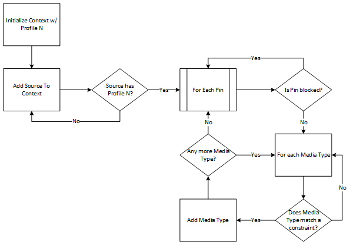

# Constraint match logic (Camera Profile V2)

When a Sensor Group (or a single device) is activated with a Camera Profile by initializing a Media Capture object, the following logic is used to determine which pins and media types are exposed to the client:

When an application initializes Media Capture with a specific profile, that profile is set on the Client Context object within the Frame Server.

Based on the presence of the selected profile, when a Source is added to the Client Context, a query is made to determine if the Source published a Camera Profile with the same Profile ID. If the Profile ID is not available on that Source, then that Source is a fully hidden Source. It is still added to the Client Context, but all pins from that Source is marked as hidden.

If the Source does declare a matching Camera Profile, then for each pin exposed by the Source, the Camera Profile is queried. If the pin is blocked, then the pin is marked as hidden. Otherwise, for each media type on that pin, the Pin Constraint is queried to determine if the media type has a match. Based on the constraints, if a match is available, the media type is added to the Client Context or otherwise, hidden.

This process is repeated until all media type, pins and Sources have been added to the Client Context. This process is repeated for any Sensor Group Transform that is part of the Client Context.

## Related articles

[Camera Profile V2 developer specification](camera-profile-v2-specification.md)
