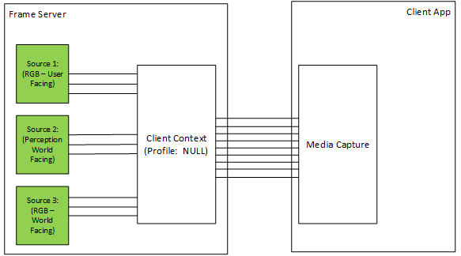
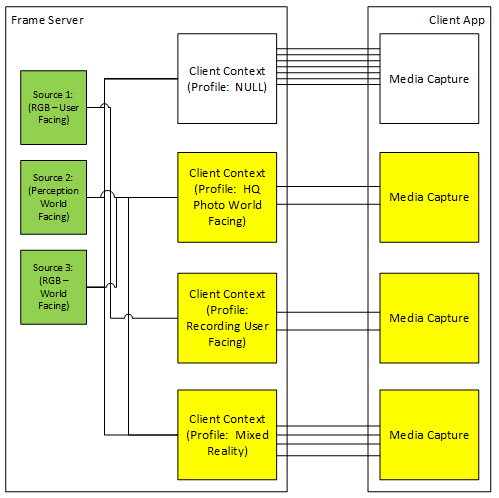

# Detailed design for ISVs (Camera Profile V2)

Consumption of Camera Profiles 1507 for ISV presented a significant challenge due to the complex nature of how profiles were presented and the fact that profiles were merely an informative data set, the underlying pipeline would still allow combinations of media types and streams that violated the hardware constraints.

ISVs still ran the risk of configuring the capture pipeline in a manner that would fail when streams were activated.

For Camera Profile V2, the configuration of a selected profile at initialization time of the Media Capture object will be communicated to the Frame Server and the Frame Server will only expose combinations of streams/media types that are valid within that profile.

Because of the low cost of creating multiple Media Capture objects when routed through the Frame Server, an application could precreate multiple instances of Media Capture objects using the same source. Only the first one created would incur a source creation latency. Subsequent instances simply take the already created source on the Frame Server and filter the set of streams/media types based on the profile.

An application that wishes to expose both a High Quality Photo mode and a Video Recording mode that contains either high frame rate video or 4K video, could create multiple instances of Media Capture objects each configured with a different profile for the same camera source. As long as only one of the Media Capture objects is actively streaming at any given time, switching between Media Capture object incurs little latency (typically the cost of a few RPC calls).

Camera Profile 1507 exposes profiles via the MediaCaptureVideoProfile object. This object is discovered through the MediaCapture factory by providing a specific device ID. This device centric view means an app that wishes to enable a specific scenario has to first enumerate/find the device of choice and use that to iterate through the available profiles.

Camera Profile V2 extends the API surface to continue providing a device centric API surface, but in addition to this, Camera Profile V2 will also provide a scenario driven profile enumeration.

Instead, of starting with a specific camera, an application starts with a specific scenario. For example, Video Recording using a World Facing Camera scenario.

This entry point provides the application of all available cameras that is suitable for that scenario. Depending on the specificity of the scenario, the resulting MediaFrameSourceGroup list may contain multiple entries. In some cases, it's possible there may not be any entries. For example, the Video Recording using the World Facing Camera for an All-In-One device that doesn't have a world facing camera would return an empty set.

The "language" used to describe the scenario allows for fallbacks based on minimum criteria. That is the language allows for "Video Recording with a preference for World Facing Camera and Highest Resolution possible with minimum frame rate of 30 fps".

## Profile Based Filtering

One of the major advantages of using the Frame Server architecture is the fact that the Client Context object on the Frame Server, which is a virtual representation of a Media Capture object on the client app, is decoupled from the physical source.

This allows multiple instances of Client Context objects using the same source(s) to be configured in specific modes of operation, which can include filtering of pins/media types that may conflict with the underlying use case.

Because the devices sources aren't part of the Client Context, creating multiple instances of Client Context objects with different configuration doesn't incur any significant overhead (just as much overhead needed to track the internal data structures).

The latency for creating/initializing a source is still there for the first Client Context, but once created, subsequent instances with either the same configuration or different configuration will incur only the added overhead of creating the internal data structures.

The following diagram shows how a Media Capture configured with null profile would be exposed by Frame Server through the Client Context:

In the above diagram, each of the sources expose three pins: Preview, Capture and Photo. And because a null profile was set, the resulting Media Capture exposes all nine pins to the application. The application can examine every pin and each media type available on each pin.

While this provides flexibility to the app, it also compounds the complexity of managing the state machine determining which combination of media types/pins may be activated simultaneously.

However, by utilizing the Profile Based Filtering:

The application can create multiple instances of Media Capture, each configured with a specific profile. In the above diagram, the null profile instance is left in as an illustration, the application can choose to not create the null profile instance.

The lower Media Capture objects are each configured with a specific profile. Based on the profile information published by the IHV/OEM of the sources, the resulting pipeline will only pull in the sources needed.

For the HQ Photo World Facing profile, only the Preview and Photo pins of the World Facing RGB (Source 3) would be exposed along with only the media types that the IHV/OEM has indicated will work for the photo operations. This assumes the IHV/OEM has indicated that for HQ Photo, simultaneous Capture isn't possible. If simultaneous Capture is allowed, the Capture pin, along with the media types that can be used for simultaneous photo and recording operations are exposed.

For the Recording User Facing, only the Preview and Capture pins of the User Facing RGB (Source 1) would be exposed. Again, the above diagram assumes that photo operations aren't possible when Capture pin is active.

For the Mixed Reality profile, the World Facing RGB and World Facing Perception video streams would be exposed to the client app. And again, only the media types that are guaranteed to work simultaneously are made available.

## Related articles

[Camera Profile V2 developer specification](camera-profile-v2-specification.md)
