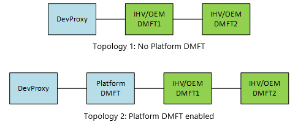

# Device MFT support (Camera Profile V2)

In scenarios where IHV/OEMs need to publish Camera Profiles based on runtime information (for example, one set of drivers used for multiple SKUs which are utilizing different sensors), camera drivers need to implement a Device MFT to publish the Camera Profiles.

During Device MFT's InitializeTransform call, the DMFT may publish Camera Profiles by providing the IMFSensorProfileCollection interface via the following attribute:

```cpp
// MF_DEVICEMFT_SENSORPROFILE_COLLECTION
// Data type: IUnknown
// IMFSensorProfileCollection interface that SGT Factory can provide to indicate new
// profiles available to the SG generation.
cpp_quote("EXTERN_GUID(MF_DEVICEMFT_SENSORPROFILE_COLLECTION, 0x36EBDC44, 0xB12C, 0x441B, 0x89, 0xF4, 0x08, 0xB2, 0xF4, 0x1A, 0x9C, 0xFC );")
```

This attribute must be set on the attribute store of the IMFTransform provided to the DMFT through the MF_DEVICEMFT_CONNECTED_FILTER_KSCONTROL attribute.

The following piece of code illustrates how the DMFT during the InitializeTransform method may provide a new Camera Profile.

For this sample, let's make some assumptions:

1. This is a 4 pin camera.

1. Pin 0 – Capture, Pin 1 – Preview, Pin 2 – Photo and Pin 3 – IR stream.

```cpp
IFACEMETHODIMP
SampleDMFT::InitializeTransform(
    _In_ IMFAttributes *pAttributes 
    )
{
    ComPtr<IMFTransform>                spTransform;
    ComPtr<IMFAttributes>               spAttributes;
    ComPtr<IMFSensorProfileCollection>  spProfileCollection;
    ComPtr<IMFSensorProfile>            spProfile;


    if (nullptr == pAttributes)
    {
        return E_INVALIDARG;
    }

    RETURN_IF_FAILED (pAttributes->GetUnknown(MF_DEVICEMFT_CONNECTED_FILTER_KSCONTROL, 
                                              IID_PPV_ARGS(&spTransform)));
    RETURN_IF_FAILED (spTransform->GetAttributes(&spAttributes));

    // Create an empty collection...
    RETURN_IF_FAILED (MFCreateSensorProfileCollection(&spProfileCollection));

    // Create various profiles we want to publish.
    // For the legacy profile, we don't want to expose the IR stream since
    // legacy apps will not be able to consume it.
    RETURN_IF_FAILED (MFCreateSensorProfile(KSCAMERAPROFILE_Legacy, 0, nullptr, &spProfile));
    RETURN_IF_FAILED (spProfile->AddProfileFilter(0, L"((RES==;FRT<=30,1;SUT==))"));
    RETURN_IF_FAILED (spProfile->AddProfileFilter(1, L"((RES==;FRT<=30,1;SUT==))"));
    RETURN_IF_FAILED (spProfile->AddProfileFilter(2, L"((RES==;FRT<=30,1;SUT==))"));
    RETURN_IF_FAILED (spProfile->AddProfileFilter(3, L"(!)"));
    RETURN_IF_FAILED (spProfileCollection->AddProfile(spProfile));
    spProfile = nullptr;

    // For the High Frame Rate recording profile, we only support 60fps or
    // higher on the record pin and any on the preview (since preview only
    // exposes 30fps).
    RETURN_IF_FAILED (MFCreateSensorProfile(KSCAMERAPROFILE_HighFrameRate, 0, nullptr, &spProfile));
    RETURN_IF_FAILED (spProfile->AddProfileFilter(0, L"((RES==;FRT>=60,1;SUT==))"));
    RETURN_IF_FAILED (spProfile->AddProfileFilter(1, L"((RES==;FRT==;SUT==))"));
    RETURN_IF_FAILED (spProfile->AddProfileFilter(2, L"(!)"));
    RETURN_IF_FAILED (spProfile->AddProfileFilter(3, L"(!)"));
    RETURN_IF_FAILED (spProfileCollection->AddProfile(spProfile));
    spProfile = nullptr;

    // For the Face Auth, we can handle any media type on the preview but we
    // want to remove the photo and record pins and allow the IR pin to only
    // expose one media type:  VGA@60fps with L8.
    RETURN_IF_FAILED (MFCreateSensorProfile(KSCAMERAPROFILE_FaceAuth_Mode, 0, nullptr, &spProfile));
    RETURN_IF_FAILED (spProfile->AddProfileFilter(0, L"(!)"));
    RETURN_IF_FAILED (spProfile->AddProfileFilter(1, L"((RES==;FRT==;SUT==))"));
    RETURN_IF_FAILED (spProfile->AddProfileFilter(2, L"(!)"));
    RETURN_IF_FAILED (spProfile->AddProfileFilter(3, L"((RES==640,480;FRT==60,1;SUT==L8))"));
    RETURN_IF_FAILED (spProfileCollection->AddProfile(spProfile));
    spProfile = nullptr;

    // Set the profile collection to the attribute store of the IMFTransform.
    RETURN_IF_FAILED (spAttributes->SetUnknown(MF_DEVICEMFT_SENSORPROFILE_COLLECTION, 
                                               spProfileCollection));

    // ... Reset of the InitializeTransform logic...
 }
```

The MF_DEVICEMFT_SENSORPROFILE_COLLECTION must be published into the connected IMFTransform's attribute store before the InitializeTransform() method returns.

## Chained DMFT

In the scenario where multiple DMFTs are chained within the device source, the DMFT responsible for publishing the Camera Profile must be configured by the IHV/OEM as the first transform in the chain following DevProxy or Platform DMFT if Platform DMFT is enabled.

For example, publishing Camera Profiles from IHV/OEM DMFT1 in the following topologies is supported:



In Topology 1 and 2, only DMFT1 may publish Camera Profiles. Any Camera Profile published by DMFT2 will be ignored.

## M-in, N-out Device MFT

One of the features supported by Device MFTs is the ability to take in an arbitrary number of input streams and expose a different number of output streams.

Because the profile logic requires pin ID to identify the profile filter information, the pin mapping must be consistent.

The IMFSensorProfileCollection published by the Device MFT must use the Pin numbering based on the output pin of the DMFT. The Pin ID in this case must match the MF_DEVICESTREAM_STREAM_ID attribute presented on the output pin's attribute store.

To avoid possible pin ID collision, the DMFT MUST remove the MF_DEVICESTREAM_TRANSFORM_STREAM_ID. The MF_DEVICESTREAM_TRANSFORM_STREAM_ID is only presented by the DevProxy and only meaningful within the context of the DevProxy. For an M-in, N-out DMFT, the MF_DEVICESTREAM_TRANSFORM_STREAM_ID is undefined.

## Related articles

[Camera Profile V2 developer specification](camera-profile-v2-specification.md)
