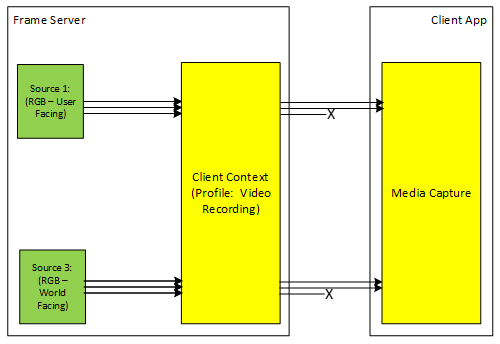

# Sensor group configuration (Camera Profile V2)

When a sensor group is configured with a specific profile, activation of that sensor group results in only the streams that are available through that profile being available.

Using the sample profiles, if we activate the Camera WF + Camera UF sensor group with `[KSCAMERAPROFILE_VideoRecording,2000]` profile ID, then the resulting Media Capture object has a Preview and Capture stream from Camera WF and Preview & Capture stream from Camera UF.

The available media types on the Preview/Capture of each of those streams are limited to what is declared to be available through the `[KSCAMERAPROFILE_VideoRecording,2000]`, as shown in the diagram.

## Related articles

[Camera Profile V2 developer specification](camera-profile-v2-specification.md)
