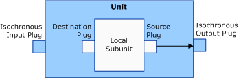
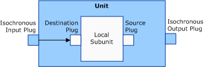

# Connections between subunit plugs and unit plugs within one AV/C unit

Scenarios 1 and 2 represent connections between a subunit and the unit that contains the subunit.

### **Scenario 1**

Connect the local subunit's source plug to the unit's isochronous output plug, as the following figure shows.

This scenario is the type of connection that was originally supported in *Avc.sys*.

Scenario 1 describes a connection where the local pin's **DataFlow** member is KSPIN\_DATAFLOW\_IN.

Each column in the following table corresponds to a member of the [**AVCCONNECTINFO**](https://msdn.microsoft.com/library/windows/hardware/ff554101) structure and specifies values for these members for a source subunit plug.

<table>
<colgroup>
<col width="25%" />
<col width="25%" />
<col width="25%" />
<col width="25%" />
</colgroup>
<thead>
<tr class="header">
<th>DeviceID</th>
<th>SubunitAddress</th>
<th>SubunitPlugNumber</th>
<th>UnitPlugNumber (for isochronous output)</th>
</tr>
</thead>
<tbody>
<tr class="odd">
<td>
Not used because the source unit&#39;s device identifier is the unit that contains the subunit
</td>
<td>
0xFF (the unit that contains the subunit)
</td>
<td>
iPlug (0x0 to 0x1E or 0x7F)
</td>
<td>
N/A
</td>
</tr>
</tbody>
</table>

 

Each column in the following table corresponds to a member of the AVCCONNECTINFO structure and specifies values for these members for a destination subunit plug.

<table>
<colgroup>
<col width="25%" />
<col width="25%" />
<col width="25%" />
<col width="25%" />
</colgroup>
<thead>
<tr class="header">
<th>DeviceID</th>
<th>SubunitAddress</th>
<th>SubunitPlugNumber</th>
<th>UnitPlugNumber (for isochronous input)</th>
</tr>
</thead>
<tbody>
<tr class="odd">
<td>
Not used because this scenario does not involve another unit
</td>
<td>
Subunit Address
</td>
<td>
Destination plug (0x0 to 0x1E)
</td>
<td>
N/A
</td>
</tr>
</tbody>
</table>

 

### **Scenario 2**

Connect from the unit's isochronous input plug to the local subunit's destination plug, as the following figure shows.

Scenario 2 describes a connection where the local pin's **DataFlow** member is KSPIN\_DATAFLOW\_OUT.

Each column in the following table corresponds to a member of the AVCCONNECTINFO structure and specifies values for these members for a source subunit plug.

<table>
<colgroup>
<col width="25%" />
<col width="25%" />
<col width="25%" />
<col width="25%" />
</colgroup>
<thead>
<tr class="header">
<th>DeviceID</th>
<th>SubunitAddress</th>
<th>SubunitPlugNumber</th>
<th>UnitPlugNumber (for isochronous output)</th>
</tr>
</thead>
<tbody>
<tr class="odd">
<td>
Not used because source unit&#39;s device identifier is the unit that contains the subunit
</td>
<td>
Subunit address
</td>
<td>
Source plug (0x0 to 0x1E)
</td>
<td>
N/A
</td>
</tr>
</tbody>
</table>

 

Each column in the following table corresponds to a member of the AVCCONNECTINFO structure and specifies values for these members for a destination subunit plug.

<table>
<colgroup>
<col width="25%" />
<col width="25%" />
<col width="25%" />
<col width="25%" />
</colgroup>
<thead>
<tr class="header">
<th>DeviceID</th>
<th>SubunitAddress</th>
<th>SubunitPlugNumber</th>
<th>UnitPlugNumber (for isochronous input)</th>
</tr>
</thead>
<tbody>
<tr class="odd">
<td>
Not used because this scenario does not involve another unit
</td>
<td>
0xFF (the unit containing the subunit)
</td>
<td>
oPCR (0x0 to 0x1E, or 0x7F)
</td>
<td>
N/A
</td>
</tr>
</tbody>
</table>

 

The following list describes the meaning of values that appear in the preceding tables:

-   The values 0x0 to 0x1E (30 decimal) represent specific plug numbers.

-   The value 0x7F represents any available isochronous input or output plug number on the AV/C unit.

-   The value 0xFF represents any available subunit source or destination plug address.

-   The values in the **DeviceID** columns (for source and destination subunit plugs) are used to search for the physical device object (PDO) of the target AV/C device to issue AV/C CCM commands to.

 

 

