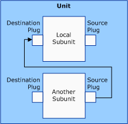
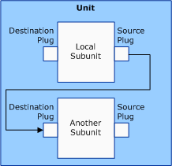

# Connections Between Two Subunit Plugs Within One AV/C Unit

Scenarios 3 and 4 represent connections between a subunit and another subunit in the same unit.

### **Scenario 3**

Connect from a specific source plug (0x0 to 0x1E), or any available source plug (0xFF) of another subunit in the same unit, to the local subunit's destination plug, as the following figure shows.

Scenario 3 describes a connection where the local pin's **DataFlow** member is KSPIN\_DATAFLOW\_IN.

Each column in the following table corresponds to a member of the [**AVCCONNECTINFO**](https://msdn.microsoft.com/library/windows/hardware/ff554101) structure and specifies values for these members for the source subunit plug.

<table>
<colgroup>
<col width="25%" />
<col width="25%" />
<col width="25%" />
<col width="25%" />
</colgroup>
<thead>
<tr class="header">
<th>DeviceID</th>
<th>SubunitAddress</th>
<th>SubunitPlugNumber</th>
<th>UnitPlugNumber (for isochronous output)</th>
</tr>
</thead>
<tbody>
<tr class="odd">
<td>
Not used because the source unit&#39;s device identifier is the unit that contains the subunit
</td>
<td>
Subunit address
</td>
<td>
Destination plug (0x0 to 0x1E, or 0xFF)
</td>
<td>
N/A
</td>
</tr>
</tbody>
</table>

 

Each column in the following table corresponds to a member of the AVCCONNECTINFO structure and specifies values for these members for a destination subunit plug.

<table>
<colgroup>
<col width="25%" />
<col width="25%" />
<col width="25%" />
<col width="25%" />
</colgroup>
<thead>
<tr class="header">
<th>DeviceID</th>
<th>SubunitAddress</th>
<th>SubunitPlugNumber</th>
<th>UnitPlugNumber (for isochronous input)</th>
</tr>
</thead>
<tbody>
<tr class="odd">
<td>
Not used because this scenario does not involve another unit
</td>
<td>
Self
</td>
<td>
Destination Plug (0xFF)
</td>
<td>
N/A
</td>
</tr>
</tbody>
</table>

 

### **Scenario 4**

Connect from the local subunit's source plug to a specific destination plug (0x0 to 0x1E), or any available (0xFF) destination plug of another subunit, as the following figure shows. Scenario 4 represents the opposite of scenario 3.

Scenario 4 describes a connection where the local pin's **DataFlow** member is KSPIN\_DATAFLOW\_OUT.

Each column in the following table corresponds to a member of the AVCCONNECTINFO structure and specifies values for these members for a source subunit plug.

<table>
<colgroup>
<col width="25%" />
<col width="25%" />
<col width="25%" />
<col width="25%" />
</colgroup>
<thead>
<tr class="header">
<th>DeviceID</th>
<th>SubunitAddress</th>
<th>SubunitPlugNumber</th>
<th>UnitPlugNumber (for isochronous output)</th>
</tr>
</thead>
<tbody>
<tr class="odd">
<td>
Not used because the source unit&#39;s device identifier is the unit that contains the subunit
</td>
<td>
Self (same subunit)
</td>
<td>
Source plug (0xFF)
</td>
<td>
N/A
</td>
</tr>
</tbody>
</table>

 

Each column in the following table corresponds to a member of the AVCCONNECTINFO structure and specifies values for these members for a destination subunit plug.

<table>
<colgroup>
<col width="25%" />
<col width="25%" />
<col width="25%" />
<col width="25%" />
</colgroup>
<thead>
<tr class="header">
<th>DeviceID</th>
<th>SubunitAddress</th>
<th>SubunitPlugNumber</th>
<th>UnitPlugNumber (for isochronous input)</th>
</tr>
</thead>
<tbody>
<tr class="odd">
<td>
Not used because this scenario does not involve another unit
</td>
<td>
Subunit Address
</td>
<td>
Destination plug (0x0 to 0x1E, or 0xFF)
</td>
<td>
N/A
</td>
</tr>
</tbody>
</table>

 

The following list describes the meaning of values that appear in the preceding tables:

-   The values 0x0 to 0x1E (30 decimal) represent specific plug numbers.

-   The value 0xFF represents any available subunit source or destination plug address.

-   "Self" contains the pin to which the AVCCONNECTINFO structure is setting.

-   The values in the **DeviceID** columns (for source and destination subunit plugs) are used to search for the physical device object (PDO) of the target AV/C device to issue AV/C CCM commands to.

 

 

