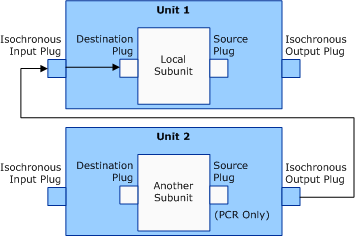
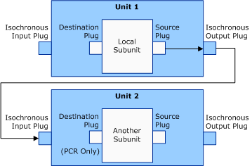

# Connections Between Two Unit Plugs in Different AV/C Units

Scenarios 7 and 8 represent connections between a subunit in one unit to a subunit in a different unit, where the target does not support subunit to unit connections within one AV/C unit. These type of connections require the **Signal source** and **Input select** CCM commands.

Scenarios 7 and 8 describe subunit source or destination plugs that have the **KSPIN\_FLAG\_AVC\_PCRONLY** flag set in the **Flag** member of their [**AVCPRECONNECTINFO**](https://msdn.microsoft.com/library/windows/hardware/ff554103) structures, which is translated by *Avc.sys* to 0xFF for their subunit's address.

### **Scenario 7**

**Signal source**: Intra-unit connection is not supported by the local unit.

**Input select**: The local unit connects from any available (0x7F) isochronous output plug on the target unit to any available (0x7F) isochronous input plug on the local unit and then connects to a specific (0x0 to 0x1E) or any available (0xFF) subunit destination plug on the local unit.

Scenario 7 describes a connection where the local pin's **DataFlow** member is KSPIN\_DATAFLOW\_IN.

Each column in the following table corresponds to a member of the [**AVCCONNECTINFO**](https://msdn.microsoft.com/library/windows/hardware/ff554101) structure and specifies values for these members for a source subunit plug.

<table>
<colgroup>
<col width="25%" />
<col width="25%" />
<col width="25%" />
<col width="25%" />
</colgroup>
<thead>
<tr class="header">
<th>DeviceID</th>
<th>SubunitAddress</th>
<th>SubunitPlugNumber</th>
<th>UnitPlugNumber (for isochronous output)</th>
</tr>
</thead>
<tbody>
<tr class="odd">
<td>
Target
</td>
<td>
Subunit address
</td>
<td>
Source plug (0xFF) - value is ignored
</td>
<td>
0x0 to 0x1E, or 0xFF
</td>
</tr>
</tbody>
</table>

 

Each column in the following table corresponds to a member of the AVCCONNECTINFO structure and specifies values for these members for a destination subunit plug.

<table>
<colgroup>
<col width="25%" />
<col width="25%" />
<col width="25%" />
<col width="25%" />
</colgroup>
<thead>
<tr class="header">
<th>DeviceID</th>
<th>SubunitAddress</th>
<th>SubunitPlugNumber</th>
<th>UnitPlugNumber (for isochronous input)</th>
</tr>
</thead>
<tbody>
<tr class="odd">
<td>
Self
</td>
<td>
Self
</td>
<td>
Destination plug (0x0 to 0x1E, or 0xFF)
</td>
<td>
0x7F
</td>
</tr>
</tbody>
</table>

 

### **Scenario 8**

**Signal source**: The local unit connects to any subunit's source plug to any available (0x7F) isochronous output plug (and returns the isochronous output plug's number).

**Input select**: The target unit connects from local unit's isochronous output plug (returned in signal source CCM command) to any available (0x7F) isochronous input plug on the target unit.

Scenario 8 describes a connection where the local pin's **DataFlow** member is KSPIN\_DATAFLOW\_OUT.

Each column in the following table corresponds to a member of the AVCCONNECTINFO structure and specifies values for these members for a source subunit plug.

<table>
<colgroup>
<col width="25%" />
<col width="25%" />
<col width="25%" />
<col width="25%" />
</colgroup>
<thead>
<tr class="header">
<th>DeviceID</th>
<th>SubunitAddress</th>
<th>SubunitPlugNumber</th>
<th>UnitPlugNumber (for isochronous output)</th>
</tr>
</thead>
<tbody>
<tr class="odd">
<td>
Self
</td>
<td>
Self
</td>
<td>
Source plug (0x0 to 0x1E, or 0xFF)
</td>
<td>
0x7F
</td>
</tr>
</tbody>
</table>

 

Each column in the following table corresponds to a member of the AVCCONNECTINFO structure and specifies values for these members for a destination subunit plug.

<table>
<colgroup>
<col width="25%" />
<col width="25%" />
<col width="25%" />
<col width="25%" />
</colgroup>
<thead>
<tr class="header">
<th>DeviceID</th>
<th>SubunitAddress</th>
<th>SubunitPlugNumber</th>
<th>UnitPlugNumber (for isochronous input)</th>
</tr>
</thead>
<tbody>
<tr class="odd">
<td>
Target
</td>
<td>
Subunit Address
</td>
<td>
Destination plug (0xFF) - value is ignored
</td>
<td>
0x0 to 0x1E, or 0x7F
</td>
</tr>
</tbody>
</table>

 

The following list describes the meaning of values that appear in the preceding tables:

-   The values 0x0 to 0x1E (30 decimal) represent specific plug numbers.

-   The value 0x7F represents any available isochronous input or output plug number on the AV/C unit.

-   The value 0xFF represents any available subunit source or destination plug address.

-   "Self" contains the pin to which the AVCCONNECTINFO structure is setting. "Target" represents the data that the AVCCONNECTINFO structure is for.

-   The values in the **DeviceID** columns (for source and destination subunit plugs) are used to search for the physical device object (PDO) of the target AV/C device to issue AV/C CCM commands to.

 

 

