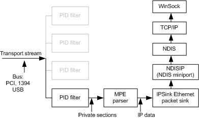

# Control Nodes for Processing IP Data

The following sequence and figure describe the data flow for IP data that is part of the received digital signal.

1.  The receiver device receives IP data and passes the IP data over the PC bus as part of the transport stream.

2.  The demultiplexer receives the transport stream and passes the private sections containing the IP data.

3.  The private sections are received by the multiprotocol encapsulation (MPE) parser, which removes the multiprotocol encapsulation and outputs the IP data. The MPE parser passes the IP data to the IPSink filter.

4.  The IPSink filter passes the IP data through a private interface to the broadcast NDISIP miniport driver.

5.  The NDISIP miniport driver is installed as a virtual NDIS miniport. The NDISIP miniport driver sends the IP data to NDIS.

6.  NDIS propagates the IP data through TCP/IP and Windows Sockets (WinSock) as it would for any other NDIS adapter.

**Note**   Starting with Windows Vista, the IPSink filter is not supported.

 

 

 

