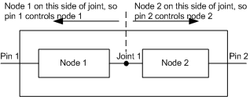

# Determining the Controlling Pin of a Node

Unlike filters and pins, nodes do not have an associated file handle by which applications in Ring 3 can access them. Because nodes are internal components within a filter, they exist somewhere between the filter's input and output pins. The network provider must determine which filter pin to use, then use the pin to access a node. This filter pin is called the controlling pin for that node. To determine the controlling pin for each node in the BDA template connection list of a filter, the network provider queries the KSPROPERTY\_BDA\_CONTROLLING\_PIN\_ID property of the [KSPROPSETID\_BdaTopology](https://msdn.microsoft.com/library/windows/hardware/ff566561) property set. The BDA minidriver in turn calls the [**BdaPropertyGetControllingPinId**](https://msdn.microsoft.com/library/windows/hardware/ff556480) support function for each node. In this call, the minidriver passes a pointer to a [**KSP\_BDA\_NODE\_PIN**](https://msdn.microsoft.com/library/windows/hardware/ff566716) structure. This structure identifies the property request to retrieve the controlling pin for a specific node type and a pair of the filter's input and output pins. The BDA support library returns the identifier of the controlling pin for the node type.

A BDA minidriver does not typically intercept the KSPROPERTY\_BDA\_CONTROLLING\_PIN\_ID property. The minidriver automatically dispatches the **BdaPropertyGetControllingPinId** support function from the KSPROPSETID\_BdaTopology property set. See [Determining BDA Device Topology](determining-bda-device-topology.md) for more information.

The support library is able to do all the work of determining the identifier of the controlling pin because the BDA minidriver provided the support library with a pointer to the [**BDA\_FILTER\_TEMPLATE**](https://msdn.microsoft.com/library/windows/hardware/ff556523) structure when the BDA minidriver started operating. See [Starting a BDA Minidriver](starting-a-bda-minidriver.md) for more information. A BDA minidriver informs the BDA support library how to determine controlling pins through information contained in BDA\_FILTER\_TEMPLATE. This information includes:

-   An array of connections. This array is a [**KSTOPOLOGY\_CONNECTION**](https://msdn.microsoft.com/library/windows/hardware/ff567148) array that provides a representation of all the possible connections between node and pin types that can be made within a filter or between a filter and adjoining filters. See [Mapping Connection Topology](mapping-connection-topology.md) For more information about the KSTOPOLOGY\_CONNECTION array.

-   An array of joint values. A joint is a point in the topology where one input splits into one or more paths to different outputs, or one or more inputs join into a single output path. The value given to a joint corresponds to the index of an element in the KSTOPOLOGY\_CONNECTION array. Most topologies will have only one joint.

-   An array of [**BDA\_PIN\_PAIRING**](https://msdn.microsoft.com/library/windows/hardware/ff556544) structures. These structures identify input and output pin types, the maximum number of input-type instances that can be created on the filter, and the maximum number of output-type instances that can be created on the filter. These structures also contain a pointer to the array of joint values between the input and output pins. See [Starting a BDA Minidriver](starting-a-bda-minidriver.md) For more information about the BDA\_PIN\_PAIRING array.

The following figure shows how the support library determines the filter pin that controls a specific node:

 

 

