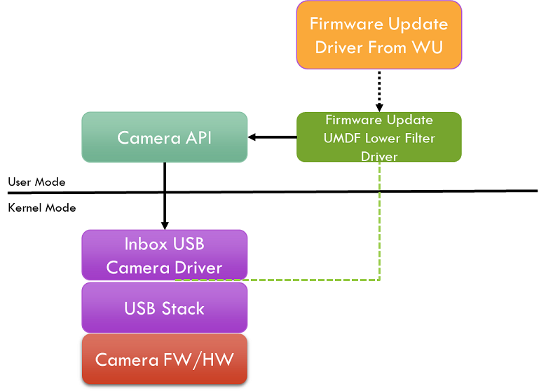
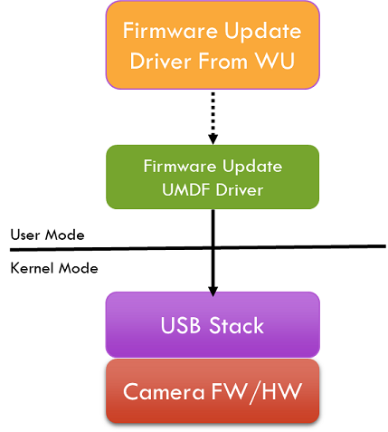

# Device Firmware Update For USB devices without using a Co-Installer

USB Device vendors use co-installers to update device firmware for devices that use inbox USB device drivers. However, co-installers are not supported by the new "Universal INF" standard, which is a requirement on Windows 10. This poses a challenge to existing USB device firmware update process. This document outlines a recommend way to update USB device firmware without a co-installer.

## Requirements

The primary requirements from the USB device firmware update process are:

1.  Seamless firmware update with no user interaction

2.  Reliable recovery mechanism (for example, no bricking of devices)

3.  Works on Windows 7 and later

4.  Overview

USB devices like UVC cameras are released with in-field updatable firmware. There is no standard way to update the firmware today. One thing that is common to all existing update mechanism is that some custom software suite runs on the client and downloads the firmware to the device. Typically, as part of the device installation process, the firmware updating software suite is installed. The co-installer kick starts the firmware update process. The absence of co-installers on Windows 10 prevents device vendors from updating the firmware on these devices in the field.

The recommended way to circumvent the absence of a co-installer for the USB device firmware update scenario is to use a lower filter driver to the USB device that will kick start the firmware update process. During the AddDevice call, the filter driver will check the device firmware version and update the firmware if necessary.

## Functional Overview

When a USB device is plugged in to the system, the generic inbox driver is installed for the device. After the installation of the generic driver, the OS queries the Windows Update server for any vendor specific driver package availability and downloads it and installs the driver. The installed driver package will perform the firmware update.

There are two ways the firmware could be updated.

1.  FW Update Filter Driver

    1.  A vendor supplied lower filter driver that performs the firmware update.

2.  FW Update Device Driver

    1.  A vendor supplied lower filter driver that puts the device in "firmware update mode".

    2.  The device enumerates as a firmware update device.

    3.  Vendor supplied firmware update driver will load against this device and updates the firmware.

## Method 1: FW Update Filter Driver

In this method, a lower filter driver to the USB device driver will be installed as part of driver update process. This filter driver will perform the firmware update.

The driver update package on Windows Update server will contain:

-   a firmware update WDF lower filter driver

-   an extension INF to install the firmware update WDF lower filter driver

-   the "firmware.bin" file.

While installing the driver update package, the firmware update WDF filter driver’s AddDevice routine will be called. From this routine, the WDF filter driver will get for the device firmware version from the device HW registry key. The device firmware should have placed the firmware version using the MSOS descriptor onto the device HW registry key.

1.  If the device firmware version and the filter driver expected firmware version are different or

2.  the firmware version is not available in the device HW registry key

    1.  then, the filter driver will insert itself into the device stack by returning success to AddDevice callback.

3.  else, the filter driver will not insert itself into the device stack

    1.  Because there is no necessity for updating the firmware as the device has the expected firmware.

When the EvtDeviceD0Entry callback of the WDF filter driver is called at a later point, the filter driver must register for device interface change notifications using CM\_Register\_Notification or IoRegisterPlugPlayNotification (UMDF or KMDF) to listen to the device interface class the USB device will register the device into. E.g. The firmware update filter driver for a RGB camera would register for KSCATEGORY\_VIDEO\_CAMERA. On receiving the notification, the filter driver should post a work-item that would perform the firmware update.

UMDF based firmware update drivers can use the device specific APIs or issue the control transfers directly to access the USB device to perform the firmware update. For example, the UMDF based filter driver for a camera would use Camera APIs to perform the firmware update.

KMDF based firmware update drivers can send the vendor specific commands to perform the firmware update.

On completion of flashing the firmware, the device must disconnect and reconnect to the bus. The device will be re-enumerated with new firmware.

The method of using a "firmware update filter driver", is recommended for devices that have enough resources to hold two full firmware images (the update image and a backup image) on the device memory. The reason is if there were failures during downloading the updated firmware, the device can abandon the update and boot into its original firmware. Thus, not bricking the device.

## Method 2: FW Update Device Driver

In this method, a lower filter driver to the USB device will be installed as part of the driver update process. This filter driver will send a command to the device to restart in firmware update mode, where the device exposes a firmware update interface. The driver for the firmware update interface will load and perform the firmware update.

The driver update package on Windows Update server for the device will contain:

1.  a WDF lower filter driver that will place the device in firmware update mode,

2.  an extension INF to install the WDF lower filter driver,

In addition to the driver update package, a separate FW Update Device Driver package will be present on the Windows Update, with:

1.  a WDF firmware update device driver and its INF, and

2.  the "firmware.bin" file.

While installing the driver update package, the WDF lower filter driver’s AddDevice routine will be called. From this routine, the filter driver will query for the device firmware version from the device HW registry key. The device firmware should have placed the "firmware version", using the MSOS descriptor or the USB device’s extension INF, onto the device HW registry key.

1.  If the device firmware version and the filter driver expected firmware versions are different or

2.  the firmware version is not available in the device HW registry key

3.  then, the WDF filter driver will insert itself into the device stack.

4.  else, the WDF filter driver will not insert itself into the device stack

When the EvtDeviceD0Entry callback of the WDF filter driver is called at a later point, the filter driver will issue a vendor specific command to the device which will place it in firmware update mode. i.e. The device will disconnect and reconnect, exposing the firmware update interface.

The system will enumerate the firmware update device interface. A custom firmware update WDF driver supplied by the vendor, in the firmware update package, will be load for this firmware update interface. This driver will update the firmware.

When the EvtDeviceD0Entry callback of the WDF firmware update driver is called at a later point, the driver must post a work-item that would perform the firmware update.

On completion of flashing the firmware, the device must disconnect and reconnect to the bus. The device will be re-enumerated with new firmware.

This method is recommended for devices that cannot hold the updated and original firmware images due to shortage of memory on the device. The reason is if there were failures during downloading the updated firmware, the device can abandon the update and boot the device into its firmware update mode again and the firmware update can be retried. Thus, not bricking the device.

## Recovery 

Firmware update process can fail for various reasons. If that happens, when the device is enumerated again, the firmware update driver may try to update the firmware again and may fail again and this update process could end up in a loop. The firmware update driver must put an upper limit to the number of retries it can perform. When the firmware update retries gets beyond a threshold (say 3 retries) then the filter driver shouldn’t attempt to update the firmware again, until a new version of the driver is downloaded from WU. The firmware update driver may use the registry to persist the retry states.

At the end of device firmware update, we recommended the device reset itself and re-enumerate.

Both methods of firmware update, the device function must be stopped before performing the firmware update. This ensures there are no open handle to the device and avoids any OS restart requirement.

## Sample INF

;==============================================================================
; Microsoft Extension INF for USB Camera Firmware Update UMDF Filter Driver
; Copyright (C) Microsoft Corporation. All rights reserved.
;==============================================================================

\[Version\]
Signature="$WINDOWS NT$"
Class=Extension
ClassGUID={e2f84ce7-8efa-411c-aa69-97454ca4cb57}
Provider=%CONTOSO%
ExtensionId = {BC6EE554-271C-48C8-B713-8078833962BD} ; replace with your own GUID
CatalogFile.NT = SampleExtension.cat
DriverVer=08/28/2017,10.0.1700.000

\[SourceDisksFiles\]
ContosoFirmwareUpdateFilterDriver.dll=1
ContosoFirmware.bin=1

\[SourceDisksNames\]
1 = %MediaDescription%

\[DestinationDirs\]
UMDriverCopy=12,UMDF ; copy to drivers\\UMDF
ContosoFirmwareCopy=12,ContosoFirmware ; copy to drivers\\ContosoFirmware
DefaultDestDir = 12

\[UMDriverCopy\]
ContosoFirmwareUpdateFilterDriver.dll

\[ContosoFirmwareCopy\]
ContosoFirmware.bin

\[Manufacturer\]
%CONTOSO% = ContosoFirmwareUpdateFilterDriver,ntamd64

\[ContosoFirmwareUpdateFilterDriver.ntamd64\]
; replace with your camera device VID PID
%ContosoCamera.DeviceDesc% = ContosoFirmwareUpdateFilterDriver\_Install, USB\\VID\_1234&PID\_1234&REV\_1234

\[ContosoFirmwareUpdateFilterDriver\_Install\]
CopyFiles=UMDriverCopy, ContosoFirmwareCopy

\[ContosoFirmwareUpdateFilterDriver\_Install.HW\]
AddReg = ContosoFirmwareUpdateFilterDriver.AddReg

\[ContosoFirmwareUpdateFilterDriver.AddReg\]
; Load the redirector as an lower filter on this specific device.
; 0x00010008 - FLG\_ADDREG\_TYPE\_MULTI\_SZ | FLG\_ADDREG\_APPEND
HKR,,"LowerFilters",0x00010008,"WUDFRd"

\[ContosoFirmwareUpdateFilterDriver\_Install.Services\]
AddService=WUDFRd,0x000001f8,WUDFRD\_ServiceInstall

\[WUDFRD\_ServiceInstall\]
DisplayName = %WudfRdDisplayName%
ServiceType = 1
StartType = 3
ErrorControl = 1
ServiceBinary = %12%\\WUDFRd.sys

\[ContosoFirmwareUpdateFilterDriver\_Install.Wdf\]
UmdfService=ContosoFirmwareUpdateFilterDriver, ContosoFirmwareUpdateFilterDriver.UmdfFilter
UmdfServiceOrder=ContosoFirmwareUpdateFilterDriver

\[ContosoFirmwareUpdateFilterDriver.UmdfFilter\]
UmdfLibraryVersion=2.0.0
ServiceBinary= "%12%\\UMDF\\ContosoFirmwareUpdateFilterDriver.dll"

\[Strings\]
CONTOSO = "Contoso Inc."
ContosoCamera.DeviceDesc = "Contoso Camera Extension"
MediaDescription="Contoso Camera Firmware Update Filter Driver Installation Media"
WudfRdDisplayName = "WDF Reflector Driver"
