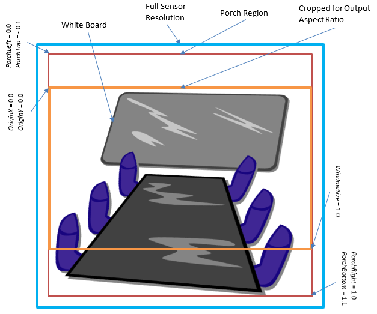
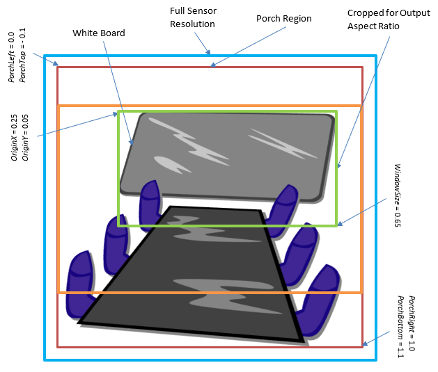

# Digital Window overview

Two new Digital Window controls provide a mechanism for digital pan, tilt and zoom for cameras that offer high-resolution native sensors, so that an application can automatically focus selectively on objects such as faces or marker boards in a conference room while retaining optimal fidelity from the camera sensor.

This enables applications to obtain higher detail images of such objects without the need to change media resolutions. The Digital Window MSXU controls targets the entire camera sensor and not an individual pipe or endpoint.

## Digital Window Control MSXU_CONTROL_DIGITALWINDOW

The Digital Window MSXU control specifies the field of view and zoom of the camera while camera is streaming. This control is a potential substitute for Pan, Tilt and Zoom. This control only applies while the camera is actively streaming.

See [Section 2.2.2.11 Digital Window Control](./uvc-extensions-1-5.md#22211-digital-window-control) in the *Microsoft extensions to USB Video Class 1.5 specification* for details.

## Digital Window Config Control MSXU_CONTROL_DIGITALWINDOW_CONFIG

The Digital Window Config MSXU control specifies the scaling limits of the camera given all available resolutions. Resolutions are independent of media type, so two media types advertising the same display resolution are combined into one capability.

See [Section 2.2.2.12 Digital Window Config Control](./uvc-extensions-1-5.md#22212-digital-window-config-control) in the *Microsoft extensions to USB Video Class 1.5 specification* for details.

## Implementation overview

The following image illustrates a typical conference room scene captured by the camera.

The image sensor captures something more than the image streamed to the client application, which is shown in the red bounding box. The orange bounding box illustrates the field of view captured by the camera given the selected aspect ratio. For the digital window control, the default bounding box is this orange box. The coordinates given along the side show the bounds of this box. The output of the sensor is cropped and scaled appropriately to the output media resolution from this box.

The marker board called out in the image is an object of interest. If an application were to wish to focus on this object, it might set a Digital Window to encompass it.

The green bounding box is set through the Digital Window control in this example. It encompasses the primary object of interest, the marker board. The rectangle may contain data that is outside the object of interest because the object may not be rectangular or it may not be viewed from the side or it may not have the same aspect ratio as the media type.

The Digital Window maintains the output format's aspect ratio and the camera upscales the sensor output to match. The coordinates specified are always relative to the original, default bounding box.

## Relationship to UVC 1.5 Digital Window Control

The new Digital Window MSXU controls below perform a function almost identical to the CT_DIGITAL_WINDOW_CONTROL found in UVC 1.5 Class specification under *Section 4.2.2.1.19 Digital Window Control*.

The *UVC 1.5 Class specification.pdf* can be downloaded at the [**USB Video Class specification**](https://www.usb.org/document-library/video-class-v15-document-set) web site.

However there are some important differences.

### Stretching

The CT_DIGITAL_WINDOW_CONTROL as specified permits an application to set the window to an arbitrary set of coordinates that are only bounded by the GET_MIN, GET_MAX and GET_RES values. To fit this field of view within the output window, this behavior requires the camera either reject what should be legal SET_CUR requests or to implement resampling or rescaling of the image that could potentially distort the image horizontally or vertically, i.e. alter the aspect ratio.

Since distortion is probably undesirable it can be avoided in a CT_DIGITAL_WINDOW_CONTROL implementation by rejecting such requests, but rather than the control contain such ambiguity, the Digital Window MSXU control maintains the field of view at the aspect ratio of the output resolution. Therefore, rescaling is not a feature or an option in this MSXU control.

### Auto Face-Framing

The CT_DIGITAL_WINDOW_CONTROL does not have any concept of face tracking. On the other hand the CT_REGION_OF_INTEREST_CONTROL does have such a concept, but this is primarily used to detect, report and potentially update the 3A controls' region of interest. In theory CT_REGION_OF_INTEREST_CONTROL could be utilized if it is implemented as an AutoUpdate control, which would allow a camera driver to leverage that control to pan, tilt or zoom the CT_DIGITAL_WINDOW_CONTROL in sync.

This new control allows direct control of face tracking to adjust the field of view by tilting, panning or zooming digitally to keep as much of the face visible as is practical. In addition the face tracking used on this control remains independent of any region of interest control.

The method of face tracking is implementation dependent.

### Per-frame Metadata

The original UVC 1.5 does not have a concept of per-frame metadata. Microsoft has extended the UVC specification to support metadata embedded in the frame's payload headers. Enabling this support can be done through the MSXU_CONTROL_METADATA control.

In addition the CT_DIGITAL_WINDOW_CONTROL does not specify whether or not the control is synchronous or asynchronous or auto updating. In addition the control includes stepping information used for the animation of the change by the camera itself. This implies that a digital pan, tilt and zoom could take a significant amount of time to complete. However since the control would have been set to new coordinates, it is unclear how long it would take to complete and when or how it would report back that the transition is done. Worse there is no information about where in the field of view the current frame originates.

This ambiguity could be resolved with per-frame metadata injected by the camera, but it is not possible to require CT_DIGITAL_WINDOW_CONTROL to support per-frame metadata directly since per-frame metadata is beyond the scope of the UVC specification.

### Aspect Ratios

It is unclear or undefined how CT_DIGITAL_WINDOW_CONTROL handles differing aspect ratios. To crop the field of view correctly the the GET_DEF and GET_CUR values reported by the UVC 1.5 control would need to change to match the current aspect after every probe/commit. To handle this correctly, the CT_DIGITAL_WINDOW_CONTROL should be an AutoUpdate control and the driver would need to not cache the GET_DEF result, but instead query this value again for every resolution exposed by the camera.

This complexity could create discovery problems when trying to map the digital window control to a specific resolution. You may not know in advance what portion of the sensor's field of view the camera would use by default until you perform a probe or commit on all media types supported by the camera. This presents potential issues with discovering any porch values for a given resolution since those are dependent on the sensor's field of view normally in use by that format relative to the total field of view available on the sensor.

## Functionality

Digital Window is related to several existing controls:

- Pan

- Tilt

- Zoom

If the camera uses digital implementations for any of these controls, they must change the values reported by Digital Window to match the same field of view. Similarly, Digital Window must change the values reported by these controls. All digital implementations of these controls must update each other to remain in sync.

Microsoft does not define the relationship between these controls and only that the last set control takes precedence.

## Regions of Interest

Because Digital Window changes the apparent Field of View (FOV), coordinates selected through any region of interest (ROI) control should be reset to their defaults whenever a SET is issued to this control. The list of current ROI controls includes:

- KSPROPERTY_CAMERACONTROL_REGION_OF_INTEREST_PROPERTY_ID

- KSPROPERTY_CAMERACONTROL_EXTENDED_ROI_CONFIGCAPS / KSPROPERTY_CAMERACONTROL_EXTENDED_ROI_ISPCONTROL

In addition, these Region of Interest controls specify their regions relative to the output window, so the coordinates they specify are always a rectangle in the current field of view. Since the Digital Window control changes the current field of view, a Region of Interest rectangle must be remapped by the camera to fit within the current Digital Window. For instance, if the current Digital Window has an (**OriginX**, **OriginY**) of (0.0, 0.0) and a **WindowSize** of 0.5 and if a Region of Interest of (0.0, 0.0), (0.5, 0.5) is specified, the camera must remap the Region of Interest rectangle to the pixels corresponding to (0.0, 0.0), (0.25, 0.25) in the default field of view. This should be analogous to and consistent with the apparent behavior of the pan, tilt and zoom controls with these Region of Interest controls.

## Streaming

Because available valid Digital Window values are dependent on the current aspect ratio, the camera must have selected a media type and streaming interface for it to enforce the **MinWindowSize**.

## Informational Values

The reported **NonUpscalingWindowSize** is also reported per resolution, but it is only informational to the application. This value informs the application what value to set as the **WindowSize** to get no upscaling of the source image. This allows the application to capture an image at the limits of the camera sensor's range of fidelity.

### Metadata Attributes

If the camera advertises MSXU_CONTROL_DIGITALWINDOW, MSXU_CONTROL_DIGITALWINDOW_CONFIG and has set a non-zero buffer size on MSXU_CONTROL_METADATA, the camera must emit the MF_CAPTURE_METADATA_DIGITAL_WINDOW attribute for every frame. It can provide this through a Device MFT or by including a MetadataId_DigitalWindow (value of 7) attribute in the raw metadata buffer. How to include metadata attributes is further described in [Section 2.2.3.1 Microsoft Standard-format Metadata](./uvc-extensions-1-5.md#2232-firmware-generated-standard-format-metadata-from-usb-video-frame-packets).

This metadata is used to report what digital window was applied to the current sample. It does this by initializing the KSCAMERA_METADATA_ITEMHEADER with the value MetadataId_DigitalWindow and the size of the structure and copying over the applied **OriginX**, **OriginY** and **WindowSize** values from the digital window control into an associated KSCAMERA_EXTENDEDPROP_DIGITALWINDOW_SETTING structure.

## See also

[Section 2.2.2.11 Digital Window Control](./uvc-extensions-1-5.md#22211-digital-window-control)

[Section 2.2.2.12 Digital Window Config Control](./uvc-extensions-1-5.md#22212-digital-window-config-control) 

[Section 2.2.3.1 Microsoft Standard-format Metadata](./uvc-extensions-1-5.md#2232-firmware-generated-standard-format-metadata-from-usb-video-frame-packets)

[*USB Video Class specification*](https://www.usb.org/document-library/video-class-v15-document-set)

[**KSPROPERTY_CAMERACONTROL_EXTENDED_DIGITALWINDOW_CONFIGCAPS**](./ksproperty-cameracontrol-extended-digitalwindow-configcaps.md)

[**KSPROPERTY_CAMERACONTROL_EXTENDED_DIGITALWINDOW**](./ksproperty-cameracontrol-extended-digitalwindow.md)

[**KSCAMERA_EXTENDEDPROP_DIGITALWINDOW_CONFIGCAPS**](/windows-hardware/drivers/ddi/ksmedia/ns-ksmedia-kscamera_extendedprop_digitalwindow_configcaps)

[**KSCAMERA_EXTENDEDPROP_DIGITALWINDOW_CONFIGCAPSHEADER**](/windows-hardware/drivers/ddi/ksmedia/ns-ksmedia-kscamera_extendedprop_digitalwindow_configcapsheader)

[**KSCAMERA_EXTENDEDPROP_DIGITALWINDOW_SETTING**](/windows-hardware/drivers/ddi/ksmedia/ns-ksmedia-kscamera_extendedprop_digitalwindow_setting)

[**KSCAMERA_METADATA_DIGITALWINDOW**](/windows-hardware/drivers/ddi/ksmedia/ns-ksmedia-kscamera_metadata_digitalwindow)