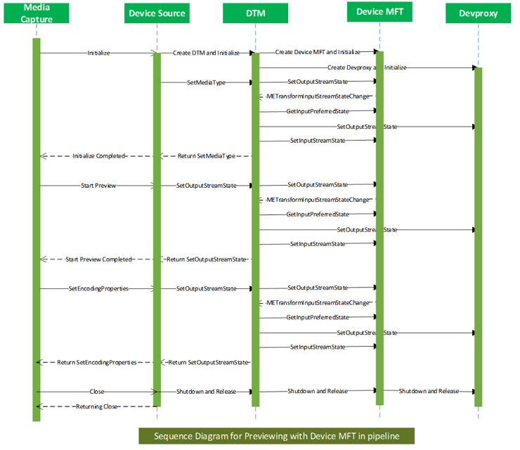
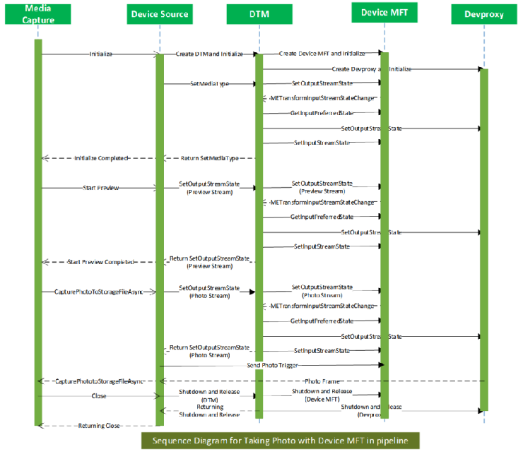

# Device MFT design guide

The video capture stack in Windows supports a user-mode extension in the form of MFT0. This is a per-stream extension component that IHVs supply, and the capture pipeline inserts as the first transform, post-capture. The MFT0 is fed post-processed frames from the device. Further post processing operations on the frames can be done inside MFT0. 

This topic outlines the design of a device-wide extension running in user mode that can be used to perform post-processing common to all streams.

## Terminology

| Term       | Description                                                                                         |
|------------|-----------------------------------------------------------------------------------------------------|
| KS         | Kernel Streaming driver                                                                             |
| AvStream   | Audio Video Streaming driver model                                                                  |
| Filter     | Object that represents a device instance                                                            |
| Device MFT | User-mode capture driver extension supplied by IHVs                                                 |
| Devproxy   | MF <-> AvStream marshaler                                                                           |
| DTM        | Device Transform Manager that manages devproxy and Device MFT. Represents the device in MF pipeline.|

## Design goals

- Device filter-wide user-mode extension that has same lifetime as the Device Filter
- Supports any number of inputs coming from device
- Supports any number of outputs (current requirement is three streams: preview, record and photo)
- Routes all device controls to Device MFT (which would optionally handle or pass it to device)
- Parallel post processing of captured stream
- Allow 3A processing independent of frame rate
- Allow metadata from one stream to be shared among other streams
- Access to GPU resources
- Access to MF MMCSS Work Queues
- Access to MF Allocator
- Simple interface (similar to MFT)
- Flexible internal architecture for IHV/OEM extensibility

## Design constraints

- No change in the Capture API surface
- Complete backward compatibility. For example, no regressions while working with legacy apps and scenarios.

## Capture stack architecture

This topic describes support for a filter-wide user-mode extension to the capture driver. This component has access to MF APIs, thread pools, GPU and ISP resources. The filter wide extension provides the flexibility of having any number of streams between itself and device Ks filter. This flexibility enables seemless out of band communication between the user-mode extension and driver which can be used for dedicated metadata and 3A processing streams.


<br>
<br>


### Device Transform Manager (DTM)

The capture stack introduces a new system-provided component, the Device Transform Manager. This resides inside Device Source and manages Devproxy MFT and Device MFT. Device Transform Manager does the MediaType negotiation, sample propagation, and all MFT event handling. It also exposes the IMFTransform interface to Device Source and other necessary private interfaces that Device Source needs to manage device streams. This component abstracts Devproxy and Device MFT from the pipeline. The pipeline just sees the DTM as the device and the streams out of DTM as the device streams.

### Devproxy

Devproxy is an async MFT that marshals the commands and video frames between the AvStream camera driver and Media Foundation. This is provided by Windows and supports *n* number of outputs from the camera driver. Also, this owns the allocators for all the pins exposed by the device.

### Device MFT

Device MFT is a user-mode extension to the capture driver. It is an *m x n* async MFT. It is installed on the system with the capture driver and is provided by the capture driver vendor.

The number of input streams of Device MFT must be same as the number of Ks pins exposed by the device. The mediatypes supported by Device MFT’s input streams must be same as the mediatypes exposed by the KS pins.

The number of output streams exposed by Device MFT are the streams seen by Device Source and capture stack, capture API and applications and can  be one, two, or three stream. The input and output stream counts of Device MFT do not need to be the same. Also, input and output streams do not need to have the same mediatypes, and typically will have different mediatypes. The number of mediatypes need not match either.

The first Ks Pin represented in user mode by Devproxy’s output stream gets associated with the first input stream of Device MFT, the second Ks Pin represented in user mode by Devproxy’s output stream with the second input stream of Device MFT, and so on.

Device MFT is given a pointer to Devproxy, DX device, and MF WorkQueue ID. Frames coming out of the device are fed directly into the corresponding Device MFT’s input as MF Samples. With all these, Device MFT can post process the captured samples and serve samples to the preview, record, and photo pins.

All the commands and controls going to the device are rerouted to Device MFT. Device MFT handles the controls or passes them on to the driver through Devproxy. This streamlines command handling by the capture driver stack.

## Functional Overview

On initialization of the capture pipeline, DeviceSource instantiates Device Transform Manager, if there is a Device MFT for the device. Passes an instance of Devproxy that represents the device to the Device Transform Manager’s initialization routine. Device Transform Manager CoCreates Device MFT and performs basic validations. Like the number of output pins of Devproxy is same as the number of input pins of Device MFT, support for mandatory interfaces etc…

Device Source would query Device Transform Manager to obtain the supported output mediatypes. DTM gets these from Device MFT’s output pins. Device Source exposes the Presentation Descriptor and Stream Descriptor based on this information to the capture pipeline.

Source Reader would use the exposed mediatypes out of the Device Source and sets the default mediatypes on each stream. In turn, DeviceSource would set these default mediatypes on the output streams of the DTM. DTM would set this mediatype on the output stream of the Device MFT using the SetOuputStreamState() function.

When SetOutputStreamState() is called, Device MFT posts a message to DTM to change its input stream’s mediatype based on the selected output mediatype and waits. In response to this message, DTM would query the preferred input mediatype for the input stream of the Device MFT using GetPreferredInputStreamState(). Sets this mediatype on the corresponding output stream of Devproxy. If that succeeds then DTM sets that same mediatype on to the Device MFT’s input stream using SetInputStreamState(). After receiving this call, Device MFT would complete SetOutputStreamState().

CaptureEngine would select individual streams by enabling specific streams on DeviceSource. This will be propagated to Device MFT by DTM through SetOutputStreamState() call. Device MFT would place the specific output streams in the requested state. As mentioned above, Device MFT would also notify Device Transform Manager about the necessary input streams that need to be enabled. This would result in Device Transform Manager propagating the stream selection to Devproxy. At the end of this process, all necessary streams, in Devproxy and Device MFT, would be ready to stream.

Source Reader would start the DeviceSource when CaptureEngine calls ReadSample. In turn, DeviceSource would start the Device Transform Manager by sending MFT_MESSAGE_NOTIFY_BEGIN_STREAMING and MFT_MESSAGE_NOTIFY_START_OF_STREAM messages indicating the start of the pipeline. Device Transform Manager would start Devproxy and Device MFT by propagating MFT_MESSAGE_NOTIFY_BEGIN_STREAMING and MFT_MESSAAGE_NOTIFY_SART_OF_STREAM messages. Note: Allocate the necessary resources on start streaming instead of DMFT initialize.

DTM would call SetOutputStreamState on Device MFT’s outputs with the streaming state parameter. Device MFT would start streaming in those streams. DTM would start the streaming on Devproxy output streams that has valid mediatype set. Devproxy would allocate the samples and fetch them from the device. These samples are fed into the Device MFT in the relevant input pin. Device MFT would process these samples and give the output to DeviceSource. From DeviceSource the samples would flow through SourceReader to CaptureEngine.

CaptureEngine would stop individual streams by disabling individual stream through an internal interface on DeviceSource. This will be translated into specific output stream disabling on Device MFT through SetOutputStreamState(). In turn, Device MFT might request disabling specific input stream(s) through METransformInputStreamStateChanged event. Device Transform Manager would propagate this to corresponding Devproxy stream(s).

As long as the Device MFT itself in streaming state, it can request any input stream to transition to any of the valid DeviceStreamState. i.e. it could send it to DeviceStreamState_Stop or DeviceStreamState_Run or DeviceStreamState_Pause etc… without affecting other streams.

However, the output stream transition is controlled by capture pipeline. i.e. the Preview, Record and Photo streams are enabled or disabled by the capture pipeline. Even when the outputs are disabled, any input stream could still be streaming as long as the Device MFT itself is in streaming state.



<br>
<br>




### Lifetime of Device MFT

Device MFT is loaded after KS Filter gets created. It will be unloaded before KS Filter gets closed.

From pipeline stand point, when the Device Source is created the Device MFT is created and when the Device Source is shutdown the Device MFT will be shutdown synchronously.

To support shutdown, the Device MFT must support IMFShutdown interface. After Device MFT->Shutdown is called, any other interface call into the Device MFT must return MF_E_SHUTDOWN error.

### Memory Type

Frames can be captured into system memory buffers or DX memory buffers per the preference of camera driver. Whatever buffer that comes out of the camera driver is directly fed into the Device MFT for further processing.

Devproxy will allocate the buffers based on driver’s preference. We require Device MFT to make use of MF allocator APIs to allocate samples needed for its output pins for non-inplace transforms.

### Mediatype change while streaming

Clients of Source Reader would be able to see the mediatypes exposed by the Device MFT’s output streams as the natively supported mediatypes. When the native mediatype is changed, Source Reader sends mediatype notification calls into the Device MFT through DeviceSource. It is the responsibility of the Device MFT to flush all the pending samples from that stream’s queue and switch to the new mediatype on that stream in a timely manner. If there is a necessity for changing the input mediatype then it should change the current input mediatype to that one. Device Transform Manager would get the current mediatype from the input stream of the Device MFT and sets it on the Devproxy’s output streams and the Device MFT’s input after each native mediatype change.

### Input Mediatype change in Device MFT

Since this is an *m x n* MFT, there can be repercussions on input streaming pin’s mediatypes and state change when output streaming pin’s mediatypes or state changes. Specifically when the following changes occur:

- Output Mediatype changes

    - When an application changes native mediatype, that will cascade through the capture stack into Device MFT as an output pin mediatype change.

    - When output mediatype changes that could trigger an input mediatype change. For example, all output pins are streaming at 720 p. This would have resulted in streaming from camera at 720 p. Now let us say, the record stream changes its native mediatype to 1080p. Now one of the Device MFT input stream that was fetching data to the record stream, has to change its mediatype.

- Output pin gets disabled

    - When application disables one of Device MFT outputs when the same input is shared by more than one outputs, for optimization sake the input may have to change the mediatype. For example, if a 1080p output stream stops and all the other streams, sharing one input, are just streaming at 720p then the input stream should change its mediatype to 720p to save power and performance.

Device Transform Manager would handle [METransformInputStreamStateChanged](https://msdn.microsoft.com/En-US/Library/Windows/Hardware/mt797687) notifications from Device MFT to change the mediatype and or state on Device MFT input and Devproxy output under these conditions.

### Flush Device MFT

Two types of flushing is needed while managing Device MFT:

- Global flush

    - Device MFT wide flush. This typically happens when the Device Transform Manager is about to send stop streaming message to Device MFT.

    - Device MFT is expected to drop all samples from its input and output queues and return synchronously.

    - Device MFT is not supposed to ask for new input or send notification on new available output.

- Local flush

    - Output pin specific flush. This typically happens when a stream is stopped.

All the events that were posted prior to flush would be dropped by DMFT Manager. After flush the DMFT should reset its internal [METransformHaveOutput](https://msdn.microsoft.com/en-us/library/windows/hardware/mt797686) tracking count.

### Drain of Device MFT

Device MFT will not receive separate drain message since there is no need for drain in a live capture source.

### Photo trigger

In this new model, instead of sending the photo trigger and photo sequence start and stop triggers directly to the driver, they will be re-routed to Device MFT. Device MFT should handle the trigger or forward it to the camera driver as necessary.

### Warm start

Device Source would try to warm start specific output stream by transitioning the stream to Pause state. In turn DTM would call the [IMFDeviceTransform::SetOutputStreamState](https://msdn.microsoft.com/en-us/library/windows/hardware/mt797684) method on Device MFT to transition a specific output stream to Pause state. This would result in corresponding input stream to be put in to Pause. This will be achieved by Device MFT by requesting **METransformInputStreamStateChanged** to DTM and handling the [IMFDeviceTransform::SetInputStreamState](https://msdn.microsoft.com/en-us/library/windows/hardware/mt797683) method.

### Variable photo sequence

With this change in architecture, photo sequence could be implemented with the help of camera device driver and Device MFT. This would greatly reduce the complexity of the camera device driver. The start and stop photo sequence triggers would be sent to the Device MFT and it can handle the photo sequence with lot less difficulty.

### Photo confirmation

A DMFT can support photo confirmation by supporting the **IMFCapturePhotoConfirmation** interface. The pipeline retrieves this interface through [IMFGetService::GetService] (https://msdn.microsoft.com/en-us/library/windows/desktop/ms696978) method.

### Metadata

Devproxy queries the driver for metadata buffer size and allocates the memory for metadata. Metadata coming from driver would still be set by Devproxy on the sample. Device MFT would consume this sample metadata. Either pass it on with the sample through its output stream or just use them for its post processing.

With Device MFT supporting any number of inputs, a dedicated input pin could be used just for metadata or out of band metadata. The mediatype for this pin would be custom and the driver decides the size and number of buffers.

This metadata stream will not be exposed beyond DTM. The stream can be put into streaming state when Device MFT starts streaming. For example, when output streams are selected for streaming, Device MFT can request DTM to start one or more video stream, and the metadata stream as well, using the **METransformInputStreamStateChanged** event. 

Note: There is no requirement for the number of input pins to match the number of output pins in this model. There can be a separate pin just dedicated for metadata or 3A.

## Device Transform Manager event handling

[Device Transform Manager events](https://msdn.microsoft.com/en-us/Library/Windows/Hardware/mt797660) are defined in the following reference topics:

- [METransformFlushInputStream](https://msdn.microsoft.com/en-us/library/windows/hardware/mt797685)
- [METransformHaveOutput](https://msdn.microsoft.com/en-us/library/windows/hardware/mt797686)
- [METransformInputStreamStateChanged](https://msdn.microsoft.com/en-us/Library/windows/hardware/mt797687)
- [METransformNeedInput](https://msdn.microsoft.com/en-us/library/windows/hardware/mt797688)


## IMFDeviceTransform interface

The [IMFDeviceTransform](https://msdn.microsoft.com/en-us/library/windows/hardware/mt797663) interface is defined to interact with Device MFT. This interface facilitates the management of *m* inputs and *n* output Device MFT. Along with other interfaces, Device MFT must implement this interface.

### General event propagation

When an event occurs in Devproxy (or inside device) we need to propagate that to the Device MFT and to the Device Source.

## Device MFT requirements

### Interface requirements

Device MFTs must support the following interfaces:

- [IMFDeviceTransform](https://msdn.microsoft.com/en-us/library/windows/hardware/mt797663)

- [IKsControl](https://msdn.microsoft.com/en-us/library/windows/hardware/ff559769)

    - This allows all ksproperties, events and methods to go through the DMFT. This gives DMFT a chance to handle these functions calls inside DMFT or just forward them to the driver. In case it handles the KsEvent methods then the DMFT has to do the following:

        - If DMFT handles any KSEVENT_TYPE_ONESHOT event then it should duplicate the handle when it receives KSEVENT_TYPE_ENABLE.

        - When it is done setting or raising the event, it should call CloseHandle on the duplicated handle.

        - If DMFT handles non-KSEVENT_TYPE_ONESHOT event, then it should duplicate the handle when it receives KSEVENT_TYPE_ENABLE and should call CloseHandle on the duplicated handle when the ks event is disabled by calling KsEvent function with the first parameter (ks event id) second parameter (event length) set to zero. The event data and length would be valid. The event data uniquely identifies a specific ks event.

        - If DMFT handles non-KSEVENT_TYPE_ONESHOT events, then it should duplicate the handle when it receives KSEVENT_TYPE_ENABLE and should call CloseHandle on the duplicated handles when the ks events are disabled by calling KsEvent function with all parameters set to zero.

- [IMFRealtimeClientEx](https://msdn.microsoft.com/en-us/library/windows/desktop/hh448047)

- [IMFShutdown](https://msdn.microsoft.com/en-us/library/windows/desktop/ms703054)

### Notification Requirements

Device MFTs must use the following messages to inform DTM about the availability of samples, any input stream state change, and so on.

- [METransformHaveOutput](https://msdn.microsoft.com/en-us/library/windows/hardware/mt797686)

- [METransformInputStreamStateChanged](https://msdn.microsoft.com/en-us/Library/windows/hardware/mt797687)

- [METransformFlushInputStream](https://msdn.microsoft.com/en-us/library/windows/hardware/mt797685)

### Thread Requirements

Device MFT must not create its own threads. Instead it must use MF Work Queues, whose ID is passed through the [IMFRealtimeClientEx] (https://msdn.microsoft.com/en-us/library/windows/desktop/hh448047) interface. This is to make sure that all the threads running in the Device MFT gets the correct priority at which the capture pipeline is running. Otherwise it may cause thread priority inversions.

### InputStream Requirements

#### Stream Count

- The number of input streams in Device MFT must be the same as the number of streams supported by the driver.

#### MediaTypes

- The number of mediatypes and the actual media types supported by the Device MFT’s input must match the number and types of mediatypes supported by the driver.

- The number could be different only if the mediatypes supported by the input of Device MFT is a subset of the mediatypes supported by the driver.

- The mediatypes supported by the driver and input of Device MFT could be standard or custom mediatypes.

### To register Device MFT

The camera device INF must have the following device interface entry that specifies the CLSID of the CoClass of the Device MFT.

```
[CaptureAvstrm.Device.NTarm.Interfaces]
AddInterface = %KSCATEGORY_VIDEO_CAMERA%, %Capture.FilterDescBack%, Capture.FilterBack

[Capture.FilterBack]
AddReg = Capture.FilterBack.AddReg, PinNames.AddReg

[Capture.FilterBack.AddReg]
HKR,,FriendlyName,,%Capture.FilterDescBack%
HKR,,CameraDeviceMftClsid,,%CameraDeviceMFT.Clsid%
```

The above INF entries result in the following registry keys being entered:
    
**Note** This is an example only (not the actual regkey)

```
[HKEY_LOCAL_MACHINE\SYSTEM\CurrentControlSet\Control\DeviceClasses\{E5323777-F976-4f5b-9B55-B94699C46E44}\##?#USB#VID_045E&PID_075D&MI_00#8&23C3DB65&0&0000#{E5323777-F976-4f5b-9B55-B94699C46E44}\#GLOBAL\Device Parameters]
"CLSID"="{17CCA71B-ECD7-11D0-B908-00A0C9223196}"
"FriendlyName"="USB Video Device"
"CameraDeviceMftClsid"="{3456A71B-ECD7-11D0-B908-00A0C9223196}"<<< Device MFT CoClass ID >>>
```


--------------------
[Send comments about this topic to Microsoft](mailto:wsddocfb@microsoft.com?subject=Documentation%20feedback%20%5Bprint\print%5D:%20Slicer%20settings%20%20RELEASE:%20%289/2/2016%29&body=%0A%0APRIVACY%20STATEMENT%0A%0AWe%20use%20your%20feedback%20to%20improve%20the%20documentation.%20We%20don't%20use%20your%20email%20address%20for%20any%20other%20purpose,%20and%20we'll%20remove%20your%20email%20address%20from%20our%20system%20after%20the%20issue%20that%20you're%20reporting%20is%20fixed.%20While%20we're%20working%20to%20fix%20this%20issue,%20we%20might%20send%20you%20an%20email%20message%20to%20ask%20for%20more%20info.%20Later,%20we%20might%20also%20send%20you%20an%20email%20message%20to%20let%20you%20know%20that%20we've%20addressed%20your%20feedback.%0A%0AFor%20more%20info%20about%20Microsoft's%20privacy%20policy,%20see%20http://privacy.microsoft.com/default.aspx. "Send comments about this topic to Microsoft")


