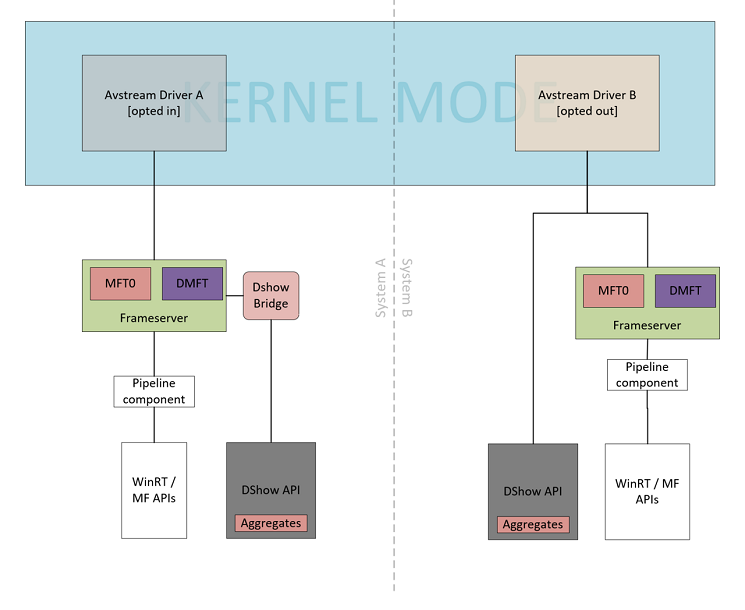

# DShow Bridge implementation guidance for UVC devices

This topic provides implementation guidance for configuring DShow Bridge for cameras and devices that comply with the USB Video Class (UVC) specification. The platform uses [Microsoft OS Descriptors](../usbcon/microsoft-defined-usb-descriptors.md) from the USB bus standard to configure DShow Bridge. The Extended Properties OS Descriptors are an extension of USB standard descriptors and are used by USB devices to return Windows specific device properties that are not enabled through standard specifications.

## Overview

The Microsoft Camera Capture stack comprises of a legacy framework stack called DirectShow and a modern framework called the Multimedia Foundation. IHVs and OEMs have had to write components for their devices to satisfy both pipelines.

DShow Bridge was written with the intent of bridging the DShow pipeline with Media Foundation platform. This enables true universal drivers so IHVs and OEMs can write drivers that can run with MediaFoundation and DShow applications on Windows version 1607 and later. With DShow Bridge opt-in enabled, a DShow application and sharing applications can share the same camera hardware concurrently.

IHVs and OEMs may need an exemption from the policies governing the DShow pipeline. Partners can enable the following features using the OS Descriptors:

- **Opting in or out of DShow Bridge**: Device can opt in or out of the Bridge to a pipeline better suited to their needs. The modern pipeline is more thoroughly documented and utilizes the features added to the OS over the multiple releases. The legacy pipeline, being in maintenance mode, lags behind.

- **MJPEG decompression in FrameServer**: FrameServer is a service virtualizing a camera device. This enables the Pins from the device to be shared between multiple clients. Architectures having an optimized Media Foundation decompressor can use this feature to decode MJPEG in FrameServer. The uncompressed translated media formats (YUY2) are offered to the multiple applications. The stream is only decompressed once for multiple possible clients. This improves the performance of applications. The following diagram shows the camera capture pipeline:



The OEMs and IHVs packaging their USB camera devices can use the USB bus standard's Extended Properties OS Feature Descriptor specification to configure DShow Bridge without resorting to any INF file changes for their UVC driver.

The OS descriptors allow devices to define registry properties for USB devices or composite devices.

To configure DShow Bridges using the USB OS Descriptors, the host software should create the following registry key for each USB device interface:

> HKLM\\SYSTEM\\CurrentControlSet\\Enum\\USB\\&lt;*DeviceVID&PID*&gt;\\&lt;*DeviceInstance*&gt;\\Device Parameters
>
> DWORD: **EnableDshowRedirection**

The **EnableDshowRedirection** registry value is a bit mask value which can be used to configure DShow Bridge as described by the table below.

| Bit mask | Description | Remarks |
|---|---|---|
| 0x00000001 | Opt into DShow Bridge | 0 – Opt-out<br>1 – Opt-in  |
| 0x00000002 | Enable MJPEG decoding once in FrameServer (see note below) | 0 – MJPEG compressed media type exposed (no operation)<br>1 – Expose the translated uncompressed media types from MJPEG (YUY2) |

> [!NOTE]
> Enables MJPEG decoding once in FrameServer and then the uncompressed translated media formats (YUY2) are offered to multiple applications. The stream is only decompressed once for multiple possible clients. This improves the performance of applications.

## Example Layouts

Examples are included below for the following specifications:

- Microsoft OS extended descriptors specification 1.0

- Microsoft OS 2.0 descriptors specification

### Microsoft OS extended property descriptors specification version 1.0

The extended properties OS descriptor has two components

- A fixed-length header section

- One or more variable length custom properties sections, which follows the header section

#### Header Section

The header section describes the entire extended properties descriptor, including the total length and the version number.

| Offset | Field      | Size (bytes) | Value      | Description                     |
|--------|------------|--------------|------------|---------------------------------|
| 0      | dwLength   | 4            | 0x0000004c | 76 decimal                      |
| 4      | bcdVersion | 2            | 0x0100     | Version 1.0                     |
| 6      | wIndex     | 2            | 0x005      | Extended property OS descriptor |
| 8      | wCount     | 2            | 0x0001     | One custom property             |

#### Custom Property Section (1.0 descriptor)

The USB HID device's extended property OS descriptor has one custom property section to create the **EnableDshowRedirection** DWORD registry key.

| Offset | Field | Size (bytes) | Value |
|--------|----------------------|---------|-------------------------------------------|
| 0      | dwSize               | 4       | 0x00000042 (66 bytes for this property)   |
| 4      | dwPropertyDataType   | 4       | 0x00000004 (REG\_DWORD\_LITTLE\_ENDIAN)   |
| 8      | wPropertyNameLength  | 2       | 0x0030                                    |
| 10     | bPropertyName        | 48      | **EnableDshowRedirection** (Unicode string) |
| 58     | dwPropertyDataLength | 4       | 0x00000004 (Sizeof(DWORD))                |
| 62     | bPropertyData        | 4       | 0x00000001 (DWORD data)                   |

### Microsoft OS 2.0 descriptors specification

This example demonstrates how Microsoft 2.0 descriptor sets can be used to provide a single DWORD registry value of **EnableDshowRedirection** that applies to Windows versions.

#### Custom Property Section (2.0 descriptor)

| Offset | Field | Size (bytes) | Value |
|--------|----------------------|----------|-----------------------------------------|
| 0      | wLength              | 2        | Length in bytes of this descriptor      |
| 4      | wDescriptorType      | 2        | 0x00000004 (REG\_DWORD\_LITTLE\_ENDIAN) |
| 8      | wPropertyDataType    | 2        | 0x0030                                  |
|        | wPropertyNameLength  | 2        |                                         |
| 10     | PropertyName         | Variable | The length of property name             |
| 58     | dwPropertyDataLength | 2        | Length of property data                 |
| 62     | PropertyData         | Variable | Property data                           |

```cpp
UCHAR Example2\_MSOS20DescriptorSetForFutureWindows\[0x48\] =
{
    //
    // Microsoft OS 2.0 Descriptor Set Header
    //
    0x0A, 0x00,                 // wLength - 12 bytes
    0x00, 0x00,                 // MSOS20_SET_HEADER_DESCRIPTOR
    0x00, 0x00, 0x0?, 0x06,     // dwWindowsVersion – 0x06030000 for future Windows version
    0x4A, 0x00,                 // wTotalLength – 72 bytes

    //
    // Microsoft OS 2.0 Registry Value Feature Descriptor
    //
    0x3E, 0x00,                 // wLength - 62 bytes
    0x04, 0x00,                 // wDescriptorType – 5 for Registry Property
    0x04, 0x00,                 // wPropertyDataType - 4 for REG_DWORD
    0x30, 0x00,                 // wPropertyNameLength – 48 bytes
    0x45, 0x00, 0x6E, 0x00,     // Property Name - "EnableDshowRedirection"
    0x61, 0x00, 0x62, 0x00,
    0x6C, 0x00, 0x65, 0x00,
    0x44, 0x00, 0x73, 0x00,
    0x68, 0x00, 0x6F, 0x00,
    0x77, 0x00, 0x52, 0x00,
    0x65, 0x00, 0x64, 0x00,
    0x69, 0x00, 0x72, 0x00,
    0x65, 0x00, 0x63, 0x00,
    0x74, 0x00, 0x69, 0x00,
    0x6F, 0x00, 0x6E, 0x00,
    0x00, 0x00, 0x00, 0x00,
    0x04, 0x00,                 // wPropertyDataLength – 4 bytes
    0x00, 0x00, 0x00, 0x00      // PropertyData – 0x00000003 (DShow Bridge is enabled and MJPEG is decoded in FrameServer)
}
```

### Resources

[Microsoft OS Descriptors for USB Devices](../usbcon/microsoft-defined-usb-descriptors.md)

[USB Generic Parent Driver (Usbccgp.sys)](../usbcon/usb-common-class-generic-parent-driver.md)

[USB Specification](https://www.usb.org/documents)
