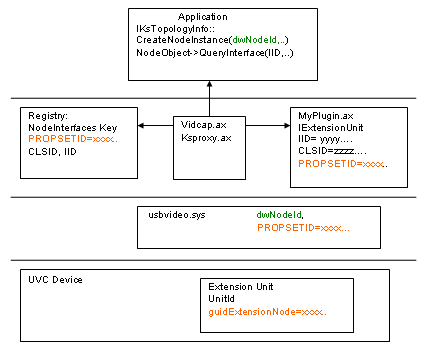

# Extension Unit Plug-In Architecture

The USB Video Class driver exposes Extension Units as nodes in the USB Video KS proxy filter. The Extension Unit controls are further exposed in user mode as a property set on the node, which is of type KSNODETYPE\_DEV\_SPECIFIC. The GUID of the property set matches the GUID of the Extension Unit descriptor.

The individual Extension Unit controls should be continuously numbered from 1 to some maximum value *n*. These controls are directly mapped to property identifiers (IDs) on the Extension Unit property set, and they can be accessed by using standard KSPROPERTY requests through [IKsControl](https://msdn.microsoft.com/library/windows/hardware/ff559766).

In response to property requests from applications, the UVC driver returns property values that have the **MembersFlags** member of the [**KSPROPERTY\_MEMBERSHEADER**](https://msdn.microsoft.com/library/windows/hardware/ff565189) structure set exclusively to KSPROPERTY\_MEMBER\_RANGES. UVC does not support stepped ranges or extension unit default values of arbitrary length.

To expose Extension Unit properties to an application, you can write a user-mode plug-in DLL that exposes a COM API. You can implement this API by making requests to the KS property set by using the **IKsControl** interface. *Vidcap.ax* automatically loads the node interface plug-in based on certain registry entries. An application can access the interface by using **IKsTopologyInfo::CreateNodeInstance** followed by a call to **QueryInterface** on the node object to obtain the required COM API.

The following elements are required to write and use an Extension Unit plug-in:

- A header and cpp file implementing the Extension Unit API and an interface named IKsNodeControl. Vidcap.ax uses the IKsNodeControl interface to inform the plug-in of the extension node identifier and provide it with an instance of IKsControl. Sample code for these files can be found in [Sample Extension Unit Plug-in DLL](sample-extension-unit-plug-in-dll.md).

- An *.rgs* file that registers the node interfaces and Class IDs (CLSIDs) under the **HKLM\\System\\CCS\\Control\\NodeInterfaces\\**<em>Property\_Set\_GUID</em> registry subkey. The entries in this registry subkey contain the binary values for the Interface ID (IID) and CLSID. For more information, see [Sample Registry Entry for UVC Extension Units](sample-registry-entry-for-uvc-extension-units.md).

- An application that invokes this interface. The application first creates a node instance with the correct node ID by using IKsTopologyInfo::CreateNodeInstance. The application then calls **QueryInterface** on the node instance to obtain the required Extension Unit interface. For more information, see [Sample Application for UVC Extension Units](sample-application-for-uvc-extension-units.md) and [Supporting Autoupdate Events with Extension Units](supporting-autoupdate-events-with-extension-units.md)

The code examples in this section illustrate all of these elements. See [Building the Extension Unit Sample Control](building-the-extension-unit-sample-control.md) to learn how to build the sample plug-in and associated sample application code.

After the plug-in DLL is registered and the registry entries described above are provided, Vidcap.ax automatically loads the relevant node interfaces when the node instance is created.

**Note**   As of Windows XP SP2, the Extension Unit property set is supported only on the node, and not on the filter.

 

### Registry Considerations

To register the IID and CLSID of the interface exported by the plug-in, you can use DLL registration or a device-specific setup information (INF) file.

See [Sample Registry Entry for UVC Extension Units](sample-registry-entry-for-uvc-extension-units.md) for a sample *.rgs* file that shows the required values for the registry entries. This topic also demonstrates how to write a device-specific INF file to install a USB video device and to register the plug-in DLL. You may choose either DLL registration or a device-specific INF file, based on your specific needs.

### Schematic

The following schematic diagram shows the relationships between the various modules involved in writing and using an Extension Unit plug-in. In particular it traces the connection from the application, to the plug-in DLL, down to the driver and finally to the Extension Unit on the device itself. The schematic also illustrates the various GUIDs involved; identical values are highlighted by the use of a matching color.

### Eventing Mechanisms

The USB Video Class supports auto-update events, where the device notifies the host driver of changes in any of its controls. The Microsoft USB Video Class driver supports this concept by letting applications register for auto-update events. The process of getting updates involves three steps:

1.  Registering for update events by using [KSEVENTSETID\_VIDCAPNotify](https://msdn.microsoft.com/library/windows/hardware/ff561773)::[**KSEVENT\_VIDCAP\_AUTO\_UPDATE**](https://msdn.microsoft.com/library/windows/hardware/ff561916)

2.  Listening for events on the notify event handle

3.  Canceling the notification when done

 

 

