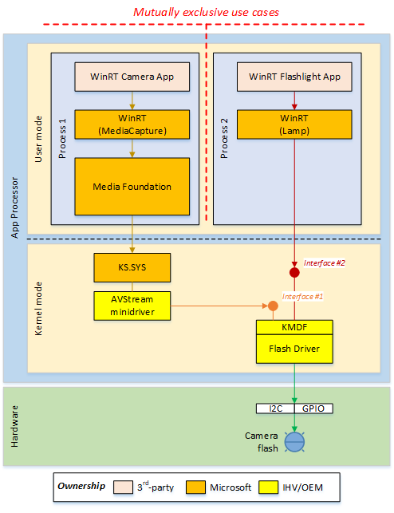

# Flashlight Support

Starting from Windows Threshold, we will expose a new WinRT *Lamp* API which allows one to program *camera flash* without the need to create a [Windows.Media.Capture.MediaCapture](/uwp/api/Windows.Media.Capture.MediaCapture) instance. By doing so, a developer can write a *flashlight* application (for illumination purpose only) by drawing least amount of resources, including power, such that a computing device can be optimized for battery life and performance.

To achieve this, an IHV/OEM shall implement a WDM driver which supports the following functions:

- Allow the system to enumerate all flash devices.

- Turn on/off flashlight on a per-device basis.

- If applicable, adjust light intensity (similar to PowerPercent) on a   per-device basis.

- If applicable, specify light color on a per-device basis.

In terms of functionality, the list above overlaps significantly with that of MediaCapture (for example, [FlashControl](/uwp/api/Windows.Media.Devices.FlashControl) and [TorchControl](/uwp/api/Windows.Media.Devices.TorchControl)). In addition, the same flash hardware is being used for both *lamp* and *flash-during-capture*. Consequently, an IHV/OEM is recommend to support both types of operations using a single WDM driver to control flash exclusively. The figure below illustrates the concept:



In the example above, there is only one flash hardware instance (shown as) and it is managed by a single *KMDF flash driver*. The flash driver exposes two device interfaces, each of which is targeted for a specific type of client (or WinRT API). For example, given the figure above:

- The WinRT *Media* *Capture* API and the AVStream minidriver always communicate with the flash driver via the GUID\_DEVINTERFACE\_CAMERA\_FLASH interface, whereas

- The WinRT *Lamp* API always communicates with the flash driver via the GUID\_DEVINTERFACE\_LAMP interface.

Since the GUID\_DEVINTERFACE\_CAMERA\_FLASH interface is used by a vendor-specific AVStream minidriver, an IHV/OEM is free to define its functionality at will – there won’t be any restriction imposed by Windows.

However, Microsoft will standardize the interface, GUID\_DEVINTERFACE\_LAMP, as it shall be used by the WinRT *Lamp API*. For more information on GUID\_DEVINTERFACE\_LAMP, refer to [Device Interface Class GUID](#device-interface-class-guid)

## Concurrency Use Cases

### Sharing Flash between Camera and Flashlight Applications

A camera flash is typically considered as a *subordinate* peripheral to a capture device. It is not meant to be shared with non-camera scenarios while capture is running. To complicate further, the number of flash devices on a chassis is extremely limited such that, in practice, there will not be spare flash dedicated to flashlight purpose only.

From software perspective, the above imposes a challenge where a camera application and a flashlight application can coexist and access flash at the same time. For example, in theory, a user can toggle LED state via a flashlight application by while a camera viewfinder is running.

Since camera requires precise controls over flash to support focus and capture, it may be difficult for the driver to resolve flash requests of conflicting interests while ensuring image quality. To address this issue, the following policy is enforced at system level as a contract:

- **If a capture session starts first**, a flashlight application cannot manipulate flash until capture stops.

  - A flashlight application can still acquire a handle to the flash driver but any operation modifying flash state yields an immediate error.

  - When capture stops such that the AVStream minidriver releases the flash, the flash driver is required to post a PnP notification (see GUID\_LAMP\_RESOURCES\_AVAILABLE in [Asynchronous Notifications](#asynchronous-notifications)) indicating the underlying hardware has now become available. Upon receiving such a notification, a flashlight application is allowed to program flash accordingly.

- **If a flashlight application starts first**, a capture session is free to hijack the flash hardware without explicit consent.

  - By “hijacking”, we mean an IHV/OEM can implement arbitrary protocol (possibly via the GUID\_DEVINTERFACE\_CAMERA\_FLASH interface) such that the AVStream minidriver is allowed to acquire flash as if the hardware is not being used at all.

  - When a hijack occurs, the flash driver is required to post another PnP notification (see GUID\_LAMP\_RESOURCES\_LOST in [Asynchronous Notifications](#asynchronous-notifications)) indicating the flash has been involuntarily reassigned such that the flashlight application can act accordingly (by updating the UI for example)

### Sharing Flash between Multiple Flashlight Applications

If camera is not involved and two flashlight applications run in succession, the driver should keep servicing the first client which has already acquired the GUID\_DEVINTERFACE\_LAMP interface and reject all additional clients until the first one releases the interface eventually.

In other words, the GUID\_DEVINTERFACE\_LAMP interface only allows one flashlight client at a time and the first client which acquires the interface prevents others from running (camera/AVStream excluded).

## Device Interface Class GUID

An IHV/OEM flash driver capable of supporting flashlight independent of MediaCapture must register itself with the [Device Interface Class](../install/overview-of-device-interface-classes.md) GUID, **GUID\_DEVINTERFACE\_LAMP**.

| Attribute  | Setting                                |
| ---------- | -------------------------------------- |
| Identifier | GUID\_DEVINTERFACE\_LAMP               |
| Class GUID | {6C11E9E3-8232-4F0A-AD19-AAEC26CA5E98} |

The device interface class GUID of GUID\_DEVINTERFACE\_CAMERA\_FLASH can be custom defined by IHVs/OEMs. However, the device interface class GUID of GUID\_DEVINTERFACE\_LAMP is defined by Windows.

By contract, a driver exposing the device interface, GUID\_DEVINTERFACE\_LAMP, is required to support the following functions (see later sections for details):

- **IOCTL\_LAMP\_GET\_CAPABILITIES\_{WHITE|COLOR}** – gets all modes   (for example, white-only vs. color) supported by the underlying hardware

- **IOCTL\_LAMP\_{GET|SET}\_MODE** – gets or sets current mode

- **IOCTL\_LAMP\_{GET|SET}\_INTENSITY\_{WHITE|COLOR}** – gets or sets light intensity

- **IOCTL\_LAMP\_{GET|SET}\_EMITTING\_LIGHT** – gets or sets the flash state (for example, ON/OFF)

If a device has more than one flash hardware of different types (for example, both a *white LED* and a *Xenon flash*) and these hardware are controlled by different flash drivers, each driver shall expose the same GUID\_DEVINTERFACE\_LAMP interface with a unique instance ID.

## Device Interface Property

Since a computing device can have zero or more flash devices on different panels, the WinRT *Lamp API* needs a mechanism to enumerate all flash hardware such that an application can program a specific instance.

To support device enumeration, similar to the camera driver, the flash driver is required to associate an ACPI \_PLD v2 structure with each GUID\_DEVINTERFACE\_LAMP interface as the interface property data.

## IOCTL_LAMP_GET_CAPABILITIES_WHITE

The IOCTL\_LAMP\_GET\_CAPABILITIES\_WHITE I/O request queries the capabilities of the flash when the device is configured to emit white light.

### Definition

```cpp
#define IOCTL_LAMP_BASE FILE_DEVICE_UNKNOWN
#define IOCTL_LAMP_GET_CAPABILITIES_WHITE \
    CTL_CODE(IOCTL_LAMP_BASE, 0x0000, METHOD_BUFFERED, FILE_ANY_ACCESS)
```

### Input Parameters

Irp-\>AssociatedIrp.SystemBuffer points to a buffer of type LAMP\_CAPABILITIES\_WHITE. See **Remarks** for details.

IO\_STACK\_LOCATION.Parameters.DeviceIoControl.OutputBufferLength is the length of the buffer (in bytes) passed in the Irp-\>AssociatedIrp.SystemBuffer field.

### Output Parameters

Irp-\>AssociatedIrp.SystemBuffer is filled with all capabilities supported by the flash hardware.

### I/O Status Block

The driver sets Irp-\>IoStatus.Status to STATUS\_SUCCESS or the appropriate error status. It will set Irp-\>IoStatus.Information to the number of bytes required to hold the buffer.

### Remarks

By requirement, a flash whose driver supports the GUID\_DEVINTERFACE\_LAMP interface is required to support emitting white light. The payload of this IOCTL is defined as follow:

```cpp
// The output parameter type of IOCTL_LAMP_GET_CAPABILITIES_WHITE.
typedef struct LAMP_CAPABILITIES_WHITE
{
    BOOLEAN IsLightIntensityAdjustable;
} LAMP_CAPABILITIES_WHITE;
```

The IsLightIntensityAdjustable field indicates whether the luminance level can be programmed. If this field evaluates false, it means that the underlying device only supports the on/off switch and the light intensity cannot be adjusted.

## IOCTL_LAMP_GET_CAPABILITIES_COLOR

The IOCTL\_LAMP\_GET\_CAPABILITIES\_COLOR I/O request queries the capabilities of the flash when the device is configured to emit color light.

### Definition

```cpp
#define IOCTL_LAMP_GET_CAPABILITIES_COLOR \
    CTL_CODE(IOCTL_LAMP_BASE, 0x0001, METHOD_BUFFERED, FILE_ANY_ACCESS)
```

### Input Parameters

Irp-\>AssociatedIrp.SystemBuffer points to a buffer of type LAMP\_CAPABILITIES\_COLOR. See **Remarks** for details.

IO\_STACK\_LOCATION.Parameters.DeviceIoControl.OutputBufferLength is the length of the buffer (in bytes) passed in the Irp-\>AssociatedIrp.SystemBuffer field.

### Output Parameters

Irp-\>AssociatedIrp.SystemBuffer is filled with all capabilities supported by the flash hardware.

### I/O Status Block

The driver sets Irp-\>IoStatus.Status to STATUS\_SUCCESS or the appropriate error status. It will set Irp-\>IoStatus.Information to the number of bytes required to hold the buffer.

### Remarks

The payload of this IOCTL is defined as follow:

```cpp
// The output parameter type of IOCTL_LAMP_GET_CAPABILITIES_COLOR.
typedef struct LAMP_CAPABILITIES_COLOR
{
    BOOLEAN IsSupported;
    BOOLEAN IsLightIntensityAdjustable;
} LAMP_CAPABILITIES_COLOR;
```

The first field, IsSupported, indicate whether the flash can emit color light. If the hardware does not support color light, the driver should set this field to false.

The second field, IsLightIntensityAdjustable, indicates whether the luminance level can be programmed. If the flash does not support color light (for example, IsSupported evaluates false), a client should discard the value of IsLightIntensityAdjustable.

## IOCTL_LAMP_GET_MODE

The IOCTL\_LAMP\_GET\_MODE I/O request queries the mode with which the flash is currently configured.

### Definition

```cpp
#define IOCTL_LAMP_GET_MODE \
    CTL_CODE(IOCTL_LAMP_BASE, 0x0002, METHOD_BUFFERED, FILE_ANY_ACCESS)
```

### Input Parameters

Irp-\>AssociatedIrp.SystemBuffer points to a buffer of type LAMP\_MODE, which is defined as follow:

```cpp
typedef enum LAMP_MODE
{
    LAMP_MODE_WHITE = 0,
    LAMP_MODE_COLOR
} LAMP_MODE;
```

IO\_STACK\_LOCATION.Parameters.DeviceIoControl.OutputBufferLength is the length of the buffer (in bytes) passed in the Irp-\>AssociatedIrp.SystemBuffer field.

### Output Parameters

Irp-\>AssociatedIrp.SystemBuffer is filled with a LAMP\_MODE value.

### I/O Status Block

The driver sets Irp-\>IoStatus.Status to STATUS\_SUCCESS or the appropriate error status. It will set Irp-\>IoStatus.Information to the number of bytes required to hold a DWORD value.

If a MediaCapture session is streaming data at the time of which this request is made, the driver should return an error (STATUS\_RESOURCE\_IN\_USE) via Irp-\>IoStatus.Status.

## IOCTL_LAMP_SET_MODE

The IOCTL\_LAMP\_SET\_MODE I/O request sets the mode in which the flash operate.

### Definition

```cpp
#define IOCTL_LAMP_SET_MODE \
    CTL_CODE(IOCTL_LAMP_BASE, 0x0003, METHOD_BUFFERED, FILE_ANY_ACCESS)
```

### Input Parameters

Irp-\>AssociatedIrp.SystemBuffer points to a buffer of type LAMP\_MODE.

### Output Parameters

None.

### I/O Status Block

The driver sets Irp-\>IoStatus.Status to STATUS\_SUCCESS or the appropriate error status.

If a MediaCapture session is streaming data at the time of which this request is made, the driver should return an error (STATUS\_RESOURCE\_IN\_USE) via Irp-\>IoStatus.Status.

## IOCTL_LAMP_GET_INTENSITY_WHITE

The IOCTL\_LAMP\_GET\_INTENSITY\_WHITE I/O request queries the light intensity when the flash is configured to emit white light.

### Definition

```cpp
#define IOCTL_LAMP_GET_INTENSITY_WHITE \
    CTL_CODE(IOCTL_LAMP_BASE, 0x0004, METHOD_BUFFERED, FILE_ANY_ACCESS)
```

### Input Parameters

Irp-\>AssociatedIrp.SystemBuffer points to a LAMP\_INTENSITY\_WHITE structure. See **Remarks** for details.

IO\_STACK\_LOCATION.Parameters.DeviceIoControl.OutputBufferLength is the length of the buffer (in bytes) passed in the Irp-\>AssociatedIrp.SystemBuffer field.

### Output Parameters

Irp-\>AssociatedIrp.SystemBuffer is filled with the light intensity information.

### I/O Status Block

The driver sets Irp-\>IoStatus.Status to STATUS\_SUCCESS or the appropriate error status.

If a MediaCapture session is streaming data at the time of which this request is made, the driver should return an error (STATUS\_RESOURCE\_IN\_USE) via Irp-\>IoStatus.Status.

### Remarks

The payload type of this IOCTL is defined as follow:

```cpp
// The I/O parameter type of IOCTL_LAMP_{GET|SET}_INTENSITY_WHITE.
typedef struct LAMP_INTENSITY_WHITE
{
    BYTE Value;
} LAMP_INTENSITY_WHITE;
```

The Value field is the white light intensity in percentage between 0 and 100 inclusive.

## IOCTL_LAMP_SET_INTENSITY_WHITE

The IOCTL\_LAMP\_SET\_INTENSITY\_WHITE I/O request sets the flash to the specified light intensity.

### Definition

```cpp
#define IOCTL_LAMP_SET_INTENSITY_WHITE \
    CTL_CODE(IOCTL_LAMP_BASE, 0x0005, METHOD_BUFFERED, FILE_ANY_ACCESS)
```

### Input Parameters

Irp-\>AssociatedIrp.SystemBuffer points to a LAMP\_INTENSITY\_WHITE structure (see [IOCTL_LAMP_GET_INTENSITY_WHITE](#ioctl_lamp_get_intensity_white) for details).

### Output Parameters

None.

### I/O Status Block

The driver sets Irp-\>IoStatus.Status to STATUS\_SUCCESS or the appropriate error status.

If a MediaCapture session is streaming data at the time of which this request is made, the driver should return an error (STATUS\_RESOURCE\_IN\_USE) via Irp-\>IoStatus.Status.

## IOCTL_LAMP_GET_INTENSITY_COLOR

The IOCTL\_LAMP\_GET\_INTENSITY\_COLOR I/O request queries the light intensity when the flash is configured to emit color light.

### Definition

```cpp
#define IOCTL_LAMP_GET_INTENSITY_COLOR \
    CTL_CODE(IOCTL_LAMP_BASE, 0x0006, METHOD_BUFFERED, FILE_ANY_ACCESS)
```

### Input Parameters

Irp-\>AssociatedIrp.SystemBuffer points to a LAMP\_INTENSITY\_COLOR structure. See **Remarks** for details.

IO\_STACK\_LOCATION.Parameters.DeviceIoControl.OutputBufferLength is the length of the buffer (in bytes) passed in the Irp-\>AssociatedIrp.SystemBuffer field.

### Output Parameters

Irp-\>AssociatedIrp.SystemBuffer is filled with the light intensity information.

### I/O Status Block

The driver sets Irp-\>IoStatus.Status to STATUS\_SUCCESS or the appropriate error status.

If a MediaCapture session is streaming data at the time of which this request is made, the driver should return an error (STATUS\_RESOURCE\_IN\_USE) via Irp-\>IoStatus.Status.

### Remarks

The payload type of this IOCTL is defined as follow:

```cpp
// The I/O parameter type of IOCTL_LAMP_{GET|SET}_INTENSITY_COLOR.
typedef struct LAMP_INTENSITY_COLOR
{
    BYTE Red; // Red light intensity in percentage (0-100)
    BYTE Green; // Green light intensity in percentage (0-100)
    BYTE Blue; // Blue light intensity in percentage (0-100)
} LAMP_INTENSITY_COLOR;
```

## IOCTL_LAMP_SET_INTENSITY_COLOR

The IOCTL\_LAMP\_SET\_INTENSITY\_COLOR I/O request sets the flash to the specified light intensity.

### Definition

```cpp
#define IOCTL_LAMP_SET_INTENSITY_COLOR \
    CTL_CODE(IOCTL_LAMP_BASE, 0x0007, METHOD_BUFFERED, FILE_ANY_ACCESS)
```

### Input Parameters

Irp-\>AssociatedIrp.SystemBuffer points to a LAMP\_INTENSITY\_COLOR structure (see [IOCTL_LAMP_GET_INTENSITY_COLOR](#ioctl_lamp_get_intensity_color) for details).

### Output Parameters

None.

### I/O Status Block

The driver sets Irp-\>IoStatus.Status to STATUS\_SUCCESS or the appropriate error status.

If a MediaCapture session is streaming data at the time of which this request is made, the driver should return an error (STATUS\_RESOURCE\_IN\_USE) via Irp-\>IoStatus.Status.

## IOCTL_LAMP_GET_EMITTING_LIGHT

The IOCTL\_LAMP\_GET\_EMITTING\_LIGHT I/O request queries if the (flash) light is turned on.

### Definition

```cpp
#define IOCTL_LAMP_GET_EMITTING_LIGHT
    CTL_CODE(IOCTL_LAMP_BASE, 0x0008, METHOD_BUFFERED, FILE_ANY_ACCESS)
```

### Input Parameters

Irp-\>AssociatedIrp.SystemBuffer points to a buffer of type BOOLEAN.

IO\_STACK\_LOCATION.Parameters.DeviceIoControl.OutputBufferLength is the length of the buffer (in bytes) passed in the Irp-\>AssociatedIrp.SystemBuffer field.

### Output Parameters

Irp-\>AssociatedIrp.SystemBuffer is filled with the flash state with TRUE meaning the flash is turned on (for example, emitting light); FALSE otherwise.

### I/O Status Block

The driver sets Irp-\>IoStatus.Status to STATUS\_SUCCESS or the appropriate error status. It will set Irp-\>IoStatus.Information to the number of bytes required to hold a DWORD value.

If a MediaCapture session is streaming data at the time of which this request is made, the driver should return an error (STATUS\_RESOURCE\_IN\_USE) via Irp-\>IoStatus.Status.

## IOCTL_LAMP_SET_EMITTING_LIGHT

The IOCTL\_LAMP\_SET\_EMITTING\_LIGHT I/O request turns on/off the (flash) light.

### Definition

```cpp
#define IOCTL_LAMP_SET_EMITTING_LIGHT
    CTL_CODE(IOCTL_LAMP_BASE, 0x0009, METHOD_BUFFERED, FILE_ANY_ACCESS)
```

### Input Parameters

Irp-\>AssociatedIrp.SystemBuffer points to a buffer of type BOOLEAN with TRUE indicating ON; FALSE otherwise.

### Output Parameters

None.

### I/O Status Block

The driver sets Irp-\>IoStatus.Status to STATUS\_SUCCESS or the appropriate error status.

If a MediaCapture session is streaming data at the time of which this request is made, the driver should return an error
(STATUS\_RESOURCE\_IN\_USE) via Irp-\>IoStatus.Status.

## Asynchronous Notifications

As described in [*Concurrency Use Cases*](#concurrency-use-cases), the flash driver is required to send PnP notifications to report resource availability. This can be done by calling IoReportTargetDeviceChange (or IoReportTargetDeviceChangeAsynchronous) with the following GUIDs depending on the scenario:

- The flash resource has been evicted because a capture session (or another flashlight application) starts:

  | Attribute  | Setting                                |
  | ---------- | -------------------------------------- |
  | Identifier | GUID\_LAMP\_RESOURCES\_LOST            |
  | Class GUID | {F770E98C-4403-48C9-B1D2-4EEC3302E41F} |

- The flash resource has now become available:

  | Attribute  | Setting                                |
  | ---------- | -------------------------------------- |
  | Identifier | GUID\_LAMP\_RESOURCES\_AVAILABLE       |
  | Class GUID | {185FE7CE-2616-481B-9094-20BB893ACD81} |