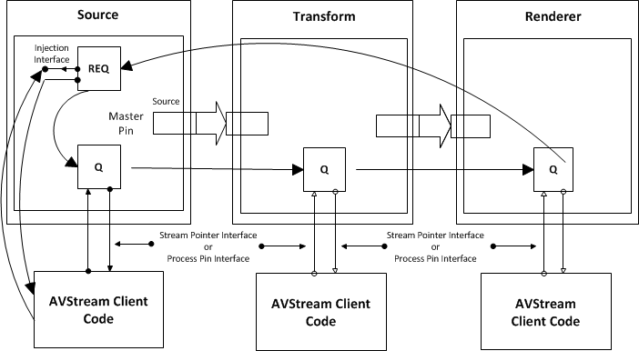

# Frame Injection

By default in AVStream, a requester acquires empty frames from an allocator and places them in a queue. The minidriver then fills frames either by [pin-centric processing](pin-centric-processing.md) or [filter-centric processing](filter-centric-processing.md). The frames move across a transport to the next object in the circuit, eventually completing the circuit and returning to the requester. AVStream then reuses the frames.

Minidrivers can override this default behavior by using *injection mode*. In injection mode, the minidriver is responsible for placing frames into the circuit. Frames propagate around the circuit in the default manner. When the frames return to the AVStream object where they started, AVStream calls a minidriver-provided [*AVStrMiniFrameReturn*](https://msdn.microsoft.com/library/windows/hardware/ff556320) routine.

In this routine, the minidriver could for instance deallocate the frame, complete work pending on the return of the frame, or refill and reinject the frame.

To set injection mode, the minidriver calls [**KsPinRegisterFrameReturnCallback**](https://msdn.microsoft.com/library/windows/hardware/ff563522) and provides a pointer to its *AVStrMiniFrameReturn* routine.

*Do not call* ***KsPinRegisterFrameReturnCallback*** *unless the filter is in the stop state.*

To inject frames into the circuit, call [**KsPinSubmitFrame**](https://msdn.microsoft.com/library/windows/hardware/ff563529) or [**KsPinSubmitFrameMdl**](https://msdn.microsoft.com/library/windows/hardware/ff563530).

The diagram below shows an AVStream filter set composed of a source filter, an [*inplace*](https://msdn.microsoft.com/library/windows/hardware/ff556290#wdkgloss-inplace) transform filter, and a rendering filter with the source injecting frames.

 

 

