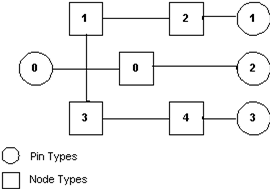

# Functional Topology

## 

To enable the building of broadcast receiver filter graphs in a way that works for all varieties of network types, and hardware and software implementations of, for example, tuners and decoders, Broadcast Architecture takes the familiar concept of a filter graph from DirectShow and abstracts it in the concept of a *functional topology*. A functional topology, like a filter graph, describes the series of transformations that occur on the incoming signal. However, unlike a filter graph, a functional topology does not describe any actual filters or software modules; or how an operation is implemented in software or hardware. Instead, it describes a configuration of abstract *control nodes*, each of which represents some common discrete operation.

Depending on the type of hardware and software components that are installed in a computer, the same functional topology can result in different filter graph configurations or *actual topologies*. For example, if a hardware vendor chooses to implement a tuner and a demodulator on the same circuit card, then the [kernel-streaming (KS) proxy module](https://msdn.microsoft.com/library/windows/hardware/ff560877) represents this hardware device in the filter graph as a single filter with two internal control nodes. A BDA device filter distinguishes itself from a more traditional DirectShow filter because a single BDA device filter can encapsulate as many hardware functions (control node implementations) as are built into a single functional module (for example, a circuit card or chip).

The function that a control node provides is uniquely identified by a GUID. For definitions of node description GUIDS, see [BDA Node Category GUIDs](https://msdn.microsoft.com/library/windows/hardware/ff556529). During the graph-building process, the network provider filter uses these GUIDs to determine which nodes are useful in supporting a particular network type or tuning space. Filters in a broadcast receiver filter graph indicate, through a COM interface, the node types and the pin types they support. BDA drivers for filters indicate this same information through KS property sets. A filter contains data structures that describe its node types, pin types, and the ways in which pins and nodes can be connected. This information is called the filter's *template topology*. The following figure illustrates a template topology.

The template topology in the preceding figure contains five different node types and four different pin types. The numbers of the pin and node types are arbitrary identifiers assigned by the filter. Each node type, however, is associated with a node description GUID that the network provider can examine. Each node type can occur only once in the topology, but since the filter arbitrarily assigns identifiers to node types, the same control node GUID could be associated with more than one node type. For example, node types that are identified with numbers 1 and 3 could represent the same control node GUID with two different output paths. A template topology must represent this scenario with two separate node types. The lines that connect these pin and node types in the template topology show the paths that the filter supports.

The network provider must examine this topology and determine the transformations that the filter performs on a signal in any particular graph. For more information about the data structures that describe the template topology, see [Broadcast Driver Architecture Minidrivers](broadcast-driver-architecture-minidrivers.md).

 

 

--------------------
[Send comments about this topic to Microsoft](mailto:wsddocfb@microsoft.com?subject=Documentation%20feedback%20%5Bstream\stream%5D:%20Functional%20Topology%20%20RELEASE:%20%288/23/2016%29&body=%0A%0APRIVACY%20STATEMENT%0A%0AWe%20use%20your%20feedback%20to%20improve%20the%20documentation.%20We%20don't%20use%20your%20email%20address%20for%20any%20other%20purpose,%20and%20we'll%20remove%20your%20email%20address%20from%20our%20system%20after%20the%20issue%20that%20you're%20reporting%20is%20fixed.%20While%20we're%20working%20to%20fix%20this%20issue,%20we%20might%20send%20you%20an%20email%20message%20to%20ask%20for%20more%20info.%20Later,%20we%20might%20also%20send%20you%20an%20email%20message%20to%20let%20you%20know%20that%20we've%20addressed%20your%20feedback.%0A%0AFor%20more%20info%20about%20Microsoft's%20privacy%20policy,%20see%20http://privacy.microsoft.com/default.aspx. "Send comments about this topic to Microsoft")

