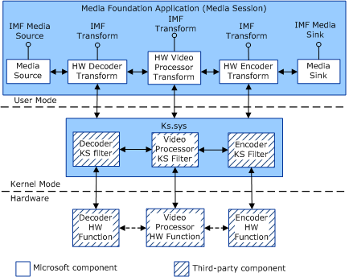

# Getting Started with Hardware Codec Support in AVStream

Starting in Windows 7, [Windows Media Foundation](https://go.microsoft.com/fwlink/p/?linkid=155069) represents AVStream-based media components as user-mode Media Foundation Transforms (MFTs).

By using this feature, vendors can present hardware-based decoders, encoders, and video processors as MFTs that can in turn be manipulated at the application level.

The AVStream model remains unchanged in Windows 7 and requires only a few additions to the minidriver to enable this functionality.

The transcoding topology is shown in the following diagram:

For best performance, the media processing that is shown in the bottom row of the diagram should occur in dedicated hardware. In this scenario, dedicated transcode hardware is known as Secured Hardware Encoder Decoder (SHED). SHED can be packaged either as a plug-in module for the motherboard or as an integrated feature on the display adapter.

Windows 7 still supports software-based transcoding. However, because the system performs the transcoding work on dedicated hardware instead of the CPU, a SHED-based solution improves the user experience significantly compared with a software-based solution.

As shown in the previous diagram, user-mode clients can access the user-mode transforms by using the IMFTransform interface that is exposed on each MFT. IMFTransform is available in Vista and later versions of Windows, but the mechanism to expose hardware-based media processing to user-mode applications is only available starting in Windows 7.

The system-supplied Device Proxy, or Devproxy, module serves the same role as KSProxy in the DirectShow streaming model. Devproxy brokers communication between *Ks.sys* in kernel-mode and MFT components in user-mode.

The resulting wrapped hardware media processing function is called a Device Proxy MFT. To take advantage of this mechanism, an AVStream minidriver should do the following:

-   Expose transform functions as individual KS filters that are part of the AVStream minidriver. For example, if the device has decode, encode, and video processing features, these functions should be represented as three distinct KS filters.
    -   **Encoder**: used to convert from an uncompressed format to a compressed format.
    -   **Decoder**: used to convert from a compressed format to an uncompressed format, which must include NV12.
    -   **Video Processor**: used to perform scaling, interlacing/de-interlacing, and format conversion. Do not include video processing support in the decoder or encoder filter.

        Microsoft strongly recommends that vendors provide hardware-based scaling support. However, if you choose not to provide hardware-based scaling support, you can use the system-supplied video processing MFT to perform scaling operations at a reduced level of performance. If you do not provide hardware-based scaling support, the Media Foundation topology builder automatically inserts the system-supplied scaling MFT into the topology.

-   Register its media processing KS filters under one of the following KS categories, available in Windows 7 and later versions of Windows:

    -   [**KSMFT\_CATEGORY\_VIDEO\_DECODER**](https://docs.microsoft.com/windows-hardware/drivers/install/ksmft-category-video-decoder)
    -   [**KSMFT\_CATEGORY\_VIDEO\_ENCODER**](https://docs.microsoft.com/windows-hardware/drivers/install/ksmft-category-video-encoder)
    -   [**KSMFT\_CATEGORY\_VIDEO\_PROCESSOR**](https://docs.microsoft.com/windows-hardware/drivers/install/ksmft-category-video-processor)
    -   [**KSMFT\_CATEGORY\_AUDIO\_DECODER**](https://docs.microsoft.com/windows-hardware/drivers/install/ksmft-category-audio-decoder)
    -   [**KSMFT\_CATEGORY\_AUDIO\_ENCODER**](https://docs.microsoft.com/windows-hardware/drivers/install/ksmft-category-audio-encoder)

    In addition, the following categories are also defined for use in other transcoding scenarios:

    -   [**KSMFT\_CATEGORY\_VIDEO\_EFFECT**](https://docs.microsoft.com/windows-hardware/drivers/install/ksmft-category-video-effect)
    -   [**KSMFT\_CATEGORY\_MULTIPLEXER**](https://docs.microsoft.com/windows-hardware/drivers/install/ksmft-category-multiplexer)
    -   [**KSMFT\_CATEGORY\_DEMULTIPLEXER**](https://docs.microsoft.com/windows-hardware/drivers/install/ksmft-category-demultiplexer)
    -   [**KSMFT\_CATEGORY\_AUDIO\_EFFECT**](https://docs.microsoft.com/windows-hardware/drivers/install/ksmft-category-audio-effect)
    -   [**KSMFT\_CATEGORY\_OTHER**](https://docs.microsoft.com/windows-hardware/drivers/install/ksmft-category-other)
-   Media foundation applications can then use the [MFTEnumEx](https://go.microsoft.com/fwlink/p/?linkid=155058) function to enumerate the devices that are registered as MFTs by using the categories mentioned previously.

 

 

