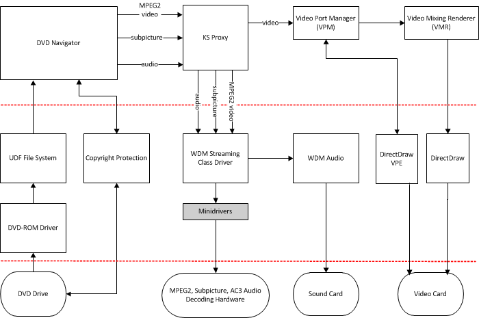

# Hardware-based DVD Decoding

## 

The following diagram illustrates a hardware-based DVD decoding solution and how it fits into the Windows Driver Model (WDM) architecture. It shows the complete support for hardware decoders with existing DVD technologies under Microsoft Windows XP.

The white boxes represent software supplied by Microsoft, and the shaded box represents the component provided by hardware vendors. The ovals represent hardware supplied by IHVs and OEMs.

Computers using Microsoft DVD support both DVD storage and, if the proper decoding hardware or software is present, DVD decoding and playback.

 

 

