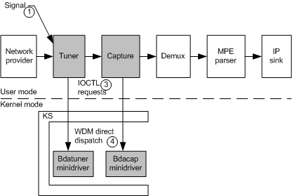

# Introducing Threats to a BDA Minidriver

The following paths can possibly introduce BDA minidriver threats:

1.  Signal transport stream.

2.  Special-purpose IOCTLs.

3.  Direct WDM dispatch routines.

The following diagram shows how BDA minidriver threats can be introduced:

 

 

