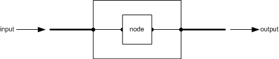
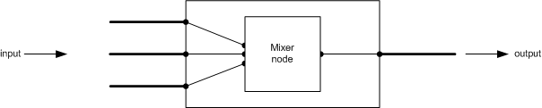

# KS Filters


## <a href="" id="ddk-ks-filters-ksg"></a>


A filter is a group of nodes that encapsulates a processing task to be performed on the data stream. [Pins](ks-pins.md) serve as input and output conduits on a filter.

A simple filter could contain one data sink pin and one data source pin. The filter receives incoming data on the data sink pin, processes it internally, and writes to the data source pin. In the following figure, the pins are shown as heavy line segments. Internally, the filter connects the data sink pin to an internal processing unit, a *node*, which in turn is connected to the data source pin.



Another device might combine or split data flows between pins. For example, an audio mixer supports several data sink pins. The mixer combines them into a single stream, and writes that stream to a data source pin. The following illustration shows the data flow.



The graph describes the internal relationship between the filter's pins. A more complicated filter might encapsulate several nodes that transform data flowing through the filter.

Filters specify internal connections between pins and internal nodes by using the [KSPROPSETID\_Topology](https://msdn.microsoft.com/library/windows/hardware/ff566598) property set.

The [**KSPROPERTY\_TOPOLOGY\_CONNECTIONS**](https://msdn.microsoft.com/library/windows/hardware/ff565802) property queries all connections between nodes of a KS filter. This property returns an array of [**KSTOPOLOGY\_CONNECTION**](https://msdn.microsoft.com/library/windows/hardware/ff567148). Each KSTOPOLOGY\_CONNECTION structure represents a single data-path connection inside a filter. In the mixer diagram above, the sequence of KSTOPOLOGY\_CONNECTION structures could be as follows:

```
//    FromNode,       FromNodePin,     ToNode,        ToNodePin,
{
 {  KSFILTER_NODE,        0,            0,               0     },
 {       0,               1,       KSFILTER_NODE,        1     }
}
```

 

 


--------------------
[Send comments about this topic to Microsoft](mailto:wsddocfb@microsoft.com?subject=Documentation%20feedback%20%5Bstream\stream%5D:%20KS%20Filters%20%20RELEASE:%20%288/23/2016%29&body=%0A%0APRIVACY%20STATEMENT%0A%0AWe%20use%20your%20feedback%20to%20improve%20the%20documentation.%20We%20don't%20use%20your%20email%20address%20for%20any%20other%20purpose,%20and%20we'll%20remove%20your%20email%20address%20from%20our%20system%20after%20the%20issue%20that%20you're%20reporting%20is%20fixed.%20While%20we're%20working%20to%20fix%20this%20issue,%20we%20might%20send%20you%20an%20email%20message%20to%20ask%20for%20more%20info.%20Later,%20we%20might%20also%20send%20you%20an%20email%20message%20to%20let%20you%20know%20that%20we've%20addressed%20your%20feedback.%0A%0AFor%20more%20info%20about%20Microsoft's%20privacy%20policy,%20see%20http://privacy.microsoft.com/default.aspx. "Send comments about this topic to Microsoft")


