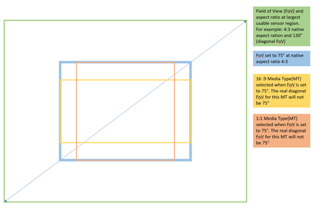

# KSPROPERTY_CAMERACONTROL_EXTENDED_FIELDOFVIEW2

**KSPROPERTY_CAMERACONTROL_EXTENDED_FIELDOFVIEW2** is a property ID that specifies the camera diagonal field of view (FoV) in degrees. The diagonal FoV values correspond to the diagonal FoV at the sensor native aspect ratio. This results in non-native aspect ratios that have slightly different real diagonal FoV.

This control is related to [**KSPROPERTY_CAMERACONTROL_EXTENDED_DIGITALWINDOW**](/windows-hardware/drivers/stream/ksproperty-cameracontrol-extended-digitalwindow), [**KSPROPERTY_CAMERACONTROL_ZOOM**](/windows-hardware/drivers/stream/ksproperty-cameracontrol-zoom), and [**KSPROPERTY_CAMERACONTROL_EXTENDED_ZOOM**](/windows-hardware/drivers/stream/ksproperty-cameracontrol-extended-zoom). See the remarks section below for interoperability requirements.

## Usage summary table

| Scope | Get | Set | Control | Type |
|--|--|--|--|--|
| Version 1 | Yes | Yes | Filter | Synchronous |

## KSCAMERA_EXTENDEDPROP_HEADER structure fields

The following table contains the requirements for the [**KSCAMERA_EXTENDEDPROP_HEADER**](/windows-hardware/drivers/ddi/content/ksmedia/ns-ksmedia-tagkscamera_extendedprop_header) structure fields when using the control.

| Member | Description |
|--|--|
| Version | Must be 1. |
| PinId | KSCAMERA_EXTENDEDPROP_FILTERSCOPE (0xFFFFFFFF) |
| Size | Must be sizeof([**KSCAMERA_EXTENDEDPROP_HEADER**](/windows-hardware/drivers/ddi/content/ksmedia/ns-ksmedia-tagkscamera_extendedprop_header)) + sizeof([**KSCAMERA_EXTENDEDPROP_VALUE**](/windows-hardware/drivers/ddi/ksmedia/ns-ksmedia-tagkscamera_extendedprop_value))  |
| Result | Must contain 0.  This field is only used to return the results of the last asynchronous SET operation. |
| Capability | Must be 0. |
| Flags | Must be 0. |

## KSCAMERA_EXTENDEDPROP_VALUE payload

The payload uses the existing [**KSCAMERA_EXTENDEDPROP_VALUE**](/windows-hardware/drivers/ddi/ksmedia/ns-ksmedia-tagkscamera_extendedprop_value) structure with a ULONG type.

## Remarks

### Interoperability with KSPROPERTY_CAMERACONTROL_ZOOM and KSPROPERTY_CAMERACONTROL_EXTENDED_ZOOM

If a driver/device chooses to support both this new FoV control and the old [**KSPROPERTY_CAMERACONTROL_ZOOM**](ksproperty-cameracontrol-zoom.md) or the [**KSPROPERTY_CAMERACONTROL_EXTENDED_ZOOM**](ksproperty-cameracontrol-extended-zoom.md), the zoom control must work within the new Field of View (FoV) selection. Meaning that the Zoom is relative to FoV. For different values of FoV, the same Zoom value results in different amounts of apparent zoom. Furthermore, setting the FoV always resets Zoom to its default value, regardless was there a change in the actual FoV value.

For example, the old Zoom control range is specified to be from 10 to 600 and the zoom is its default value, 10, when the new FoV setting is set from 75 degrees to 90 degrees, the old zoom control will still be at 10 with the same 10 to 600 range. But if the old zoom was at 50, it's reset back to 10 when the new FoV value is set.

### Interoperability with KSPROPERTY_CAMERACONTROL_EXTENDED_DIGITALWINDOW and DIGITALWINDOW_CONFIGCAPS

If a driver/device chooses to support both this new FoV2 control and the Digital Window (DW) controls, the following requirements must be followed:

- If the sole purpose of implementing Digital Window support is to support KSCAMERA_EXTENDEDPROP_DIGITALWINDOW_AUTOFACEFRAMING, it's acceptable that the manual Digital Window only supports one window size that represents the full window. This full window should match the DefaultDiagonalFieldOfViewInDegrees of the FIELDOFVIEW2_CONFIGCAPS, though the maximum FoV can be wider. In this case, the requirements listed below for a manual Digital Window can be ignored, as manual Digital Window isn't fully supported.

- The supported manual Digital Window area must cover at least the widest FoV setting, for example, by using the Digital Window, you can create a digital crop that would match any of the supported FoV settings. If the default FoV isn't the widest FoV, the Digital Window should use the *Porch* values to represent the wider windows.

- KSPROPERTY_CAMERACONTROL_EXTENDED_DIGITALWINDOW_CONFIGCAPS must report the same capabilities regardless of the FoV control state.

  - The current manual Digital Window must reflect the current FoV setting and vice versa, the last control wins.

  - When a manual Digital Window is set, the FoV should be internally changed to the smallest available FoV setting that encompasses the selected window area. This means the origin coordinates of the Digital Window can cause change in the FoV even if the Digital Window window size stays same. For example, if the Digital Window origin coordinates are in the top left corner with 0.4 window size, the FoV setting advertises the widest available FoV (in this example 120°) as otherwise it doesn't encompass that area. But if a second Digital Window with the same window size is done as center crop, the reflected FoV is likely something narrower (75° in our example).

  - When KSCAMERA_EXTENDEDPROP_DIGITALWINDOW_AUTOFACEFRAMING is supported and set, the driver/device must internally change the FoV to the widest setting. For example, GET operation for KSPROPERTY_CAMERACONTROL_EXTENDED_FIELDOFVIEW2 will return widest FoV setting when KSCAMERA_EXTENDEDPROP_DIGITALWINDOW_AUTOFACEFRAMING is enabled. However, any successful SET operation for KSPROPERTY_CAMERACONTROL_EXTENDED_FIELDOFVIEW2 will change the Digital Window back to KSCAMERA_EXTENDEDPROP_DIGITALWINDOW_MANUAL mode, as the last control wins.

### Interoperability with Region of Interest controls

Because this control changes the apparent Field of View (FoV), coordinates selected through any region of interest (ROI) control should be reset to their defaults whenever a SET is issued to this control. The list of current ROI controls includes:

- KSPROPERTY_CAMERACONTROL_REGION_OF_INTEREST_PROPERTY_ID

- KSPROPERTY_CAMERACONTROL_EXTENDED_ROI_CONFIGCAPS / KSPROPERTY_CAMERACONTROL_EXTENDED_ROI_ISPCONTROL

Should we define a future control that defines a rectangular region, that control must be reset as well.

In addition, Region of Interest controls specify their regions relative to the output window, so the coordinates they specify are always a rectangle in the current field of view. Since this control changes the current field of view, a Region of Interest rectangle must be remapped by the camera to fit within the current Field of View.

## Requirements

**Minimum supported client:** Windows 11, version 24H2

**Header:** ksmedia.h (include Ksmedia.h)

## See also

[**KSCAMERA_EXTENDEDPROP_FIELDOFVIEW2_CONFIGCAPS**](/windows-hardware/drivers/ddi/content/ksmedia/ns-ksmedia-kscamera_extendedprop_fieldofview2_configcaps)

[**KSCAMERA_EXTENDEDPROP_HEADER**](/windows-hardware/drivers/ddi/content/ksmedia/ns-ksmedia-tagkscamera_extendedprop_header)

[**KSCAMERA_EXTENDEDPROP_VALUE**](/windows-hardware/drivers/ddi/ksmedia/ns-ksmedia-tagkscamera_extendedprop_value)

[KSPROPERTY_CAMERACONTROL_EXTENDED_FIELDOFVIEW2_CONFIGCAPS](ksproperty-cameracontrol-extended-fieldofview2-configcaps.md)
