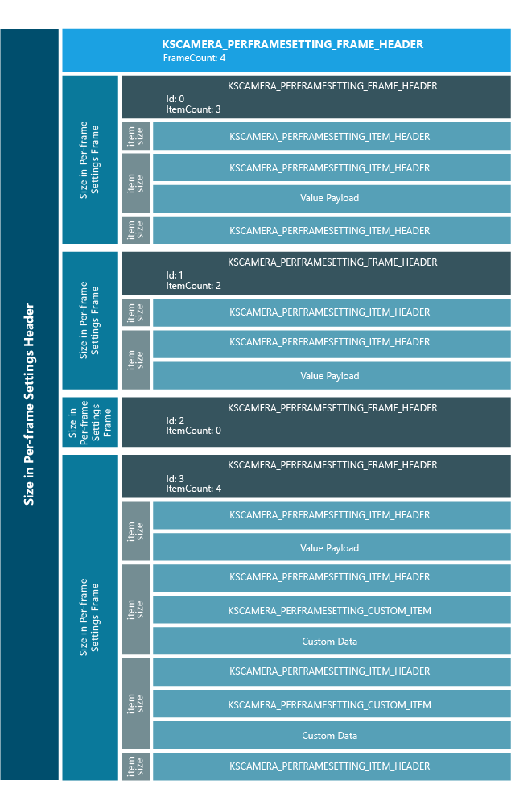

# KSPROPERTY\_CAMERACONTROL\_PERFRAMESETTING\_SET

The **KSPROPERTY\_CAMERACONTROL\_PERFRAMESETTING\_SET** property ID that is defined in [**KSPROPERTY\_CAMERACONTROL\_PERFRAMESETTING\_PROPERTY**](/windows-hardware/drivers/ddi/ksmedia/ne-ksmedia-ksproperty_cameracontrol_perframesetting_property) is used to set per-frame settings in the driver.

## Usage summary

To set per frame settings, the **KSPROPERTY\_CAMERACONTROL\_PERFRAMESETTING\_SET** property control is sent to the driver along with a per frame settings payload.

This property can be read or written. While a **GET** call can be used to return the last per frame settings that was set on the driver, the **GET** call is not exposed to the app client and is only issued at the initialization time when the per-frame setting control is constructed by the MF pipeline, where the driver must return **STATUS\_BUFFER\_OVERFLOW** with buffer size of 0.

In a GET call, a zero length buffer is sent to the driver first to find out the required data buffer size to hold the entire per-frame settings the driver has. In response to this call, the driver must return **STATUS\_BUFFER\_OVERFLOW** with the required per-frame settings buffer size that must be 0 if no per-frame settings has ever been set or at least the size of [**KSCAMERA\_PERFRAMESETTING\_HEADER**](/windows-hardware/drivers/ddi/ksmedia/ns-ksmedia-kscamera_perframesetting_header) otherwise.

The per-frame setting payload must start with a **KSCAMERA\_PERFRAMESETTING\_HEADER**, followed by one or more frame settings. The number of frame settings is specified in FrameCount. The settings for each frame must start with a [**KSCAMERA\_PERFRAMESETTING\_FRAME\_HEADER**](/windows-hardware/drivers/ddi/ksmedia/ns-ksmedia-kscamera_perframesetting_frame_header), followed by zero or more item settings. The number of item settings is specified in ItemCount. The settings for each item, if any must start with a [**KSCAMERA\_PERFRAMESETTING\_ITEM\_HEADER**](/windows-hardware/drivers/ddi/ksmedia/ns-ksmedia-kscamera_perframesetting_item_header).

For the settings for each item, if a Value payload is present, the **KSCAMERA\_PERFRAMESETTING\_ITEM\_HEADER** must be followed by a [**KSCAMERA\_EXTENDEDPROP\_VALUE**](/windows-hardware/drivers/ddi/ksmedia/ns-ksmedia-tagkscamera_extendedprop_value). If a custom item is present, **KSCAMERA\_PERFRAMESETTING\_ITEM\_HEADER** must be followed by a [**KSCAMERA\_PERFRAMESETTING\_CUSTOM\_ITEM**](/windows-hardware/drivers/ddi/ksmedia/ns-ksmedia-kscamera_perframesetting_custom_item), followed by the custom data associated with the GUID Id specified in **KSCAMERA\_PERFRAMESETTING\_CUSTOM\_ITEM**.

If FrameCount is 0, the driver must reject the per-frame settings payload. If ItemCount is 0, no frame settings are specified. The driver must apply global settings to the frame associated. For example, FrameCount = 1 and ItemCount = 0 implies a single frame variable photo sequence with global settings.

The figure below illustrates the data structure layout of a per frame settings payload configuration. In the example below, a per-frame settings for four frames are configured with frame 0 containing three items, two without payload and one with a Value payload; frame 1 containing two items, one without payload and the other with a value payload; frame 2 containing 0 item which implies the global settings for frame 2; frame 3 containing four items, one with a value payload, two each with a custom item and a custom data payload, and one without payload.



1.  **Size in per-frame settings header** represents the total payload size to be filled in **KSCAMERA\_PERFRAMESETTING\_HEADER.Size**

2.  **Size in per-frame settings frame** represents the size to be filled in **KSCAMERA\_PERFRAMESETTING\_FRAME\_HEADER.Size** for a frame.

3.  **Item size** represents the size to be filled in **KSCAMERA\_PERFRAMESETTING\_ITEM\_HEADER.Size** for an item.

4.  **Custom item size** represents the size to be filled in **KSCAMERA\_PERFRAMESETTING\_CUSTOM\_ITEM.Size** for a custom item.

**Per-frame settings exposure time**

If manual exposure time is specified in per frame settings, **KSCAMERA\_EXTENDEDPROP\_VALUE.Value.ll** will contain the desired exposure time in a **SET** call and the current exposure time in use in a **GET** call.

**Per-frame settings compensation**

If manual settings compensation is specified in per frame settings, **KSCAMERA\_EXTENDEDPROP\_VALUE.Value.l** will contain the desired exposure compensation in a **SET** call and the current exposure compensation in use in a **GET** call.

**Per-frame settings focus**

If manual per frame settings is specified in per frame settings, **KSCAMERA\_EXTENDEDPROP\_VALUE.Value.ul** will contain the desired lens position in a **SET** call and the current lens position in use in a **GET** call.

**Per-frame settings ISO**

If the driver does not support **KSCAMERA\_EXTENDEDPROP\_ISO\_MANUAL**, the Value payload is not included. Otherwise, the per-frame setting item header must be followed by a **KSCAMERA\_EXTENDEDPROP\_VALUE**. In a **SET** call, **KSCAMERA\_EXTENDEDPROP\_VALUE.Value.ul** contains the desired ISO speed if **KSCAMERA\_EXTENDEDPROP\_ISO\_MANUAL** is supported and specified in **KSCAMERA\_PERFRAMESETTING\_ITEM\_HEADER.Flags**.

The following shows how the item header and Value payload should look like when the per-frame settings ISO capability is **KSCAMERA\_EXTNDEDPROP\_ISO\_AUTO**, **KSCAMERA\_EXTENDEDPROP\_ISO\_MANUAL** (min = 30, max = 210, step =20)as follows:

```cpp
KSCAMERA_EXTNDEDPROP_ISO_AUTO, 
KSCAMERA_EXTENDEDPROP_ISO_MANUAL (min = 30, max = 210, step =20)
```

1.  If the ISO speed is 70

    ```cpp
    KSCAMERA_PERFRAMESETTING_ITEM_HEADER.Flags = KSCAMERA_EXTENDEDPROP_ISO_MANUAL
    KSCAMERA_EXTENDEDPROP_VALUE.Value.ul = 70
    ```

2.  If the ISO speed is 50

    ```cpp
    KSCAMERA_PERFRAMESETTING_ITEM_HEADER.Flags = KSCAMERA_EXTENDEDPROP_ISO_MANUAL
    KSCAMERA_EXTENDEDPROP_VALUE.Value.ul = 50
    ```

The following table summarizes the available controls and values for per-frame settings. The actual availability is determined by the driver's actual capability, which can be obtained using [**KSPROPERTY\_CAMERACONTROL\_PERFRAMESETTING\_CAPABILITY**](ksproperty-cameracontrol-perframesetting-capability.md).

<table>
<colgroup>
<col width="50%" />
<col width="50%" />
</colgroup>
<thead>
<tr class="header">
<th>Name</th>
<th>Available values</th>
</tr>
</thead>
<tbody>
<tr class="odd">
<td><p>Exposure time</p></td>
<td><p>Auto or time in 100 nanoseconds.</p></td>
</tr>
<tr class="even">
<td><p>Flash</p></td>
<td><p>On/Off, auto, red eye reduction on/off, flash power in percentage.</p></td>
</tr>
<tr class="odd">
<td><p>Exposure compensation</p></td>
<td><p>Auto or compensation step value.</p></td>
</tr>
<tr class="even">
<td><p>ISO speed</p></td>
<td><p>Auto or manual with integer ISO value.</p></td>
</tr>
<tr class="odd">
<td><p>Focus</p></td>
<td><p>Auto or logical lens position. This value does not have a specific unit.</p></td>
</tr>
<tr class="even">
<td><p>Custom properties</p></td>
<td><p>The OEM defines this with a custom GUID and property data.</p></td>
</tr>
<tr class="odd">
<td><p>Confirmation image</p></td>
<td><p>On/Off</p></td>
</tr>
</tbody>
</table>

To pass in the custom property data to the per-frame settings, the app does the following:

1.  Calls the QueryInterface on IFrameSettingsControls to get the IMFGetServices interface that is associated with the per-frame settings.

2.  Calls the GetService from the IMFGetServices interface to create a custom IMFAttributes interface on the per-frame settings.

3.  Calls the SetUINT32, SetBlob, etc on the custom property GUID to set the custom property data on the IMFAttributes that is associated with the per-frame settings.

The framework will look up the custom IMFAttributes to construct the custom item payloads if any when assembling the per-frame settings payload to be set on the driver.

The **LoopCount** field in **KSCAMERA\_PERFRAMESETTING\_HEADER** specifies the number of repeats that the per-frame settings should be applied to the future frames to be captured in a photo sequence. The **LoopCount** is hard coded to 1 by the pipeline (for example, the per frame settings will be only applied once without further repeats). The **FrameCount** field in **KSCAMERA\_PERFRAMESETTING\_HEADER** specifies the number of frame settings that the per-frame settings should be applied to the frames in each repeat.

The **ItemCount** field in **KSCAMERA\_PERFRAMESETTING\_FRAME\_HEADER** specifies the number of item settings that should be applied to the corresponding frame. If **ItemCount** is 0, global settings should be applied to the corresponding frame.

The table below lists the possible configurations and the corresponding photo sequence types.

<table>
<colgroup>
<col width="25%" />
<col width="25%" />
<col width="25%" />
<col width="25%" />
</colgroup>
<thead>
<tr class="header">
<th>LoopCount</th>
<th>FrameCount</th>
<th>ItemCount</th>
<th>Type</th>
</tr>
</thead>
<tbody>
<tr class="odd">
<td><p>L(L=1)</p></td>
<td><p>N(N&gt;0)</p></td>
<td><p>S(S&gt;=0)</p></td>
<td><p>Finite variable photo sequence</p></td>
</tr>
<tr class="even">
<td><p>L(L=1)</p></td>
<td><p>1</p></td>
<td><p>0</p></td>
<td><p>One frame finite variable photo sequence with global settings</p></td>
</tr>
<tr class="odd">
<td><p>L(L=1)</p></td>
<td><p>0</p></td>
<td><p>S</p></td>
<td><p>Invalid configuration</p></td>
</tr>
</tbody>
</table>

The variable photo sequence has been simplified to perform finite captures with only one repeat. The photo sequence with per frame settings will be always flagged as a variable photo sequence and the per-frame settings payload is always required.

If the loop count is L (L = 1) and the frame count is N (N &gt; 0), it is a finite variable photo sequence. The per-frame settings will be repeated L = 1 times with the N frame settings applied to the next N future frames in each repeat.

If the loop count is L (L = 1), the frame count is 1, and the item count is 0, it is a one frame finite variable photo sequence with global settings.

The variable photo sequence is further simplified to not request any past frames. The pipeline will hardcode the requested past photo count, (for example, RequestedHistoryFrames) to 0. The driver delivers only future frames in a variable photo sequence. The following figure illustrates the expected number of frames to be delivered by the driver in a variable photo sequence. The past photo count is specified in **KSCAMERA\_EXTENDEDPROP\_PHOTOMODE.RequestedHistoryFrames** by the [**KSPROPERTY\_CAMERACONTROL\_EXTENDED\_PHOTOMODE**](ksproperty-cameracontrol-extended-photomode2.md) extended property control that is hardcoded to 0 by the pipeline.

```cpp
N : Frame Count
L : Loop Count
P : Past Photos Requested
T : Total number of frame delivered by driver
L = 1
P = 0
T = (N * L) + P
```

For the finite variable photo sequence, the driver must mark the **KSSTREAM\_HEADER.OptionsFlags** for the last frame with the **KSSTREAM\_HEADER\_OPTIONSF\_ENDOFPHOTOSEQUENCE** flag. Doing so will ensure that the driver automatically stops delivering frames back to the MF pipeline after the amount of future frames expected have been delivered. This effectively stops the photo sequence and notifies the app client of the completion of the photo sequence. This happens when driver finishes capturing the last frame in the finite variable photo sequence.

## Requirements

<table>
<colgroup>
<col width="50%" />
<col width="50%" />
</colgroup>
<tbody>
<tr class="odd">
<td><p>Header</p></td>
<td>Ksmedia.h</td>
</tr>
</tbody>
</table>
